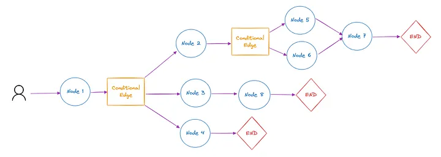
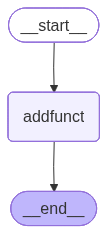
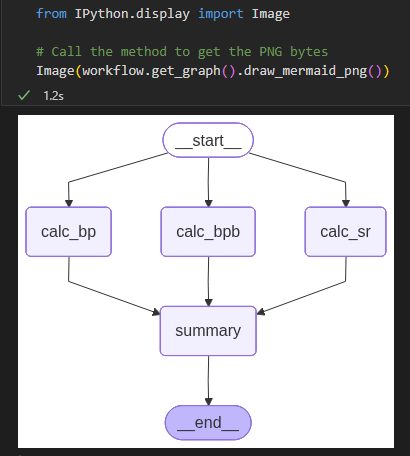
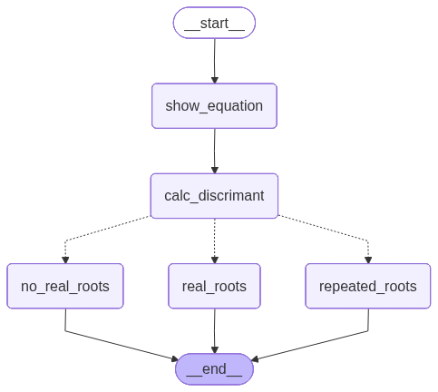
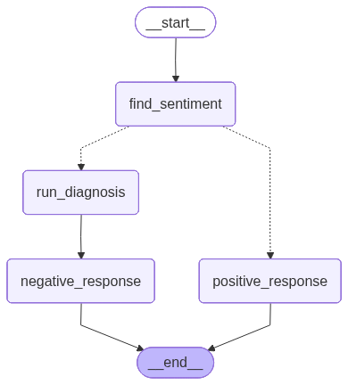
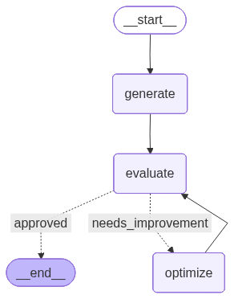
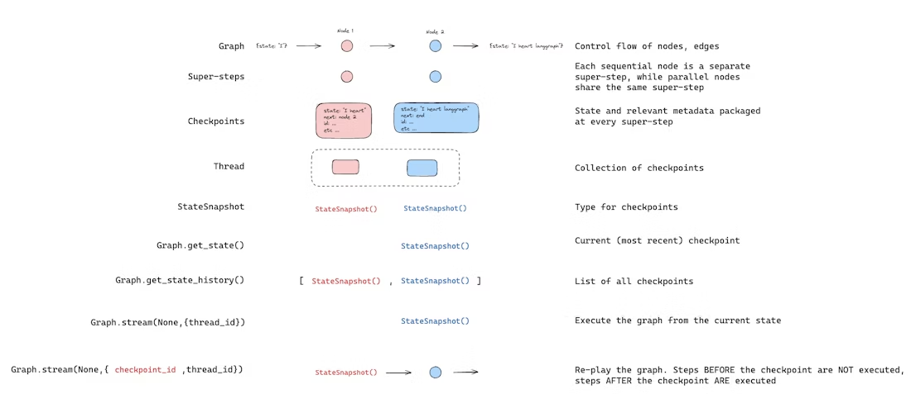
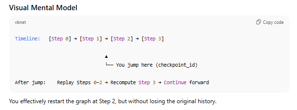

# 🤖 Understanding Agents and Agentic Systems

- [Building effective agents](https://www.anthropic.com/engineering/building-effective-agents)
- [LangChain vs. LangGraph](https://medium.com/@tahirbalarabe2/%EF%B8%8Flangchain-vs-langgraph-a-comparative-analysis-ce7749a80d9c)

This document provides an overview of **agents**, **workflows**, and **agentic systems** — including when to use them, how to design them, and common implementation patterns.

---

## 🧩 What Are Agents?

The term **"agent"** can refer to different levels of system autonomy:

- **Fully autonomous systems** that independently use tools over extended periods to accomplish complex tasks.
- **Prescriptive implementations** that follow predefined workflows.

Both are categorized as **agentic systems**, but with a key architectural distinction:

| System Type   | Description                                                                             |
| ------------- | --------------------------------------------------------------------------------------- |
| **Workflows** | LLMs and tools are orchestrated through **predefined code paths**.                      |
| **Agents**    | LLMs **dynamically direct their own processes** and **decide** how to accomplish tasks. |

---

## ⚖️ When (and When Not) to Use Agents

Start with the **simplest solution possible** — add complexity only when needed.

### ✅ Use Agents When:

- Tasks are **open-ended** or **hard to predict**.
- You need **flexible, model-driven decision-making**.
- The system must operate **autonomously at scale**.

### ❌ Avoid Agents When:

- Simpler workflows or single LLM calls (with retrieval/in-context examples) suffice.
- Cost, latency, or reliability are bigger priorities than flexibility.

### Tradeoff:

Agentic systems often **trade latency and cost for performance** — use them when that tradeoff makes sense.

---

## 🧱 Frameworks for Building Agents

There are many frameworks that simplify agentic development:

- [LangGraph (LangChain)](https://www.langchain.com/langgraph)
- [Amazon Bedrock AI Agent Framework](https://aws.amazon.com/bedrock/)
- [Rivet](https://www.rivet.works/) – Drag-and-drop LLM workflow builder
- [Vellum](https://vellum.ai/) – GUI for complex workflow testing

⚠️ **Caution:**  
Frameworks add abstraction layers that can obscure the underlying prompts and responses, making debugging harder.  
Start by using **LLM APIs directly** — many patterns can be implemented in just a few lines of code.

---

## 🧠 Building Blocks, Workflows, and Agents

Agentic systems can be viewed as a **spectrum of complexity**, from simple augmented models to fully autonomous agents.

---

### 🧩 1. Building Block: The Augmented LLM


An **augmented LLM** is an LLM enhanced with:

- **Retrieval** (search/query access)
- **Tools** (API calls, code execution, etc.)
- **Memory** (context retention across sessions)

These capabilities allow LLMs to:

- Generate their own queries
- Choose and use tools dynamically
- Retain and reference prior information

> **Tip:** Tailor augmentations to your use case and expose them through a clear, documented interface.  
> The [Model Context Protocol (MCP)](https://modelcontextprotocol.io/) is a good integration approach.

---

### 🔗 2. Workflow: Prompt Chaining


Prompt chaining decomposes a task into a sequence of steps, where each LLM call processes the output of the previous one. You can add programmatic checks (see "gate” in the diagram below) on any intermediate steps to ensure that the process is still on track.

**Use When:**  
This workflow is ideal for situations where the task can be easily and cleanly decomposed into fixed subtasks. The main goal is to trade off latency for higher accuracy, by making each LLM call an easier task.

**Examples:**

- Generate marketing copy → Translate it → Refine tone
- Write a document outline → Validate it → Draft full text

---

### 🚦 3. Workflow: Routing


Classify an input and **route it** to a specialized process or model.

**Use When:**  
You have **distinct input categories** requiring **different handling**.

**Examples:**

- Route customer queries (refunds, tech support, general)
- Send easy tasks to a small model, hard ones to a larger model

---

### ⚙️ 4. Workflow: Parallelization


Run multiple LLMs **simultaneously** and aggregate results.

**Variants:**

- **Sectioning:** Split task into parallel subtasks.
- **Voting:** Running the same task multiple times to get diverse outputs.

## ⚙️ Workflow: Parallelization

### 🧠 When to Use

Parallelization is effective when:

- Subtasks can be **divided and run in parallel** for faster execution.
- Multiple **perspectives or attempts** are needed to increase confidence in results.
- Complex tasks involve **multiple considerations**, each best handled by a **dedicated LLM call** for focused attention.

---

### 🔍 Key Variations

#### **1. Sectioning**

Split a task into **independent subtasks** that run simultaneously.

**Use Cases:**

- **Guardrails:**
  - One LLM processes user queries.
  - Another LLM screens for inappropriate or unsafe content.
  - Improves reliability versus combining both in one model call.
- **Automated Evals:**
  - Each LLM instance evaluates a **different aspect** of model performance on a given prompt.

---

#### **2. Voting**

Run the **same task multiple times** to gather diverse outputs and reach consensus.

**Use Cases:**

- **Code Review:**
  - Multiple prompts independently check code for vulnerabilities; issues flagged if any detect a problem.
- **Content Evaluation:**
  - Several LLMs assess whether content is inappropriate.
  - Uses different **criteria or thresholds** to balance false positives and negatives.

---

### ✅ Summary

| Technique      | Purpose                         | Benefit                        |
| -------------- | ------------------------------- | ------------------------------ |
| **Sectioning** | Split independent subtasks      | Speed & specialization         |
| **Voting**     | Repeat same task multiple times | Higher confidence & robustness |

---

### 🧭 5. Workflow: Orchestrator-Workers


A **central LLM** (the orchestrator) dynamically breaks tasks down and delegates them to **worker LLMs**.

**Use When:**  
This workflow is well-suited for complex tasks where you can’t predict the subtasks needed (in coding, for example, the number of files that need to be changed and the nature of the change in each file likely depend on the task). Whereas it’s topographically similar, the key difference from parallelization is its flexibility—subtasks aren't pre-defined, but determined by the orchestrator based on the specific input

**Examples:**

- Multi-file coding agents
- Search and synthesis from multiple data sources

---

### 🔁 6. Workflow: Evaluator-Optimizer


Two LLMs interact in a **feedback loop** — one produces, the other evaluates.
The **Evaluator-Optimizer** workflow involves two LLMs (or two roles of the same LLM) working together in a **feedback loop**:

- One acts as the **Optimizer**, generating initial responses or outputs.
- The other serves as the **Evaluator**, reviewing those outputs against predefined criteria and providing constructive feedback.  
  This process continues iteratively until the output meets the desired standard or quality threshold.

**Use When:**  
You have clear evaluation criteria and iterative improvement helps.
This workflow is particularly effective when:

- You have **clear evaluation criteria** or measurable quality standards.
- **Iterative refinement** leads to **tangible improvements** in results.

It mirrors how a human writer drafts, reviews, and revises content — each iteration improving upon the last.

**Examples:**

- Literary translation refinement
- Iterative search or summarization tasks

---

## 🤖 7. Agents (Autonomous Systems)


As LLMs improve in reasoning, planning, and tool use, **agents** are emerging in production.


### 🔍 How Agents Work

1. Start with a **user command or discussion**.
2. **Plan and operate independently**, using tools and environment feedback.
3. **Pause for human input** when needed (e.g., blockers, checkpoints).
4. **Stop** upon task completion or after predefined conditions.

Agents are essentially:

> LLMs that loop between reasoning, taking actions (via tools), and observing results.

### 🧱 Implementation Notes

- Define **clear toolsets** and documentation.
- Include **stopping conditions** (e.g., max iterations).
- Test in **sandboxed environments** with guardrails.

### ✅ Use Agents For:

- **Open-ended, multi-step** problems
- **Dynamic tool use** and **planning**
- **Scaling complex automation** in trusted environments

### ⚠️ Be Aware:

- Agents are **expensive** (multiple tool calls and iterations)
- **Compounding errors** can occur
- Require **trust and safety checks**

**Examples:**

- Coding agent that edits multiple files for SWE-bench tasks
- "Computer use" agents that operate desktop environments

---

## 🧩 Combining and Customizing Patterns

These workflows are **building blocks**, not rigid templates.  
You can **mix and match** to suit your needs:

- Chain + Routing for adaptive pipelines
- Orchestrator + Evaluator for supervised autonomous systems

> Measure performance, iterate often, and **add complexity only when it improves results**.

---

## 🧭 Summary & Best Practices

Building the **right system** matters more than building the **most complex system**.

### Core Principles for Agents

1. 🧠 **Keep it simple** – Add autonomy only when beneficial.
2. 🔍 **Be transparent** – Make planning steps visible.
3. 🧰 **Design your agent-computer interface (ACI)** carefully – Document and test all tools.

---

# **LangChain vs LangGraph** — The Next Generation of LLM Workflow Orchestration

## 📘 Introduction

Modern LLM applications are moving from simple, sequential prompt chains to **complex, stateful, and multi-agent systems**.  
While **LangChain** laid the foundation for LLM-driven pipelines, it struggles when workflows require **loops, persistence, human involvement, or fault recovery**.

To overcome these challenges, **LangGraph** was created — a **graph-based orchestration framework** built on top of LangChain.  
It brings **state management**, **event-driven execution**, **fault tolerance**, and **observability** to complex LLM workflows.

This document explains:

- What LangChain is and its challenges
- How LangGraph solves them
- Key differences and when to use each

---

## 🧩 What is LangChain?

**LangChain** is a framework for building applications powered by Large Language Models (LLMs).  
It provides tools and abstractions for connecting:

- LLMs (OpenAI, Anthropic, etc.)
- Prompts and Chains
- Tools and Agents
- Memory and Retrieval
- Data Loaders and Vector Stores

LangChain workflows are **sequential**, flowing step-by-step:
Input → Preprocess → Retrieve → Prompt → LLM → Output

It’s perfect for:

- Chatbots
- RAG (Retrieval-Augmented Generation)
- Summarization
- Information extraction
- Early prototypes and research

---

## ⚠️ Challenges in LangChain

While LangChain is powerful, it was designed for **sequential workflows**, not **dynamic, persistent, or fault-tolerant systems**.  
Below are its key limitations:

| #   | Challenge                    | Description                                                                                          |
| --- | ---------------------------- | ---------------------------------------------------------------------------------------------------- |
| 1   | **Control Flow Complexity**  | Hard to implement loops, branching, or conditional paths — designed mainly for straight chains.      |
| 2   | **Handling State**           | State (context, memory, variables) is limited and not durable across sessions or restarts.           |
| 3   | **Event-Driven Execution**   | Workflows execute in sequence; no event-based triggers or reactivity.                                |
| 4   | **Fault Tolerance**          | No built-in retry, rollback, or recovery mechanisms — if a step fails, the whole chain must restart. |
| 5   | **HITL (Human-in-the-Loop)** | Integrating human feedback or approval steps is manual and complex.                                  |
| 6   | **Nested Workflows**         | Difficult to manage or visualize nested or recursive workflows.                                      |
| 7   | **Observability**            | Limited runtime insights — debugging or understanding workflow behavior is challenging.              |

---

## 🔁 What is LangGraph?

**LangGraph** is a next-generation orchestration library built on top of LangChain.  
It turns LLM pipelines into **graphs** instead of linear chains.

### Key Concepts:

- **Nodes** → Actions or agents
- **Edges** → Data or state flow between nodes
- **State** → Shared object representing workflow progress
- **Checkpoints** → Savepoints for resuming execution

LangGraph supports:

- **Branching**, **loops**, and **conditional flows**
- **Persistent state** and **resumable workflows**
- **Event-driven execution**
- **Automatic retries** and **failure recovery**
- **Human-in-the-loop (HITL)** support
- **Deep observability** and debugging tools

---

## 🧠 How LangGraph Solves LangChain’s Limitations

| Challenge                    | LangChain Limitation          | LangGraph Solution                                                         |
| ---------------------------- | ----------------------------- | -------------------------------------------------------------------------- |
| **Control Flow Complexity**  | Sequential, limited branching | Graph-based flow enables conditional routing, loops, and dynamic branching |
| **Handling State**           | Memory is transient           | Persistent state objects with checkpointing and recovery                   |
| **Event-Driven Execution**   | Sequential, not reactive      | Event-driven nodes trigger on changes or external inputs                   |
| **Fault Tolerance**          | No retry or rollback          | Automatic retry, rollback, and checkpoint recovery built-in                |
| **HITL (Human-in-the-Loop)** | Manual integration required   | Native pause, review, and resume workflows                                 |
| **Nested Workflows**         | Hard to nest chains           | Supports subgraphs for modular, reusable workflows                         |
| **Observability**            | Limited logs                  | Real-time state tracking, tracing, and visualization                       |

---

## 🚀 Why We Need LangGraph

LLM systems are increasingly **interactive**, **stateful**, and **dynamic**.  
LangChain’s linear model struggles to manage:

- Multiple agents interacting in loops
- Conditional branching based on model output
- Long-running sessions with user intervention
- Error handling, retries, and resumption
- Live monitoring and debugging

**LangGraph** introduces the control and resilience needed for **production-grade AI applications**, not just prototypes.

---

## 🔑 Key Differences

| Feature           | LangChain                 | LangGraph                              |
| ----------------- | ------------------------- | -------------------------------------- |
| Architecture      | Linear Chains             | Graph-based Workflow                   |
| Control Flow      | Sequential                | Conditional / Looping                  |
| State Handling    | Transient Memory          | Persistent, Serializable State         |
| Fault Tolerance   | Manual                    | Built-in Retry & Recovery              |
| Execution Model   | Step-by-step              | Event-driven                           |
| Human-in-the-Loop | Manual integration        | Native pause/resume support            |
| Nested Workflows  | Difficult                 | Supported (subgraphs)                  |
| Observability     | Limited logs              | Full runtime introspection             |
| Use Case          | RAG, Chatbots, Prototypes | Multi-agent, Stateful, Complex Systems |

---

## 🧰 When to Use Each

### ✅ Use **LangChain** when:

- You’re building a **prototype** or **simple linear workflow**
- You need **fast iteration and simplicity**
- Your task fits a **retrieve → generate → output** pattern

### 🚀 Use **LangGraph** when:

- You need **branching**, **loops**, or **dynamic routing**
- You’re building **multi-agent** or **long-running** workflows
- You want **fault tolerance** and **state persistence**
- You need **HITL (Human-in-the-Loop)** interaction
- You want **monitoring**, **debugging**, and **workflow visualization**

---

## 🧪 Conceptual Example

### LangChain (Linear)

LangChain:
User → Retriever → Prompt → LLM → Output

LangGraph:


---

## 🏁 Summary

| LangChain Strengths | LangGraph Advantages                    |
| ------------------- | --------------------------------------- |
| Quick prototyping   | Production-ready orchestration          |
| Simple linear flows | Dynamic, event-driven graphs            |
| Great for demos     | Great for real-world systems            |
| Minimal setup       | Advanced state, retry, and HITL support |

In short:

> **LangChain** helps you build LLM pipelines.  
> **LangGraph** helps you orchestrate resilient, intelligent LLM systems.

---

## 📚 References

- [LangChain Official Docs](https://python.langchain.com/)
- [LangGraph Official Docs](https://langchain-ai.github.io/langgraph/)
- [LangChain Blog: Why LangGraph](https://blog.langchain.dev/langgraph/)
- [Medium: LangChain vs LangGraph Analysis](https://medium.com/@tahirbalarabe2/langchain-vs-langgraph-a-comparative-analysis-ce7749a80d9c)
- [DuploCloud Blog: LangChain vs LangGraph](https://duplocloud.com/blog/langchain-vs-langgraph/)

---

# 🧭 LangGraph API Reference

LangGraph is a **message-passing framework** for building modular, graph-based AI workflows and agent systems. It orchestrates complex workflows by connecting logical components (**nodes**) and controlling their interactions via **edges** and **state**.

---

## 📚 Table of Contents

- [Core Concepts](#-core-concepts)
- [Building a Graph](#-building-a-graph)
- [State and Schema](#-state-and-schema)
- [Reducers](#-reducers)
- [Working with Messages](#-working-with-messages)
- [Nodes](#-nodes)
- [Edges and Control Flow](#-edges-and-control-flow)
- [Advanced Features](#-advanced-features)
- [Complete Examples](#-complete-examples)

---

## 🧩 Core Concepts

### 1. 🗃️ State

It is the shared memory that flows through your workflow.It holds all the data being passed between nodes as your graph runs.
A **State** represents the **current data snapshot** in your graph at any point in execution. It's passed between nodes as input and output, making it the central communication mechanism.

> Think of it as a shared message that evolves as nodes process and update data.

**Example:**

```python
from typing_extensions import TypedDict

class State(TypedDict):
    user_input: str
    result: str
```

### 2. 🧱 Schema

A **Schema** defines the structure of the state — ensuring consistent communication between nodes.

**Supported schema types:**

- ✅ **TypedDict** (fast and simple, recommended)
- ✅ **dataclass** (adds default values)
- ⚙️ **Pydantic BaseModel** (adds validation, slower)

**Example:**

```python
from typing_extensions import TypedDict
from dataclasses import dataclass

class InputState(TypedDict):
    question: str

class OutputState(TypedDict):
    answer: str

@dataclass
class OverallState:
    question: str
    answer: str = ""
```

### 3. ⚙️ Nodes and Edges

LangGraph workflows are graphs composed of:

- **Nodes** → perform computation or logic (LLM calls, APIs, etc.)
- **Edges** → define the control flow between nodes

> 🧩 **"Nodes do the work. Edges tell what to do next."**

**Example:**

```python
from langgraph.graph import StateGraph, START, END
from typing_extensions import TypedDict

class State(TypedDict):
    input: str
    output: str

graph = StateGraph(State)

def greet_node(state: State):
    return {"output": f"Hello, {state['input']}!"}

graph.add_node("greet_node", greet_node)
graph.add_edge(START, "greet_node")
graph.add_edge("greet_node", END)

app = graph.compile()
print(app.invoke({"input": "LangGraph"}))
# Output: {'input': 'LangGraph', 'output': 'Hello, LangGraph!'}
```

---

## 🏗️ Building a Graph

### Step-by-Step Process

1. **Define your State**
2. **Add Nodes** (functions)
3. **Connect them using Edges**
4. **Compile the graph** ⚠️ (required before running)

```python
from langgraph.graph import StateGraph, START, END
from typing_extensions import TypedDict

# 1. Define state
class State(TypedDict):
    input: str
    output: str

# 2. Create builder
builder = StateGraph(State)

# 3. Add nodes
builder.add_node("process", process_node)
builder.add_node("finalize", finalize_node)

# 4. Add edges
builder.add_edge(START, "process")
builder.add_edge("process", "finalize")
builder.add_edge("finalize", END)

# 5. Compile (REQUIRED!)
graph = builder.compile()

# 6. Run
result = graph.invoke({"input": "hello"})
```

### ⚙️ How LangGraph Executes

- Execution happens in **super-steps** (inspired by Google's Pregel)
- Each node runs when it receives a new message (state)
- **Parallel nodes** run in the same super-step
- **Sequential nodes** run in separate super-steps
- Execution ends when all nodes are inactive and no messages remain

---

## 🔁 Reducers

Reducers define **how node updates modify the shared state**.
Each key in the state can have its own reducer , which determines whether new data replaces, merges, or adds to the existing value.

### Default Reducer (Overwrite)

If not specified, updates simply **overwrite** existing values.

```python
class State(TypedDict):
    foo: int
    bar: list[str]

# Update behavior:
# Input: {"foo": 1, "bar": ["hi"]}
# Node returns {"foo": 2}
# Result: {"foo": 2, "bar": ["hi"]}
```

### Custom Reducer (Append/Combine)

Use `Annotated` to specify a reducer function.

```python
from typing import Annotated
from operator import add

class State(TypedDict):
    foo: int
    bar: Annotated[list[str], add]  # Appends to list

# Update behavior:
# Input: {"foo": 1, "bar": ["hi"]}
# Node returns {"bar": ["bye"]}
# Result: {"foo": 1, "bar": ["hi", "bye"]}
```

### Overwrite Reducer

Use `Overwrite` to bypass reducers and replace data directly.

```python
from langgraph.types import Overwrite

# Use when you need to force overwrite
return {"key": Overwrite(new_value)}
```

---

## 💬 Working with Messages

LangGraph supports **chat-style message passing**, ideal for LLM conversations.

### Using add_messages

```python
from langchain.messages import AnyMessage, HumanMessage
from langgraph.graph.message import add_messages
from typing import Annotated
from typing_extensions import TypedDict

class GraphState(TypedDict):
    messages: Annotated[list[AnyMessage], add_messages]

# Supported input formats:
{"messages": [HumanMessage(content="Hello!")]}
# OR
{"messages": [{"type": "human", "content": "Hello!"}]}
```

**Benefits of `add_messages`:**

- ✅ Appends new messages
- ✅ Updates existing messages by ID
- ✅ Auto-deserializes messages into LangChain Message objects

### MessagesState (Built-in)

Pre-built state for chat applications:

```python
from langgraph.graph import MessagesState

class State(MessagesState):
    documents: list[str]  # Add custom fields
    user_id: str
```

---

## 🧠 Nodes

Nodes are Python functions (sync or async) that process state.

### Basic Node

```python
def my_node(state: State):
    return {"result": f"Processed: {state['input']}"}
```

### Node with Config

```python
from langchain_core.runnables import RunnableConfig

def node_with_config(state: State, config: RunnableConfig):
    thread_id = config["configurable"]["thread_id"]
    current_step = config["metadata"]["langgraph_step"]
    return {"result": f"Processing at step {current_step}"}
```

### Node with Runtime Context

```python
from langgraph.runtime import Runtime
from dataclasses import dataclass

@dataclass
class Context:
    user_id: str
    llm_provider: str = "openai"

def node_with_runtime(state: State, runtime: Runtime[Context]):
    print(f"User: {runtime.context.user_id}")
    print(f"Provider: {runtime.context.llm_provider}")
    return {"result": "Done"}
```

### 🚦 Special Nodes

| Node    | Purpose                                        |
| ------- | ---------------------------------------------- |
| `START` | Entry point of the graph (receives user input) |
| `END`   | Terminal node (marks workflow completion)      |

```python
from langgraph.graph import START, END

graph.add_edge(START, "first_node")
graph.add_edge("last_node", END)
```

### ⚡ Node Caching

Cache expensive computations to improve performance:

```python
import time
from langgraph.cache.memory import InMemoryCache
from langgraph.types import CachePolicy

def expensive_node(state: State):
    time.sleep(2)  # Expensive operation
    return {"result": state["x"] * 2}

builder.add_node(
    "expensive_node",
    expensive_node,
    cache_policy=CachePolicy(ttl=60)  # Cache for 60 seconds
)

graph = builder.compile(cache=InMemoryCache())

# First call: slow (2 seconds)
graph.invoke({"x": 5})

# Second call: instant (cached)
graph.invoke({"x": 5})
```

---

## 🧩 Edges and Control Flow

### 1. Normal Edges

Direct transition from one node to another:

```python
graph.add_edge("node_a", "node_b")
```

### 2. Conditional Edges

Route dynamically based on state:

```python
def router(state: State):
    if state["score"] > 5:
        return "node_b"
    return "node_c"

graph.add_conditional_edges("node_a", router)
```

With mapping dictionary:

```python
def router(state: State):
    return state["score"] > 5

graph.add_conditional_edges(
    "node_a",
    router,
    {True: "node_b", False: "node_c"}
)
```

### 3. Entry Point

Define where the graph starts:

```python
from langgraph.graph import START

graph.add_edge(START, "first_node")
```

### 4. Conditional Entry Point

Start at different nodes based on logic:

```python
def entry_router(state: State):
    if state["is_premium"]:
        return "premium_flow"
    return "standard_flow"

graph.add_conditional_edges(START, entry_router)
```

---

## 🚀 Advanced Features

### Command (State Update + Routing)

Combine state updates and control flow in one step:

```python
from langgraph.types import Command
from typing import Literal

def my_node(state: State) -> Command[Literal["next_node"]]:
    return Command(
        update={"foo": "bar"},  # Update state
        goto="next_node"         # Route to next node
    )
```

**When to use Command:**

- ✅ Need to update state AND route in the same node
- ✅ Implementing multi-agent handoffs
- ✅ Dynamic workflow control

**When to use Conditional Edges:**

- ✅ Route between nodes without updating state

### Send (Dynamic Parallelism)

Create parallel branches dynamically (map-reduce pattern):

```python
from langgraph.types import Send

def fan_out(state: State):
    # Process each item in parallel
    return [
        Send("process_item", {"item": item})
        for item in state['items']
    ]

graph.add_conditional_edges("fan_out_node", fan_out)
```

### Multiple Schemas

Use different schemas for input/output/internal nodes:

```python
class InputState(TypedDict):
    user_input: str

class OutputState(TypedDict):
    final_result: str

class InternalState(TypedDict):
    user_input: str
    final_result: str
    intermediate_data: str  # Only used internally

builder = StateGraph(
    InternalState,
    input_schema=InputState,
    output_schema=OutputState
)
```

### Context Schema

Pass runtime information (like model provider) to nodes:

```python
from dataclasses import dataclass
from langgraph.runtime import Runtime

@dataclass
class ContextSchema:
    llm_provider: str = "openai"
    user_id: str = ""

graph = StateGraph(State, context_schema=ContextSchema)

# Invoke with context
graph.invoke(
    {"input": "Test"},
    context={"llm_provider": "anthropic", "user_id": "user123"}
)

# Access in node
def my_node(state: State, runtime: Runtime[ContextSchema]):
    provider = runtime.context.llm_provider
    user_id = runtime.context.user_id
    return state
```

### Recursion Limit

Prevent infinite loops with recursion limits (default = 25 steps):

```python
# Set custom limit
graph.invoke(inputs, config={"recursion_limit": 50})
```

**Monitor and handle proactively:**

```python
from langchain_core.runnables import RunnableConfig

def reasoning_node(state: dict, config: RunnableConfig):
    current_step = config["metadata"]["langgraph_step"]
    limit = config["recursion_limit"]

    # Check if approaching limit (80% threshold)
    if current_step >= limit * 0.8:
        return {**state, "route_to": "fallback"}

    # Normal processing
    return {"messages": state["messages"] + ["thinking..."]}
```

**Available metadata:**

```python
def inspect_metadata(state: dict, config: RunnableConfig):
    metadata = config["metadata"]

    print(f"Step: {metadata['langgraph_step']}")
    print(f"Node: {metadata['langgraph_node']}")
    print(f"Triggers: {metadata['langgraph_triggers']}")
    print(f"Path: {metadata['langgraph_path']}")

    return state
```

---

## 📝 Complete Examples

### Example 1: Simple Greeting Bot

```python
from langgraph.graph import StateGraph, START, END
from typing_extensions import TypedDict

class State(TypedDict):
    name: str
    greeting: str

def greet(state: State):
    return {"greeting": f"Hello, {state['name']}!"}

graph = StateGraph(State)
graph.add_node("greet", greet)
graph.add_edge(START, "greet")
graph.add_edge("greet", END)

app = graph.compile()
print(app.invoke({"name": "Alice"}))
# Output: {'name': 'Alice', 'greeting': 'Hello, Alice!'}
```

### Example 2: Conditional Routing

```python
from langgraph.graph import StateGraph, START, END

class State(TypedDict):
    score: int
    result: str

def evaluate(state: State):
    return {"result": "Evaluating..."}

def pass_node(state: State):
    return {"result": "Passed!"}

def fail_node(state: State):
    return {"result": "Failed!"}

def router(state: State):
    return "pass" if state["score"] >= 50 else "fail"

builder = StateGraph(State)
builder.add_node("evaluate", evaluate)
builder.add_node("pass", pass_node)
builder.add_node("fail", fail_node)

builder.add_edge(START, "evaluate")
builder.add_conditional_edges("evaluate", router)
builder.add_edge("pass", END)
builder.add_edge("fail", END)

graph = builder.compile()

print(graph.invoke({"score": 75}))
# Output: {'score': 75, 'result': 'Passed!'}

print(graph.invoke({"score": 30}))
# Output: {'score': 30, 'result': 'Failed!'}
```

### Example 3: Using Command

```python
from langgraph.graph import StateGraph, START, END
from langgraph.types import Command
from typing import Literal

class State(TypedDict):
    count: int
    status: str

def increment(state: State) -> Command[Literal["check", "finalize"]]:
    new_count = state["count"] + 1

    if new_count >= 3:
        return Command(
            update={"count": new_count},
            goto="finalize"
        )

    return Command(
        update={"count": new_count},
        goto="check"
    )

def check(state: State) -> Command[Literal["increment"]]:
    return Command(
        update={"status": f"Count is {state['count']}"},
        goto="increment"
    )

def finalize(state: State):
    return {"status": f"Done! Final count: {state['count']}"}

builder = StateGraph(State)
builder.add_node("increment", increment)
builder.add_node("check", check)
builder.add_node("finalize", finalize)

builder.add_edge(START, "increment")
builder.add_edge("finalize", END)

graph = builder.compile()
print(graph.invoke({"count": 0}))
# Output: {'count': 3, 'status': 'Done! Final count: 3'}
```

### Example 4: Chat with Messages

```python
from langgraph.graph import StateGraph, MessagesState, START, END
from langchain.messages import HumanMessage, AIMessage

class State(MessagesState):
    pass

def chatbot(state: State):
    user_msg = state["messages"][-1].content
    response = f"You said: {user_msg}"
    return {"messages": [AIMessage(content=response)]}

builder = StateGraph(State)
builder.add_node("chatbot", chatbot)
builder.add_edge(START, "chatbot")
builder.add_edge("chatbot", END)

graph = builder.compile()

result = graph.invoke({
    "messages": [HumanMessage(content="Hello!")]
})

for msg in result["messages"]:
    print(f"{msg.type}: {msg.content}")
# Output:
# human: Hello!
# ai: You said: Hello!
```

---

## 📊 Summary Table

| Concept             | Purpose                      | Example                                |
| ------------------- | ---------------------------- | -------------------------------------- |
| **State**           | Shared data structure        | `class State(TypedDict): ...`          |
| **Schema**          | Defines structure of State   | TypedDict, Pydantic, dataclass         |
| **Node**            | Function that processes data | `def node(state): return {...}`        |
| **Edge**            | Connects nodes               | `graph.add_edge("A", "B")`             |
| **Command**         | Combines state + routing     | `return Command(update=..., goto=...)` |
| **Send**            | Dynamic parallel execution   | `return [Send("node", {...})]`         |
| **Reducer**         | Merges state updates         | `Annotated[key, add]`                  |
| **Cache**           | Caches node outputs          | `InMemoryCache()`                      |
| **Context**         | Runtime data                 | `Runtime[ContextSchema]`               |
| **Messages**        | Conversation history         | `add_messages`                         |
| **Recursion Limit** | Prevents loops               | `config={"recursion_limit": 10}`       |

---

## 💡 Key Takeaways

✅ **LangGraph** = Graph-based orchestration for AI agents  
✅ **State** carries shared data between nodes  
✅ **Schema** defines structure and ensures consistency  
✅ **Nodes** execute logic (can be any Python function)  
✅ **Edges** define control flow  
✅ **Reducers** control how state updates are merged  
✅ **Command** combines state updates and routing  
✅ **Send** enables dynamic parallel execution  
✅ **Context** passes runtime information to nodes  
✅ **Caching** improves performance for expensive operations

**Build transparent, modular, and scalable LLM-powered systems — one node at a time.**

---

## 🔗 Additional Resources

- [LangGraph Documentation](https://docs.langchain.com/docs/langgraph)
- [LangGraph GitHub](https://github.com/langchain-ai/langgraph)
- [LangChain Documentation](https://docs.langchain.com)

---

**Made with ❤️ for building intelligent agent workflows**

---

# CODES

## Sequential worflow

### 1. BASIC LangGraph additon code

```python
# Import necessary modules from langgraph and typing
from langgraph.graph import StateGraph, START, END
from typing import TypedDict

# 👉 1) Define a TypedDict to describe the structure of our state data
class AddState(TypedDict):
    a: int  # First input number
    b: int  # Second input number
    c: int  # Result of the multiplication (output)

# 👉 2) Create a new state graph using the defined state structure
graph = StateGraph(AddState)

# Define a function that performs the main computation
def addfunct(state: AddState) -> AddState:
    """
    Multiplies 'a' and 'b' from the state and stores the result in 'c'.
    Returns the updated state.
    """
    a = state['a']
    b = state['b']
    c = a * b  # Perform multiplication
    state['c'] = c  # Store result in the state
    return state

# 👉 3) Add Nodes
# Add the computation function as a node in the graph
graph.add_node("addfunct", addfunct)

# 👉 4) Add Edges
# Define the workflow connections:
# - Start from START node
# - Go to 'addfunct' node
# - End at END node
graph.add_edge(START, "addfunct")
graph.add_edge("addfunct", END)

# 👉 5) Compile
# Compile the workflow graph into an executable workflow
workflow = graph.compile()

# 👉 4) Run
# Invoke the workflow with input values for 'a' and 'b'
result = workflow.invoke({"a": 40, "b": 40})

from IPython.display import Image

# Call the method to get the PNG bytes
Image(workflow.get_graph().draw_mermaid_png())
```



### 2. Calculate BMI

```python
# Import necessary modules
from langgraph.graph import StateGraph, START, END
from typing import TypedDict

# Define a TypedDict to represent the data structure (state) used in the workflow
class BmiState(TypedDict):
    weight: float     # User's weight in kilograms
    height: float     # User's height in meters
    bmi: float        # Calculated Body Mass Index
    category: str     # BMI classification (e.g., Normal, Overweight, etc.)

# Define a function to calculate BMI based on the weight and height
# Har node function ek hi signature follow karta hai:
# 👉 Input: state (dict type)
# 👉 Output: updated state (dict type)
def calc_bmi(state: BmiState) -> BmiState:
    """
    Calculates BMI using the formula: BMI = weight / (height ** 2)
    Adds the result to the state dictionary under 'bmi'.
    """
    weight = state['weight']
    height = state['height']

    # Calculate BMI and round to 2 decimal places
    bmi = weight / (height ** 2)
    state['bmi'] = round(bmi, 2)

    return state

# Define a function to classify BMI into different categories
def level_bmi(state: BmiState) -> BmiState:
    """
    Determines the BMI category based on the calculated BMI value.
    Updates the 'category' field in the state.
    """
    bmi = state['bmi']

    if bmi < 18.5:
        state['category'] = "Underweight"
    elif 18.5 <= bmi < 25:
        state['category'] = "Normal"
    elif 25 <= bmi < 30:
        state['category'] = "Overweight"
    else:
        state['category'] = "Obese"

    return state

# Initialize a state graph using the defined BmiState structure
graph = StateGraph(BmiState)

# Add nodes (functions) to the graph
graph.add_node("calc_bmi", calc_bmi)
graph.add_node("level_bmi", level_bmi)

# Define the execution flow between nodes
graph.add_edge(START, "calc_bmi")       # Start → Calculate BMI
graph.add_edge("calc_bmi", "level_bmi") # Calculate BMI → Determine Category
graph.add_edge("level_bmi", END)        # Determine Category → End

# Compile the workflow graph into an executable workflow
# Compile karne ke baad ye ek executable workflow object ban jata hai
workflow = graph.compile()

# Run the workflow with input data
result = workflow.invoke({"weight": 40, "height": 1.4})

# Display the final result
print(result)

{'weight': 40, 'height': 1.4, 'bmi': 20.41, 'category': 'Normal'}
```

### 3. Simple Chatbot

```python
# ✅ Import necessary libraries
from langgraph.graph import StateGraph, START, END  # For building the workflow graph
from typing import TypedDict  # To define the structure of the state dictionary
from openai import AzureOpenAI  # Azure OpenAI client for API interaction
from dotenv import load_dotenv  # To load environment variables from a .env file
import os  # For accessing environment variables

# ✅ Load environment variables from the .env file
# This securely loads Azure OpenAI credentials from your .env file
load_dotenv()

# ✅ Retrieve Azure OpenAI credentials from environment variables
azure_endpoint = os.getenv("AZURE_OPENAI_ENDPOINT")
azure_api_key = os.getenv("AZURE_OPENAI_API_KEY")
azure_api_version = os.getenv("AZURE_OPENAI_API_VERSION")
azure_deployment = os.getenv("AZURE_OPENAI_DEPLOYMENT_NAME")

# ✅ Initialize the Azure OpenAI client
# The client object is used to communicate with the Azure OpenAI service
client = AzureOpenAI(
    azure_endpoint=azure_endpoint,
    api_key=azure_api_key,
    api_version=azure_api_version
)

# ✅ Define the structure of the state that flows through the workflow
class ChatbotState(TypedDict):
    question: str  # The user's input question
    answer: str    # The model's generated answer

# ✅ Define the function (node) that will handle chat responses
def Chat_resp(state: ChatbotState) -> ChatbotState:
    """
    This function takes the current workflow state as input,
    uses Azure OpenAI to generate an answer based on the user's question,
    and returns the updated state containing the answer.
    """
    # Extract user question from the workflow state
    question = state['question']

    # Create a prompt to guide the model response
    prompt = f"Please provide a short and clear answer related to: {question}"

    try:
        # Send the prompt to Azure OpenAI and get the model response
        response = client.chat.completions.create(
            model=azure_deployment,  # The Azure model deployment name (from your Azure resource)
            messages=[
                {"role": "system", "content": "You are a helpful AI assistant."},
                {"role": "user", "content": prompt}
            ],
            temperature=0.7,  # Controls creativity (higher = more creative)
            max_tokens=150    # Limits the length of the model's response
        )

        # Extract the model-generated text response
        answer = response.choices[0].message.content

        # Store the generated answer back in the state
        state['answer'] = answer

    except Exception as e:
        # Handle any errors during the API request
        state['answer'] = f"Error: {str(e)}"

    # Return the updated state to continue the workflow
    return state

# ✅ Create a new workflow graph for the Chatbot
graph = StateGraph(ChatbotState)

# Add the response-generating node to the graph
graph.add_node("Chat_resp", Chat_resp)

# Define the workflow execution order (edges)
# The workflow starts -> runs Chat_resp -> ends
graph.add_edge(START, "Chat_resp")
graph.add_edge("Chat_resp", END)

# ✅ Compile the graph into an executable workflow
workflow = graph.compile()

# ✅ Run the workflow with a user question as input
result = workflow.invoke({"question": "Tell me about Inosuke?"})

# ✅ Print the model's response
print(result)

{'question': 'Tell me about Inosuke?',
 'answer': 'Inosuke Hashibira is a prominent character from *Demon Slayer: Kimetsu no Yaiba*. He is a brash and aggressive Demon Slayer known for wearing a boar mask and dual-wielding serrated swords. Raised in the wild, he has a feral personality, exceptional physical abilities, and uses the Beast Breathing combat style. Despite his rough demeanor, he shows moments of loyalty and growth throughout the series.'}

```

### 4. Prompt Chaining

```python
from langgraph.graph import StateGraph,START,END
from typing import TypedDict
from openai import AzureOpenAI
from dotenv import load_dotenv
import os
load_dotenv()

# ✅ Step 3: Fetch environment variables from the system
azure_endpoint = os.getenv("AZURE_OPENAI_ENDPOINT")
azure_api_key = os.getenv("AZURE_OPENAI_API_KEY")
azure_api_version = os.getenv("AZURE_OPENAI_API_VERSION")
azure_deployment = os.getenv("AZURE_OPENAI_DEPLOYMENT_NAME")

client = AzureOpenAI(
    azure_endpoint=azure_endpoint,
    api_key=azure_api_key,
    api_version=azure_api_version
)

class BlogState(TypedDict):
    title:str
    outline:str
    content:str

# ✅ Function 1: Create an outline for the blog topic
def create_outline(state: BlogState) -> BlogState:
    """
    Generates a blog outline based on the given title using Azure OpenAI.
    Updates the state with the generated outline.
    """
    title = state['title']
    prompt = f"Generate a detailed outline for a blog post on the topic: '{title}'."

    try:
        # Azure OpenAI chat completion request
        response = client.chat.completions.create(
            model=azure_deployment,  # Azure deployment name from your environment
            messages=[
                {"role": "system", "content": "You are a skilled blog writer and content strategist."},
                {"role": "user", "content": prompt}
            ],
            temperature=0.7,  # Controls creativity
            max_tokens=400    # Increased for more detailed outlines
        )

        # Extract model's response text
        outline = response.choices[0].message.content.strip()
        state['outline'] = outline

    except Exception as e:
        # Store error message in the state if API call fails
        state['outline'] = f"Error while generating outline: {str(e)}"

    return state


# ✅ Function 2: Create the actual blog content from the outline
def create_blog(state: BlogState) -> BlogState:
    """
    Generates a 300-word blog post based on the previously created outline.
    Updates the state with the generated content.
    """
    outline = state.get('outline', '')

    # If outline is empty or contains an error, handle gracefully
    if not outline or outline.startswith("Error"):
        state['content'] = "Cannot generate blog content because outline is missing or invalid."
        return state

    prompt = f"Write a short, engaging blog post of about 300 words based on this outline:\n\n{outline}"

    try:
        # Azure OpenAI chat completion request
        response = client.chat.completions.create(
            model=azure_deployment,  # Azure deployment name
            messages=[
                {"role": "system", "content": "You are a creative content writer who writes in a clear and engaging tone."},
                {"role": "user", "content": prompt}
            ],
            temperature=0.8,  # Slightly more creative for blog writing
            max_tokens=600    # Allow enough tokens for ~300 words
        )

        # Extract and clean up the response text
        content = response.choices[0].message.content.strip()
        state['content'] = content

    except Exception as e:
        # Store any error message in the state
        state['content'] = f"Error while generating content: {str(e)}"

    return state

graph=StateGraph(BlogState)

graph.add_node("create_outline",create_outline)
graph.add_node("create_blog",create_blog)

graph.add_edge(START,"create_outline")

# prompt chaining
graph.add_edge("create_outline","create_blog")

graph.add_edge("create_blog",END)

workflow=graph.compile()

workflow.invoke({"title":"mera bharat mahan"})
{'title': 'mera bharat mahan',
 'outline': '**Outline for Blog Post: "Mera Bharat Mahan"**\n\n---\n\n### **Introduction**\n1. **Opening Statement**: A heartfelt introduction highlighting the pride and emotional connection Indians feel toward their motherland.\n   - Example: "India is not just a country; it\'s a civilization, a culture, and a symbol of unity amidst diversity."\n2. **Purpose of the Blog**:\n   - To celebrate India\'s greatness, explore its achievements, and reflect on why it holds an esteemed position in the world.\n3. **Hook**: A famous quote or saying that captures the essence of India, like "Unity in Diversity" or "Sare Jahan Se Achha Hindustan Hamara,
 'content': '**Mera Bharat Mahan: Celebrating the Soul of India**\n\nIndia is not just a country; it’s a living, breathing civilization—a vibrant tapestry of cultures, languages, and traditions woven together with the golden thread of unity. Known as the land of "Unity in Diversity," India holds a unique place in the world, inspiring awe with its unparalleled richness and resilience. Today, let’s take a moment to reflect on why every Indian proudly proclaims, *Mera Bharat Mahan*.\n\n### **I. Cultural Richness Beyond Compare**\n\nFrom the snow-capped Himalayas to the sun-soaked beaches of Kerala, India’s diversity is its greatest strength. It is home to an astounding array of religions, festivals, and traditions, all coexisting harmoniously. Each corner of the country has its own story—be it the vibrant colors of Holi in the North or the Onam festivities in the South, every celebration reflects the nation\'s inclusive spirit. \n\nLanguages? India boasts 22 officially recognized ones, including Hindi, Bengali, Tamil, and Telugu, and thousands of dialects that bring nuance to its identity. And who can forget India’s classical music, mesmerizing dance forms like Bharatanatyam and Kathak, or intricate art like Madhubani and Warli? These treasures make India a cultural powerhouse.
```

---

## Parallel worflow

- [Parallel-workflows-in-langgraph](https://medium.com/@ameejais0999/parallel-workflows-in-langgraph-a-practical-approach-6e4340ceb8d4)

### 5. Simple parallel workflow

```python
from langgraph.graph import StateGraph, START, END
from typing import TypedDict

class CricState(TypedDict):
    runs: int
    balls: int
    fours: int
    sixes: int

    sr: float                     # Strike rate
    bpb: float                    # Balls per boundary
    boundary_percentage: float    # % of runs scored from boundaries
    summary: str                  # Final summary text

# Define function node to calculate strike rate
def calc_sr(state: CricState):
    # Strike rate = (runs / balls) * 100
    sr = (state['runs'] / state['balls']) * 100
    state['sr'] = sr
    return state
# Define function node to calculate balls per boundary (BPB)
def calc_bpb(state: CricState):
    # It divides balls by (fours + sixes) — though mathematically the current code
    # uses wrong precedence. (But we are not fixing as per user request.)
    bpb = (state['balls'] / state['fours'] + state['sixes'])
    state['bpb'] = bpb
    return state
# Define function node to calculate boundary percentage
def calc_bp(state: CricState):
    # Boundary percentage = (runs from boundaries / total runs) * 100
    boundary_percentage = (((state['fours'] * 4) + (state['sixes'] * 6)) / state['runs']) * 100
    state['boundary_percentage'] = boundary_percentage
    return state

# Define summary node to produce the final description
def summary(state: CricState) -> str:
    # Returns a formatted string summarizing the batting performance
    return (
        f"The batsman scored runs at a strike rate of {state['sr']}, "
        f"his balls per boundary (BPB) is {state['bpb']}, "
        f"and his boundary percentage is {state['boundary_percentage']}%."
    )

# Create the LangGraph workflow
graph = StateGraph(CricState)

# Add all computation nodes to the graph
graph.add_node("calc_sr", calc_sr)
graph.add_node("calc_bpb", calc_bpb)
graph.add_node("calc_bp", calc_bp)
graph.add_node("summary", summary)

# --- Define edges (workflow sequence) ---

# Each of the following edges connects START directly to the three calculation nodes.
# This means all three nodes will execute in parallel as soon as the workflow starts.
graph.add_edge(START, "calc_sr")
graph.add_edge(START, "calc_bpb")
graph.add_edge(START, "calc_bp")

# After calculations, all three nodes connect to the summary node
graph.add_edge("calc_sr", "summary")
graph.add_edge("calc_bpb", "summary")
graph.add_edge("calc_bp", "summary")

# The summary node then connects to END to mark workflow completion
graph.add_edge("summary", END)

# Compile the graph into an executable workflow
workflow = graph.compile()

# Invoke the workflow with initial data
workflow.invoke({"runs": 100, "balls": 60, "fours": 10, "sixes": 2})

# ---------------------------------------------------------------
# ⚠️ EXPLANATION OF THE ERROR:
# You will get the following runtime error:
# InvalidUpdateError: At key 'runs': Can receive only one value per step.
#
# WHY THIS HAPPENS:
# In LangGraph, multiple nodes ('calc_sr', 'calc_bpb', 'calc_bp') are all connected
# directly to the START node, meaning they execute *in parallel*.
# Each node reads and writes to the same shared state (the CricState dict),
# causing multiple concurrent updates to the same keys ('runs', 'balls', etc.).
#
# LangGraph enforces single-writer semantics: only ONE node may update a given key
# in a single step. Hence, this conflict triggers the InvalidUpdateError.
#
# HOW TO FIX
# ---------------------------------------------------------------
# ------------------------  SOLUTIONS  ---------------------------------------

** Returning only the updated key-value pair (instead of the entire state) **

def calc_sr(state:CricState):
    sr=(state['runs']/state['balls'])*100

    return {"sr": sr}

def calc_bpb(state:CricState):
    bpb=(state['balls']/state['fours']+state['sixes'])

    return {"bpb": bpb}

def calc_bp(state:CricState):
    boundary_percentage=(((state['fours']*4)+(state['sixes']*6))/state['runs'])*100

    return {"boundary_percentage": boundary_percentage}

def summary(state: CricState) -> str:
    text = (
        f"The batsman scored runs at a strike rate of {state['sr']:.2f}, "
        f"his balls per boundary (BPB) is {state['bpb']:.2f}, "
        f"and his boundary percentage is {state['boundary_percentage']:.2f}%."
    )
    return {"summary": text}

OUTPUT:--------------------------

{'runs': 100,
 'balls': 60,
 'fours': 10,
 'sixes': 2,
 'sr': 166.66666666666669,
 'bpb': 8.0,
 'boundary_percentage': 52.0,
 'summary': 'The batsman scored runs at a strike rate of 166.67, his balls per boundary (BPB) is 8.00, and his boundary percentage is 52.00%.'}
```



---

### 5. Hard parallel workflow (ESSAY EVALUATE)

```python
# ==============================================================
# 🧠 Essay Evaluation Workflow using Azure OpenAI + LangGraph
# ==============================================================
# This script:
#   1. Uses Azure OpenAI (GPT model) with structured Pydantic output.
#   2. Defines a multi-step essay evaluation workflow using LangGraph.
#   3. Aggregates results using a reducer (Annotated[list[int], operator.add]).
# ==============================================================

from langgraph.graph import StateGraph, START, END
from typing import TypedDict, Annotated
from openai import AzureOpenAI
from dotenv import load_dotenv
import os
from pydantic import BaseModel, Field
from langchain_openai import AzureChatOpenAI
import operator

# --------------------------------------------------------------
# ✅ Step 1: Load environment variables for Azure OpenAI
# --------------------------------------------------------------
load_dotenv()
azure_endpoint = os.getenv("AZURE_OPENAI_ENDPOINT")
azure_api_key = os.getenv("AZURE_OPENAI_API_KEY")
azure_api_version = os.getenv("AZURE_OPENAI_API_VERSION")
azure_deployment = os.getenv("AZURE_OPENAI_DEPLOYMENT_NAME")

# --------------------------------------------------------------
# ✅ Step 2: Initialize both AzureOpenAI client and LangChain wrapper
# --------------------------------------------------------------
# The base AzureOpenAI client is used for raw API access (if needed),
# while the AzureChatOpenAI wrapper adds LangChain functionality such as
# .invoke() and .with_structured_output().
client = AzureOpenAI(
    azure_endpoint=azure_endpoint,
    api_key=azure_api_key,
    api_version=azure_api_version
)

model = AzureChatOpenAI(
    azure_endpoint=azure_endpoint,
    api_key=azure_api_key,
    api_version=azure_api_version,
    azure_deployment=azure_deployment,
    temperature=0,
)

# --------------------------------------------------------------
# ✅ Step 3: Define a Pydantic schema for structured model outputs
# --------------------------------------------------------------
# Why we use a schema:
# -------------------
# By default, LLMs can generate output in any free-form text format —
# for example, instead of returning `score: 7`, the model might return
# "Score: seven" or include extra commentary like "I would give it a 7 out of 10."
#
# This becomes a problem when we want to programmatically process or aggregate results.
#
# To solve this, we define a **Pydantic schema** (eval_schema) that acts as a
# strict blueprint for the model’s output. The schema enforces:
#   - Type safety (e.g., `score` must be an integer between 0 and 10)
#   - Consistent structure (`feedback` must be a text string)
#   - Automatic validation and parsing by LangChain
#
# When we later call `model.with_structured_output(eval_schema)`,
# the LangChain wrapper automatically reformats the prompt internally
# to ensure the LLM responds with valid JSON matching this schema.
# It then parses and validates the response before returning it as a Python object.
class eval_schema(BaseModel):
    feedback: str = Field(description="Feedback for the essay")
    score: int = Field(description="Score out of 10", ge=0, le=10)
# Without a schema, the LLM might output:
# The essay is good. I'd give it seven out of ten.

# With a schema (eval_schema), the LLM must output valid JSON, like:

# {
#   "feedback": "The essay is well-written and informative.",
#   "score": 7
# }
# Convert the model into structured-output mode using this schema
structured_output = model.with_structured_output(eval_schema)

# --------------------------------------------------------------
# ✅ Step 4: Define the essay input
# --------------------------------------------------------------
essay = """
Artificial Intelligence (AI) is transforming India’s economy through automation,
data-driven governance, and innovation in fields such as healthcare and education.
"""

# Example call — structured output parsing happens automatically
prompt = f"Evaluate the quality of the following essay and provide feedback and a score out of 10:\n{essay}"
response = structured_output.invoke(prompt)
print("Initial Test Run:", response)

# --------------------------------------------------------------
# ✅ Step 5: Define the state schema for LangGraph
# --------------------------------------------------------------
# Each node in the graph operates on a shared "state".
# LangGraph uses a TypedDict to define what keys exist in the state.
#
# The key concept:
#   Annotated[list[int], operator.add]
# means that when multiple nodes return lists of scores,
# LangGraph will automatically use `operator.add` (list concatenation)
# to combine them into a single aggregated list.
#
# This pattern is known as a *reducer* — it aggregates results from
# multiple parallel nodes into a single unified state.
class essay_eval_llm(TypedDict):
    essay: str
    language_feedback: str
    depth_of_analysis_feedback: str
    clarity_of_thought_feedback: str
    overall_feedback: str
    # Tells LangGraph how to merge results from multiple parallel nodes. Each node returns a list of scores, and operator.add concatenates them (i.e., reducer pattern).
    individual_scores: Annotated[list[int], operator.add]  # reducer pattern
    avg_score: float

# --------------------------------------------------------------
# ✅ Step 6: Create a LangGraph StateGraph
# --------------------------------------------------------------
graph = StateGraph(essay_eval_llm)

# --------------------------------------------------------------
# ✅ Step 7: Define LLM-powered node functions
# --------------------------------------------------------------
# Each node independently evaluates a different dimension of the essay.

def evaluate_language(state: essay_eval_llm) -> essay_eval_llm:
    """Evaluate language and grammar quality."""
    prompt = f"Evaluate the language quality of the following essay and provide feedback and a score out of 10:\n{state['essay']}"
    output = structured_output.invoke(prompt)
    return {'language_feedback': output.feedback, 'individual_scores': [output.score]}


def evaluate_analysis(state: essay_eval_llm) -> essay_eval_llm:
    """Evaluate the depth of analysis in the essay."""
    prompt = f"Evaluate the depth of analysis in the following essay and provide feedback and a score out of 10:\n{state['essay']}"
    output = structured_output.invoke(prompt)
    return {'depth_of_analysis_feedback': output.feedback, 'individual_scores': [output.score]}


def evaluate_thought(state: essay_eval_llm) -> essay_eval_llm:
    """Evaluate clarity of thought and coherence."""
    prompt = f"Evaluate the clarity of thought and coherence of the following essay and provide feedback and a score out of 10:\n{state['essay']}"
    output = structured_output.invoke(prompt)
    return {'clarity_of_thought_feedback': output.feedback, 'individual_scores': [output.score]}


def final_evaluation(state: essay_eval_llm) -> essay_eval_llm:
    """
    Combine feedback from previous nodes and produce an overall evaluation.
    The average score is computed using the aggregated 'individual_scores' list.
    """
    prompt = (
        f"Based on the following feedback:\n"
        f"Language Feedback: {state['language_feedback']}\n"
        f"Depth of Analysis Feedback: {state['depth_of_analysis_feedback']}\n"
        f"Clarity of Thought Feedback: {state['clarity_of_thought_feedback']}\n"
        f"Scores: {state['individual_scores']}\n"
        f"Summarize this into a single overall feedback paragraph."
    )
    overall_feedback = model.invoke(prompt)
    avg_score = sum(state['individual_scores']) / len(state['individual_scores'])
    return {'overall_feedback': overall_feedback, 'avg_score': avg_score}

# --------------------------------------------------------------
# ✅ Step 8: Add nodes to the graph
# --------------------------------------------------------------
graph.add_node('evaluate_language', evaluate_language)
graph.add_node('evaluate_analysis', evaluate_analysis)
graph.add_node('evaluate_thought', evaluate_thought)
graph.add_node('final_evaluation', final_evaluation)

# --------------------------------------------------------------
# ✅ Step 9: Define edges (workflow logic)
# --------------------------------------------------------------
# The START node fans out to all evaluation nodes in parallel.
# The results are reduced using Annotated[list[int], operator.add].
# Then, the combined state goes into the final_evaluation node.
graph.add_edge(START, 'evaluate_language')
graph.add_edge(START, 'evaluate_analysis')
graph.add_edge(START, 'evaluate_thought')

graph.add_edge('evaluate_language', 'final_evaluation')
graph.add_edge('evaluate_analysis', 'final_evaluation')
graph.add_edge('evaluate_thought', 'final_evaluation')
graph.add_edge('final_evaluation', END)

# --------------------------------------------------------------
# ✅ Step 10: Compile and run the workflow
# --------------------------------------------------------------
workflow = graph.compile()

# Initial input state
initial_state = {'essay': essay}

# Execute the workflow
final_output = workflow.invoke(initial_state)

# --------------------------------------------------------------
# ✅ Step 11: Print final results
# --------------------------------------------------------------
print("\n=== Final Evaluation ===")
print(final_output["overall_feedback"])
print("Average Score:", final_output["avg_score"])
content="The essay offers a comprehensive and balanced analysis of AI's impact on India's economy, society, and governance, effectively highlighting opportunities and challenges with clear sector-specific examples. The structure is logical, and the language is articulate and engaging, making the content informative. While the essay is well-developed, incorporating more detailed elaboration on specific initiatives and statistical data could further strengthen the arguments and enhance the depth of analysis. Overall, the essay demonstrates strong clarity of thought and depth, earning high individual scores of [9, 9, 8]." additional_kwargs={'refusal': None} response_metadata={'token_usage': {'completion_tokens': 107, 'prompt_tokens': 226, 'total_tokens': 333, 'completion_tokens_details': {'accepted_prediction_tokens': 0, 'audio_tokens': 0, 'reasoning_tokens': 0, 'rejected_prediction_tokens': 0}, 'prompt_tokens_details': {'audio_tokens': 0, 'cached_tokens': 0}}, 'model_provider': 'openai', 'model_name': 'gpt-4o-2024-11-20', 'system_fingerprint': 'fp_b54fe76834', 'id': 'chatcmpl-CayES6ZLz6YjPcLL46nzDyp8CwAtW', 'prompt_filter_results': [{'prompt_index': 0, 'content_filter_results': {'hate': {'filtered': False, 'severity': 'safe'}, 'jailbreak': {'filtered': False, 'detected': False}, 'self_harm': {'filtered': False, 'severity': 'safe'}, 'sexual': {'filtered': False, 'severity': 'safe'}, 'violence': {'filtered': False, 'severity': 'safe'}}}], 'finish_reason': 'stop', 'logprobs': None, 'content_filter_results': {'hate': {'filtered': False, 'severity': 'safe'}, 'protected_material_code': {'filtered': False, 'detected': False}, 'protected_material_text': {'filtered': False, 'detected': False}, 'self_harm': {'filtered': False, 'severity': 'safe'}, 'sexual': {'filtered': False, 'severity': 'safe'}, 'violence': {'filtered': False, 'severity': 'safe'}}} id='lc_run--51bb6e2b-154d-4416-8bb1-53a56f222b04-0' usage_metadata={'input_tokens': 226, 'output_tokens': 107, 'total_tokens': 333, 'input_token_details': {'audio': 0, 'cache_read': 0}, 'output_token_details': {'audio': 0, 'reasoning': 0}}
Final Feedback: The essay offers a comprehensive and balanced analysis of AI's impact on India's economy, society, and governance, effectively highlighting opportunities and challenges with clear sector-specific examples. The structure is logical, and the language is articulate and engaging, making the content informative. While the essay is well-developed, incorporating more detailed elaboration on specific initiatives and statistical data could further strengthen the arguments and enhance the depth of analysis. Overall, the essay demonstrates strong clarity of thought and depth, earning high individual scores of [9, 9, 8].
Average Score: 8.666666666666666
```

---

## Conditional Workflow

### 6. Simple conditional workflow (🧮 Quadratic Equation Solver using LangGraph)



```python
# ============================================================
# 🧮 Quadratic Equation Solver using LangGraph
# ============================================================
# This program uses a LangGraph StateGraph to solve a quadratic
# equation of the form: a*x² + b*x + c = 0
#
# Steps:
#   1. Display the equation in readable form.
#   2. Compute the discriminant (b² - 4ac).
#   3. Based on the discriminant, branch conditionally:
#        - If d > 0  → Two distinct real roots.
#        - If d == 0 → Repeated (equal) real roots.
#        - If d < 0  → No real roots.
#   4. Return a structured result.
# ============================================================

from langgraph.graph import StateGraph, START, END
from typing import TypedDict, Annotated, Literal

# ------------------------------------------------------------
# ✅ Step 1: Define the shared state structure
# ------------------------------------------------------------
# This TypedDict defines all the fields that can exist in the
# workflow's state. Every node in the graph reads from and/or
# writes to this shared state.
class QuadState(TypedDict):
    a: int
    b: int
    c: int
    equation: str
    discrimant: float
    result: str


# ------------------------------------------------------------
# ✅ Step 2: Define node functions (LLM-like modular units)
# ------------------------------------------------------------

def show_equation(state: QuadState):
    """
    Constructs a human-readable string for the quadratic equation
    based on input coefficients a, b, and c.
    Example: a=4, b=-5, c=-4 → "4x² - 5x - 4 = 0"
    """
    equation = f"{state['a']}x² + {state['b']}x + {state['c']} = 0"
    return {"equation": equation}


def calc_discrimant(state: QuadState):
    """
    Calculates the discriminant of the quadratic equation.
    Formula: d = b² - 4ac
    This value determines the nature of the roots.
    """
    a = state["a"]
    b = state["b"]
    c = state["c"]
    discrimant = b**2 - (4* a* c)
    return {"discrimant": discrimant}


def real_roots(state: QuadState):
    """
    Calculates two distinct real roots when discriminant > 0.
    Formula:
        root1 = (-b + sqrt(d)) / (2a)
        root2 = (-b - sqrt(d)) / (2a)
    """
    a = state["a"]
    b = state["b"]
    d = state["discrimant"]

    root1 = (-b + d**0.5) / (2 * a)
    root2 = (-b - d**0.5) / (2 * a)

    result = f"The real roots are {root1} and {root2}"
    return {"result": result}


def repeated_roots(state: QuadState):
    """
    Calculates the single repeated root when discriminant = 0.
    Formula:
        root = -b / (2a)
    """
    a = state["a"]
    b = state["b"]
    root = -b / (2 * a)
    result = f"Repeated root is {root}"
    return {"result": result}


def no_real_roots(state: QuadState):
    """
    Handles the case where discriminant < 0.
    The equation has no real roots in this scenario.
    """
    result = "No real roots exist for this equation."
    return {"result": result}


def check_condition(state: QuadState) -> Literal["real_roots", "repeated_roots", "no_real_roots"]:
    """
    Conditional routing function:
    Based on the discriminant, decide which node to call next.
    Returns:
        - "real_roots" if discriminant > 0
        - "repeated_roots" if discriminant == 0
        - "no_real_roots" if discriminant < 0
    """
    d = state["discrimant"]
    if d > 0:
        return "real_roots"
    elif d == 0:
        return "repeated_roots"
    else:
        return "no_real_roots"


# ------------------------------------------------------------
# ✅ Step 3: Define and build the graph workflow
# ------------------------------------------------------------
graph = StateGraph(QuadState)

# Add processing nodes to the graph
graph.add_node("show_equation", show_equation)
graph.add_node("calc_discrimant", calc_discrimant)
graph.add_node("real_roots", real_roots)
graph.add_node("repeated_roots", repeated_roots)
graph.add_node("no_real_roots", no_real_roots)

# Define data flow (edges) between nodes
graph.add_edge(START, "show_equation")           # Start → show equation
graph.add_edge("show_equation", "calc_discrimant")  # Equation → discriminant

# Add conditional branching after discriminant calculation
graph.add_conditional_edges("calc_discrimant", check_condition)

# The graph ends after any root calculation node
graph.add_edge("calc_discrimant", END)

# Compile the graph into an executable workflow
workflow = graph.compile()


# ------------------------------------------------------------
# ✅ Step 4: Run the workflow with sample input
# ------------------------------------------------------------
initial_state = {"a": 4, "b": -5, "c": -4}
final_output = workflow.invoke(initial_state)

# ------------------------------------------------------------
# ✅ Step 5: Display the results
# ------------------------------------------------------------
print(final_output)
print("\n🧾 Equation:", final_output["equation"])
print("🔹 Discriminant:", final_output["discrimant"])
print("✅ Result:", final_output["result"])

```

### 7. Hard sentiment llm based



```python
# ==============================
# 🧠 Sentiment Analysis & Diagnosis Workflow using LangGraph + Azure OpenAI
# ==============================

# ✅ Import required libraries
from langgraph.graph import StateGraph, START, END
from typing import TypedDict, Annotated, Literal
from openai import AzureOpenAI
from dotenv import load_dotenv
import os
from pydantic import BaseModel, Field
from langchain_openai import AzureChatOpenAI
import operator

load_dotenv()

# ✅ Step 1: Fetch environment variables from .env file
azure_endpoint = os.getenv("AZURE_OPENAI_ENDPOINT")
azure_api_key = os.getenv("AZURE_OPENAI_API_KEY")
azure_api_version = os.getenv("AZURE_OPENAI_API_VERSION")
azure_deployment = os.getenv("AZURE_OPENAI_DEPLOYMENT_NAME")

# ==============================
# 🤖 Initialize Azure OpenAI Client
# ==============================
# Low-level client (direct OpenAI-style API)
client = AzureOpenAI(
    azure_endpoint=azure_endpoint,
    api_key=azure_api_key,
    api_version=azure_api_version
)

# ✅ High-level LangChain wrapper for Azure OpenAI
model = AzureChatOpenAI(
    azure_endpoint=azure_endpoint,
    api_key=azure_api_key,
    api_version=azure_api_version,
    azure_deployment=azure_deployment,
    temperature=0,  # deterministic output
)

# ==============================
# 🧩 Define Structured Output Schemas
# ==============================

# Schema for basic sentiment classification
class SentimentSchema(BaseModel):
    sentiment: Literal["POSITIVE", "NEGATIVE", "NEUTRAL"] = Field(
        description="Sentiment of the review."
    )

# Schema for deeper issue diagnosis when sentiment is negative
class DiagnosisSchema(BaseModel):
    issue_type: Literal["UX", "Performance", "Bug", "Support", "Other"] = Field(
        description="Category of issue mentioned in the review"
    )
    tone: Literal["angry", "frustrated", "disappointed", "calm"] = Field(
        description="Emotional tone expressed by the user"
    )
    urgency: Literal["low", "medium", "high"] = Field(
        description="Urgency or criticality of the issue"
    )

# Create structured output models
structured_model = model.with_structured_output(SentimentSchema)
structured_model2 = model.with_structured_output(DiagnosisSchema)

# ==============================
# 🧾 Define Review State
# ==============================
# This represents the state flowing through the LangGraph pipeline
class ReviewState(TypedDict):
    review: str
    sentiment: Literal["POSITIVE", "NEGATIVE", "NEUTRAL"]
    diagnosis: dict
    response: str

# Initialize the graph
graph = StateGraph(ReviewState)

# ==============================
# 🪞 Node 1: Find Sentiment
# ==============================
def find_sentiment(state: ReviewState):
    """Analyze the sentiment of a customer review."""
    prompt = f"For the following review, find out the sentiment:\n{state['review']}"
    sentiment = structured_model.invoke(prompt).sentiment
    return {"sentiment": sentiment}

# ==============================
# 🔀 Conditional Branch: Positive vs Negative
# ==============================
def check_sentiment(state: ReviewState) -> Literal["positive_response", "run_diagnosis"]:
    """Route based on sentiment — positive goes to thank-you, otherwise diagnose issue."""
    if state['sentiment'] == "POSITIVE":
        return "positive_response"
    else:
        return "run_diagnosis"

# ==============================
# 💬 Node 2A: Positive Response Generator
# ==============================
def positive_response(state: ReviewState):
    """Generate a warm thank-you message for positive reviews."""
    prompt = f"""
    Write a warm thank-you message in response to this review:
    "{state['review']}"

    Also, kindly ask the user to leave feedback on our website.
    """
    response = model.invoke(prompt).content
    return {"response": response}

# ==============================
# 🩺 Node 2B: Run Diagnosis on Negative Review
# ==============================
def run_diagnosis(state: ReviewState):
    """Diagnose the issue type, tone, and urgency of a negative review."""
    prompt = f"""Diagnose this negative review:\n\n{state['review']}\n
    Return issue_type, tone, and urgency."""
    response = structured_model2.invoke(prompt)
    return {"diagnosis": response.model_dump()}

# ==============================
# 💡 Node 3: Negative Response Generator
# ==============================
def negative_response(state: ReviewState):
    """Generate an empathetic and helpful response for negative reviews."""
    diagnosis = state['diagnosis']
    prompt = f"""
    You are a support assistant.
    The user had a '{diagnosis['issue_type']}' issue, sounded '{diagnosis['tone']}',
    and marked urgency as '{diagnosis['urgency']}'.
    Write an empathetic, helpful resolution message.
    """
    response = model.invoke(prompt).content
    return {"response": response}

# ==============================
# 🧱 Build Graph Nodes and Edges
# ==============================
graph.add_node("find_sentiment", find_sentiment)
graph.add_node("positive_response", positive_response)
graph.add_node("run_diagnosis", run_diagnosis)
graph.add_node("negative_response", negative_response)

# Define workflow edges
graph.add_edge(START, "find_sentiment")
graph.add_conditional_edges("find_sentiment", check_sentiment)
graph.add_edge("positive_response", END)
graph.add_edge("run_diagnosis", "negative_response")
graph.add_edge("negative_response", END)

# Compile the full workflow
workflow = graph.compile()

# ==============================
# 🚀 Test Run
# ==============================
initial_state = {"review": "The product was very bad"}

# Invoke the workflow
workflow.invoke(initial_state)

# Example output (for illustration)
# {
#  'review': 'The product was very bad',
#  'sentiment': 'NEGATIVE',
#  'diagnosis': {
#      'issue_type': 'Other',
#      'tone': 'disappointed',
#      'urgency': 'medium'
#  },
#  'response': "Subject: We're Here to Help ..."
# }

# {'review': 'The product was very good',
#  'sentiment': 'POSITIVE',
#  'response': "**Subject:** Thank You for Your Kind Words!  \n\nDear [User's Name],  \n\nThank you so much for your wonderful review! We're thrilled to hear that you found our product to be very good. Your satisfaction means the world to us, and it motivates us to continue delivering the best possible experience.  \n\nIf you have a moment, we would greatly appreciate it if you could share your feedback on our website as well. Your insights help us grow and improve, and they also assist other customers in making informed decisions.  \n\nThank you again for your support, and we look forward to serving you in the future!  \n\nWarm regards,  \n[Your Name/Your Team Name]  \n[Your Company Name]  "}

```

### 8. Iterative Workflow (Auto Tweet Generation)



```python
# ==========================================================
# 🧠 Auto Tweet Generation & Evaluation Workflow with LangGraph
# ==========================================================
from langgraph.graph import StateGraph, START, END
from typing import TypedDict, Annotated, Literal
from openai import AzureOpenAI
from dotenv import load_dotenv
import os
from pydantic import BaseModel, Field
from langchain_openai import AzureChatOpenAI
import operator
from langchain_core.messages import SystemMessage, HumanMessage

# -----------------------------
# ✅ Load environment variables
# -----------------------------
load_dotenv()

# Retrieve Azure OpenAI credentials
azure_endpoint = os.getenv("AZURE_OPENAI_ENDPOINT")
azure_api_key = os.getenv("AZURE_OPENAI_API_KEY")
azure_api_version = os.getenv("AZURE_OPENAI_API_VERSION")
azure_deployment = os.getenv("AZURE_OPENAI_DEPLOYMENT_NAME")

# -----------------------------
# ✅ Initialize Azure Clients
# -----------------------------
# Direct Azure client (low-level)
client = AzureOpenAI(
    azure_endpoint=azure_endpoint,
    api_key=azure_api_key,
    api_version=azure_api_version
)

# LangChain Azure wrapper (high-level)
# Enables structured outputs and easy prompt composition
model = AzureChatOpenAI(
    azure_endpoint=azure_endpoint,
    api_key=azure_api_key,
    api_version=azure_api_version,
    azure_deployment=azure_deployment,
    temperature=0,  # Deterministic responses for consistency
)

# ==========================================================
# 🧩 Structured LLM Output Model
# ==========================================================
class TweetEvaluation(BaseModel):
    """Schema defining structured output for tweet evaluations."""
    evaluation: Literal["approved", "needs_improvement"] = Field(
        ..., description="Final evaluation result."
    )
    feedback: str = Field(
        ..., description="Feedback for the tweet."
    )

# Enable structured output parsing for evaluations
structured_evaluator_llm = model.with_structured_output(TweetEvaluation)

# ==========================================================
# 🧱 State Definition for LangGraph
# ==========================================================
class TweetState(TypedDict):
    """Holds the current state of tweet generation, evaluation, and optimization."""

    topic: str
    tweet: str
    evaluation: Literal["approved", "needs_improvement"]
    feedback: str
    iteration: int
    max_iteration: int

    # Track tweet and feedback history across iterations
    tweet_history: Annotated[list[str], operator.add]
    feedback_history: Annotated[list[str], operator.add]

# ==========================================================
# ✍️ Step 1: Tweet Generation Node
# ==========================================================
def generate_tweet(state: TweetState):
    """
    Generates a short, witty, and original tweet based on the given topic.
    Uses humor styles like sarcasm, irony, and cultural references.
    """
    messages = [
                SystemMessage(content="You are a funny and clever Twitter/X influencer."),
                HumanMessage(content=f"""
                Write a short, original, and hilarious tweet on the topic: "{state['topic']}".
                Rules:
                - Do NOT use question-answer format.
                - Max 280 characters.
                - Use observational humor, irony, sarcasm, or cultural references.
                - Think in meme logic, punchlines, or relatable takes.
                - Use simple, day to day english
                """)
                ]

    # Invoke model to generate tweet text
    response = model.invoke(messages).content

    # Return generated tweet and store in tweet history
    return {'tweet': response, 'tweet_history': [response]}

# ==========================================================
# 🔍 Step 2: Tweet Evaluation Node
# ==========================================================
def evaluate_tweet(state: TweetState):
    """
    Evaluates a tweet on multiple criteria including:
    - Originality
    - Humor quality
    - Virality potential
    - Format and punchiness
    Returns a structured response (approved or needs_improvement).
    """
    messages = [
                SystemMessage(content="You are a ruthless, no-laugh-given Twitter critic. You evaluate tweets based on humor, originality, virality, and tweet format."),
                HumanMessage(content=f"""
                Evaluate the following tweet:

                Tweet: "{state['tweet']}"

                Use the criteria below to evaluate the tweet:

                1. Originality – Is this fresh, or have you seen it a hundred times before?
                2. Humor – Did it genuinely make you smile, laugh, or chuckle?
                3. Punchiness – Is it short, sharp, and scroll-stopping?
                4. Virality Potential – Would people retweet or share it?
                5. Format – Is it a well-formed tweet (not a setup-punchline joke, not a Q&A joke, and under 280 characters)?

                Auto-reject if:
                - It's written in question-answer format
                - It exceeds 280 characters
                - It reads like a traditional setup-punchline joke
                - It ends weakly with vague or generic phrases

                ### Respond ONLY in structured format:
                - evaluation: "approved" or "needs_improvement"
                - feedback: One paragraph explaining strengths and weaknesses
                """)
                ]

    # Get structured evaluation
    response = structured_evaluator_llm.invoke(messages)

    # Return structured results
    return {
        'evaluation': response.evaluation,
        'feedback': response.feedback,
        'feedback_history': [response.feedback]
    }

# ==========================================================
# 🚀 Step 3: Tweet Optimization Node
# ==========================================================
def optimize_tweet(state: TweetState):
    """
    Rewrites the tweet based on previous feedback to improve humor and virality.
    Stops when approved or max iterations reached.
    """
    messages = [
        SystemMessage(content="You punch up tweets for virality and humor based on given feedback."),
        HumanMessage(content=f"""
                    Improve the tweet based on this feedback:
                    "{state['feedback']}"

                    Topic: "{state['topic']}"
                    Original Tweet:
                    {state['tweet']}

                    Re-write it as a short, viral-worthy tweet.
                    Avoid Q&A style and stay under 280 characters.
                    """)
                ]

    # Generate optimized version of tweet
    response = model.invoke(messages).content

    # Increment iteration count
    iteration = state['iteration'] + 1

    return {'tweet': response, 'iteration': iteration, 'tweet_history': [response]}

# ==========================================================
# 🔁 Step 4: Evaluation Routing Logic
# ==========================================================
def route_evaluation(state: TweetState):
    """
    Determines the next step in the workflow.
    - If approved or max iteration reached → END
    - Otherwise → optimize again
    """
    if state['evaluation'] == 'approved' or state['iteration'] >= state['max_iteration']:
        return 'approved'
    else:
        return 'needs_improvement'

# ==========================================================
# 🧩 LangGraph Construction
# ==========================================================
graph = StateGraph(TweetState)

# Register nodes
graph.add_node('generate', generate_tweet)
graph.add_node('evaluate', evaluate_tweet)
graph.add_node('optimize', optimize_tweet)

# Define edges between nodes
graph.add_edge(START, 'generate')
graph.add_edge('generate', 'evaluate')

# Add conditional edges to control workflow routing after evaluation
graph.add_conditional_edges(
    'evaluate',           # The current node (where the decision happens)
    route_evaluation,     # The function that decides the next step based on state
    {
        'approved': END,              # If tweet passes evaluation → end workflow
        'needs_improvement': 'optimize'  # Otherwise → go to optimization step
    }
)

# Display the graph structure (useful for debugging or visualization)
graph

graph.add_edge('optimize', 'evaluate')

# Compile the state machine into an executable workflow
workflow = graph.compile()

# ==========================================================
# 🧪 Run the Workflow
# ==========================================================
initial_state = {
    "topic": "Humor",
    "iteration": 1,
    "max_iteration": 5
}

result = workflow.invoke(initial_state)

print(result)
for tweet in result['tweet_history']:
    print(tweet)
{'topic': 'Humor', 'tweet': 'Humor is just trauma with good timing. Like when you trip in public, but instead of crying, you say, "I meant to do that." Congrats, you\'re now a comedian.', 'evaluation': 'approved', 'feedback': 'The tweet is original and presents a humorous perspective on the relationship between trauma and humor, using a relatable example of tripping in public. It is concise, well-structured, and avoids traditional joke formats, making it scroll-stopping and shareable. The humor is subtle yet effective, and the tweet has good potential for virality due to its relatability and clever phrasing.', 'iteration': 1, 'max_iteration': 5, 'tweet_history': ['Humor is just trauma with good timing. Like when you trip in public, but instead of crying, you say, "I meant to do that." Congrats, you\'re now a comedian.'], 'feedback_history': ['The tweet is original and presents a humorous perspective on the relationship between trauma and humor, using a relatable example of tripping in public. It is concise, well-structured, and avoids traditional joke formats, making it scroll-stopping and shareable. The humor is subtle yet effective, and the tweet has good potential for virality due to its relatability and clever phrasing.']}
Humor is just trauma with good timing. Like when you trip in public, but instead of crying, you say, "I meant to do that." Congrats, you're now a comedian.

```

### 9. Conversational Chatbot Using LangGraph

```python
from langgraph.graph import StateGraph, START, END
from typing import TypedDict, Annotated
from openai import AzureOpenAI
from dotenv import load_dotenv
import os
from langchain_core.messages import BaseMessage, HumanMessage, SystemMessage
from langchain_openai import AzureChatOpenAI
from langgraph.graph.message import add_messages
from langgraph.checkpoint.memory import MemorySaver

# Load environment variables from .env file
load_dotenv()

# Fetch Azure OpenAI settings from environment variables
azure_endpoint = os.getenv("AZURE_OPENAI_ENDPOINT")
azure_api_key = os.getenv("AZURE_OPENAI_API_KEY")
azure_api_version = os.getenv("AZURE_OPENAI_API_VERSION")
azure_deployment = os.getenv("AZURE_OPENAI_DEPLOYMENT_NAME")

# Low-level Azure OpenAI client (mainly for direct access if needed)
client = AzureOpenAI(
    azure_endpoint=azure_endpoint,
    api_key=azure_api_key,
    api_version=azure_api_version
)

# LangChain wrapper for Azure ChatGPT model
model = AzureChatOpenAI(
    azure_endpoint=azure_endpoint,
    api_key=azure_api_key,
    api_version=azure_api_version,
    azure_deployment=azure_deployment,
    temperature=0,  # deterministic replies
)

# Define conversation state structure
class ChatState(TypedDict):
    # `messages` stores the entire chat history.
    # `Annotated[..., add_messages]` tells LangGraph to *append* new messages
    # instead of replacing the list each time. Without this, memory would not accumulate.
    messages: Annotated[list[BaseMessage], add_messages]


def chat_node(state: ChatState):
    """
    Node function executed by LangGraph.
    Takes the current chat history from state,
    sends it to the model, and appends the assistant's new response.
    """
    messages = state['messages']  # Extract conversation so far

    # Send messages to Azure GPT model
    response = model.invoke(messages)

    # Return only the new assistant message; LangGraph will merge it automatically
    return {'messages': [response]}


# In-memory checkpointer persists conversation across turns.
# Without this, every loop iteration would start with an empty state.
checkpointer = MemorySaver()

# Build state machine graph
graph = StateGraph(ChatState)

# Add nodes to graph
graph.add_node('chat_node', chat_node)

# Define execution flow
graph.add_edge(START, 'chat_node')
graph.add_edge('chat_node', END)

# Compile graph into a runnable chatbot,
# attaching the checkpointer so the state is saved and restored each time.
chatbot = graph.compile(checkpointer=checkpointer)

# A unique thread_id identifies the conversation.
# Multiple threads allow multiple independent chat sessions.
thread_id = "1"

print("AI Chatbot Ready! Type 'exit' to quit.\n")

while True:
    user_message = input("You: ")

    if user_message.strip().lower() in ["exit", "quit", "bye"]:
        print("AI: Goodbye! 👋")
        break

    # `configurable.thread_id` tells LangGraph which saved state to load.
    # This is essential for multi-turn memory; without it, every turn resets.
    config = {"configurable": {"thread_id": thread_id}}

    # Invoke the chatbot graph with new user input
    response = chatbot.invoke(
        {"messages": [HumanMessage(content=user_message)]},
        config=config
    )

    # Extract the last assistant reply added by the graph
    ai_reply = response["messages"][-1].content

    print(f"\n--- Conversation Turn ---")
    print(f"Human: {user_message}")
    print(f"AI   : {ai_reply}\n")


# AI Chatbot Ready! Type 'exit' to quit.


# --- Conversation Turn ---
# Human: hi my name is laxmi kant
# AI   : Hello, Laxmi Kant! 😊 How can I assist you today?


# --- Conversation Turn ---
# Human: tell me what is factorial of 4
# AI   : The factorial of a number is the product of all positive integers from 1 to that number.

# For **4**, the factorial is calculated as:

# \[
# 4! = 4 \times 3 \times 2 \times 1 = 24
# \]

# So, the factorial of **4** is **24**. 😊


# --- Conversation Turn ---
# Human: sorry can you remember my name
# AI   : Of course, Laxmi Kant! 😊 I'll remember your name during this conversation. How can I assist you further?

# AI: Goodbye! 👋
```

---

# Persistence in LangGraph: Checkpoints, Threads, and Beyond 🚀

Persistence refers to ability to save and restore the state of workflow over the time.

LangGraph offers built-in support for persistence through a concept called checkpointers. This feature allows us to save and restore execution states with minimal effort, enabling a wide array of capabilities such as debugging, time-traveling through workflows, state updates, and more.

**Inspect Execution State**

One of the most useful benefits of LangGraph’s persistence model is the ability to inspect the state of a workflow — either at its most recent checkpoint or any point in the past.

## Checkpointers

In LangGraph, a checkpointer is a component that saves the state of a graph at various points during its execution. These saved states are called checkpoints. By default, checkpoints are taken at every super-step, that is, after each node in the graph has executed and passed control to the next.


**Main Checkpointers Summary**

- LangGraph uses **checkpoints** each checkpoint includes:

  - **Values**: The current state of all channels
  - **Next nodes**: The nodes scheduled to execute next
  - **Tasks**: Pending operations, including errors and results
  - **Metadata**: Execution details, timing, and writes
  - **Config**: Thread ID, checkpoint ID, and parent checkpoint info

- These checkpoints are not simple logs—they represent the **actual executable state** of the graph.
- LangGraph supports **pluggable checkpointers**, allowing developers to swap storage backends (in-memory, PostgreSQL, custom DBs) without changing graph logic, as long as the interface is followed.
- LangGraph groups checkpoints by a unique **thread_id**, which represents a single graph execution (e.g., a conversation or workflow run).
- All checkpoints from one execution share the same thread_id, enabling replaying, inspecting state, or forking execution.
- When invoking a graph, you specify the thread_id in the configuration:
  ```python
  config = {"configurable": {"thread_id": "my-thread-id"}}
  ```

# Real-World Use Cases for LangGraph Checkpoints

LangGraph’s checkpointing system enables powerful real-world applications by allowing workflows to pause, resume, branch, and maintain persistent state.  
Below are several practical examples demonstrating how checkpoints make complex workflows reliable, interactive, and fault-tolerant.

---

## 1. Human-in-the-Loop Approval

Some workflows require human decision-making before proceeding.  
With checkpointing, the graph can **pause**, store its state, and wait for human input.

### Example

```python
def requires_approval(state):
    if state.get("requires_human_review"):
        # Graph pauses; checkpoint stored here
        return {"status": "pending_approval"}
    return {"status": "approved"}

# Later — after human review:
# graph.update_state(config, {"requires_human_review": False, "status": "approved"})
```

Why This Matters

1. The graph stops at the checkpoint when human intervention is needed

2. The exact state is saved and can be resumed later

3. Perfect for compliance workflows, verification pipelines, editorial review, etc.

## 2. Multi-Session Customer Support

Use checkpoints to maintain persistent memory across multiple sessions for each customer.

### Example

```python
customer_config = {
    "configurable": {
        "thread_id": f"customer_{customer_id}_session_{session_id}",
        "user_id": customer_id
    }
}

#All messages in this thread share the same state/memory
graph.run("Hello, I need help", config=customer_config)
```

Why This Matters

1. Every customer gets a persistent conversation thread

2. The system remembers context, preferences, and past messages

3. Ideal for chatbots, support agents, account-based assistants

## 3. Fault-Tolerant Data Processing

Checkpointing ensures that long-running or risky operations can safely resume after failures.

### Example

```python
from langgraph import Graph

graph = Graph()

def risky_task(_):
    result = numerator / denominator
    return {"result": result}

try:
    graph.run(risky_task)
except Exception:
    # Resume execution from last checkpoint
    graph.resume(checkpoint_id="last_good_step")
```

Why This Matters

1. Prevents the need to restart entire pipelines

2. Allows rerunning only the failed portion

3. Ensures durability of long-running ETL, ML processing, ingestion pipelines

## 4.Time Travel in LangGraph

LangGraph’s checkpointing system enables a powerful capability known as **time travel** — the ability to resume, replay, or fork execution from any previous point in the workflow's history.

Time travel is possible because every super-step produces a **checkpoint** containing the complete executable state of the graph.  
This allows you to not only inspect past states but also _re-run the graph starting from any checkpoint_.

---

## How Time Travel Works

When you invoke a graph with a specific `checkpoint_id`, LangGraph:

1. **Replays** all steps _before_ that checkpoint
   - These steps are not re-executed
   - Their outputs are restored exactly as originally recorded
2. **Re-executes** all steps _after_ that checkpoint
   - New results are computed
   - You can explore alternative branches or behavior
3. Saves new checkpoints going forward

This allows alternate “timelines” without modifying past execution.

---



## Example: Replaying From a Checkpoint

```python
config = {none,
    "configurable": {
        "thread_id": "1",
        "checkpoint_id": "1f052580-7d11-6106-8001-173e8ab4fb91"
    }
}

# Resume the graph starting from that historical point
result = graph.invoke(None, config=config)
print(result)
```

```python
from langgraph.graph import StateGraph, START, END
from typing import TypedDict
from langchain_openai import ChatOpenAI
from dotenv import load_dotenv
# InMemorySaver is LangGraph’s in-memory checkpointer implementation. # It is the simplest checkpointer and is used for storing checkpoints entirely in RAM.
from langgraph.checkpoint.memory import InMemorySaver
load_dotenv()

llm = ChatOpenAI()
class JokeState(TypedDict):

    topic: str
    joke: str
    explanation: str
def generate_joke(state: JokeState):

    prompt = f'generate a joke on the topic {state["topic"]}'
    response = llm.invoke(prompt).content

    return {'joke': response}
def generate_explanation(state: JokeState):

    prompt = f'write an explanation for the joke - {state["joke"]}'
    response = llm.invoke(prompt).content

    return {'explanation': response}
graph = StateGraph(JokeState)

graph.add_node('generate_joke', generate_joke)
graph.add_node('generate_explanation', generate_explanation)

graph.add_edge(START, 'generate_joke')
graph.add_edge('generate_joke', 'generate_explanation')
graph.add_edge('generate_explanation', END)

checkpointer = InMemorySaver()

workflow = graph.compile(checkpointer=checkpointer)
config1 = {"configurable": {"thread_id": "1"}}
workflow.invoke({'topic':'pizza'}, config=config1)
# {'topic': 'pizza',
#  'joke': 'Why did the pizza go to the doctor? Because it was feeling a little saucy!',
#  'explanation': 'This joke plays on the double meaning of the word "saucy." In one sense, "saucy" can mean bold, impertinent, or sassy. But in the context of a pizza, "saucy" refers to the tomato sauce typically used as a base on pizzas. So when the pizza went to the doctor because it was feeling "saucy," it implies that the pizza was not feeling well due to too much sauce, rather than being bold or sassy. The humor comes from the unexpected twist on the word\'s meaning.'}
workflow.get_state(config1)
# StateSnapshot(values={'topic': 'pizza', 'joke': 'Why did the pizza go to the doctor? Because it was feeling a little saucy!', 'explanation': 'This joke plays on the double meaning of the word "saucy." In one sense, "saucy" can mean bold, impertinent, or sassy. But in the context of a pizza, "saucy" refers to the tomato sauce typically used as a base on pizzas. So when the pizza went to the doctor because it was feeling "saucy," it implies that the pizza was not feeling well due to too much sauce, rather than being bold or sassy. The humor comes from the unexpected twist on the word\'s meaning.'}, next=(), config={'configurable': {'thread_id': '1', 'checkpoint_ns': '', 'checkpoint_id': '1f06cc6e-93a2-6a08-8002-395e36be0f5e'}}, metadata={'source': 'loop', 'step': 2, 'parents': {}, 'thread_id': '1'}, created_at='2025-07-29T21:56:42.071296+00:00', parent_config={'configurable': {'thread_id': '1', 'checkpoint_ns': '', 'checkpoint_id': '1f06cc6e-7a2f-60ea-8001-4ac26c539f8d'}}, tasks=(), interrupts=())
list(workflow.get_state_history(config1))
# [StateSnapshot(values={'topic': 'pizza', 'joke': 'Why did the pizza go to the doctor? Because it was feeling a little saucy!', 'explanation': 'This joke plays on the double meaning of the word "saucy." In one sense, "saucy" can mean bold, impertinent, or sassy. But in the context of a pizza, "saucy" refers to the tomato sauce typically used as a base on pizzas. So when the pizza went to the doctor because it was feeling "saucy," it implies that the pizza was not feeling well due to too much sauce, rather than being bold or sassy. The humor comes from the unexpected twist on the word\'s meaning.'}, next=(), config={'configurable': {'thread_id': '1', 'checkpoint_ns': '', 'checkpoint_id': '1f06cc6e-93a2-6a08-8002-395e36be0f5e'}}, metadata={'source': 'loop', 'step': 2, 'parents': {}, 'thread_id': '1'}, created_at='2025-07-29T21:56:42.071296+00:00', parent_config={'configurable': {'thread_id': '1', 'checkpoint_ns': '', 'checkpoint_id': '1f06cc6e-7a2f-60ea-8001-4ac26c539f8d'}}, tasks=(), interrupts=()),
#  StateSnapshot(values={'topic': 'pizza', 'joke': 'Why did the pizza go to the doctor? Because it was feeling a little saucy!'}, next=('generate_explanation',), config={'configurable': {'thread_id': '1', 'checkpoint_ns': '', 'checkpoint_id': '1f06cc6e-7a2f-60ea-8001-4ac26c539f8d'}}, metadata={'source': 'loop', 'step': 1, 'parents': {}, 'thread_id': '1'}, created_at='2025-07-29T21:56:39.402519+00:00', parent_config={'configurable': {'thread_id': '1', 'checkpoint_ns': '', 'checkpoint_id': '1f06cc6e-7232-6cb1-8000-f71609e6cec5'}}, tasks=(PregelTask(id='1f8e036d-b599-6074-0dac-c200937328d4', name='generate_explanation', path=('__pregel_pull', 'generate_explanation'), error=None, interrupts=(), state=None, result={'explanation': 'This joke plays on the double meaning of the word "saucy." In one sense, "saucy" can mean bold, impertinent, or sassy. But in the context of a pizza, "saucy" refers to the tomato sauce typically used as a base on pizzas. So when the pizza went to the doctor because it was feeling "saucy," it implies that the pizza was not feeling well due to too much sauce, rather than being bold or sassy. The humor comes from the unexpected twist on the word\'s meaning.'}),), interrupts=()),
#  StateSnapshot(values={'topic': 'pizza'}, next=('generate_joke',), config={'configurable': {'thread_id': '1', 'checkpoint_ns': '', 'checkpoint_id': '1f06cc6e-7232-6cb1-8000-f71609e6cec5'}}, metadata={'source': 'loop', 'step': 0, 'parents': {}, 'thread_id': '1'}, created_at='2025-07-29T21:56:38.565188+00:00', parent_config={'configurable': {'thread_id': '1', 'checkpoint_ns': '', 'checkpoint_id': '1f06cc6e-7230-65a8-bfff-0a96c2fc4e11'}}, tasks=(PregelTask(id='dcd96e38-1f32-5ed6-9f44-fa2b22c193f0', name='generate_joke', path=('__pregel_pull', 'generate_joke'), error=None, interrupts=(), state=None, result={'joke': 'Why did the pizza go to the doctor? Because it was feeling a little saucy!'}),), interrupts=()),
#  StateSnapshot(values={}, next=('__start__',), config={'configurable': {'thread_id': '1', 'checkpoint_ns': '', 'checkpoint_id': '1f06cc6e-7230-65a8-bfff-0a96c2fc4e11'}}, metadata={'source': 'input', 'step': -1, 'parents': {}, 'thread_id': '1'}, created_at='2025-07-29T21:56:38.564189+00:00', parent_config=None, tasks=(PregelTask(id='2d4d902e-419f-6dff-1b83-385121fc185e', name='__start__', path=('__pregel_pull', '__start__'), error=None, interrupts=(), state=None, result={'topic': 'pizza'}),), interrupts=())]
config2 = {"configurable": {"thread_id": "2"}}
workflow.invoke({'topic':'pasta'}, config=config2)
# {'topic': 'pasta',
#  'joke': 'Why did the spaghetti sit down at the dinner table? \nBecause it was pasta-tively exhausted from all that boiling!',
#  'explanation': 'This joke plays on the idea that pasta needs to be boiled in order to be cooked and ready to eat. The punchline, "pasta-tively exhausted," is a play on words between "positively exhausted" and "pasta," highlighting the fact that the spaghetti was tired from being boiled. The humor lies in the personification of the spaghetti as if it has feelings and actions, such as sitting down at the dinner table.'}
workflow.get_state(config1)
# StateSnapshot(values={'topic': 'pizza', 'joke': 'Why did the pizza go to the doctor? Because it was feeling a little saucy!', 'explanation': 'This joke plays on the double meaning of the word "saucy." In one sense, "saucy" can mean bold, impertinent, or sassy. But in the context of a pizza, "saucy" refers to the tomato sauce typically used as a base on pizzas. So when the pizza went to the doctor because it was feeling "saucy," it implies that the pizza was not feeling well due to too much sauce, rather than being bold or sassy. The humor comes from the unexpected twist on the word\'s meaning.'}, next=(), config={'configurable': {'thread_id': '1', 'checkpoint_ns': '', 'checkpoint_id': '1f06cc6e-93a2-6a08-8002-395e36be0f5e'}}, metadata={'source': 'loop', 'step': 2, 'parents': {}, 'thread_id': '1'}, created_at='2025-07-29T21:56:42.071296+00:00', parent_config={'configurable': {'thread_id': '1', 'checkpoint_ns': '', 'checkpoint_id': '1f06cc6e-7a2f-60ea-8001-4ac26c539f8d'}}, tasks=(), interrupts=())
list(workflow.get_state_history(config1))
# [StateSnapshot(values={'topic': 'pizza', 'joke': 'Why did the pizza go to the doctor? Because it was feeling a little saucy!', 'explanation': 'This joke plays on the double meaning of the word "saucy." In one sense, "saucy" can mean bold, impertinent, or sassy. But in the context of a pizza, "saucy" refers to the tomato sauce typically used as a base on pizzas. So when the pizza went to the doctor because it was feeling "saucy," it implies that the pizza was not feeling well due to too much sauce, rather than being bold or sassy. The humor comes from the unexpected twist on the word\'s meaning.'}, next=(), config={'configurable': {'thread_id': '1', 'checkpoint_ns': '', 'checkpoint_id': '1f06cc6e-93a2-6a08-8002-395e36be0f5e'}}, metadata={'source': 'loop', 'step': 2, 'parents': {}, 'thread_id': '1'}, created_at='2025-07-29T21:56:42.071296+00:00', parent_config={'configurable': {'thread_id': '1', 'checkpoint_ns': '', 'checkpoint_id': '1f06cc6e-7a2f-60ea-8001-4ac26c539f8d'}}, tasks=(), interrupts=()),
#  StateSnapshot(values={'topic': 'pizza', 'joke': 'Why did the pizza go to the doctor? Because it was feeling a little saucy!'}, next=('generate_explanation',), config={'configurable': {'thread_id': '1', 'checkpoint_ns': '', 'checkpoint_id': '1f06cc6e-7a2f-60ea-8001-4ac26c539f8d'}}, metadata={'source': 'loop', 'step': 1, 'parents': {}, 'thread_id': '1'}, created_at='2025-07-29T21:56:39.402519+00:00', parent_config={'configurable': {'thread_id': '1', 'checkpoint_ns': '', 'checkpoint_id': '1f06cc6e-7232-6cb1-8000-f71609e6cec5'}}, tasks=(PregelTask(id='1f8e036d-b599-6074-0dac-c200937328d4', name='generate_explanation', path=('__pregel_pull', 'generate_explanation'), error=None, interrupts=(), state=None, result={'explanation': 'This joke plays on the double meaning of the word "saucy." In one sense, "saucy" can mean bold, impertinent, or sassy. But in the context of a pizza, "saucy" refers to the tomato sauce typically used as a base on pizzas. So when the pizza went to the doctor because it was feeling "saucy," it implies that the pizza was not feeling well due to too much sauce, rather than being bold or sassy. The humor comes from the unexpected twist on the word\'s meaning.'}),), interrupts=()),
#  StateSnapshot(values={'topic': 'pizza'}, next=('generate_joke',), config={'configurable': {'thread_id': '1', 'checkpoint_ns': '', 'checkpoint_id': '1f06cc6e-7232-6cb1-8000-f71609e6cec5'}}, metadata={'source': 'loop', 'step': 0, 'parents': {}, 'thread_id': '1'}, created_at='2025-07-29T21:56:38.565188+00:00', parent_config={'configurable': {'thread_id': '1', 'checkpoint_ns': '', 'checkpoint_id': '1f06cc6e-7230-65a8-bfff-0a96c2fc4e11'}}, tasks=(PregelTask(id='dcd96e38-1f32-5ed6-9f44-fa2b22c193f0', name='generate_joke', path=('__pregel_pull', 'generate_joke'), error=None, interrupts=(), state=None, result={'joke': 'Why did the pizza go to the doctor? Because it was feeling a little saucy!'}),), interrupts=()),
#  StateSnapshot(values={}, next=('__start__',), config={'configurable': {'thread_id': '1', 'checkpoint_ns': '', 'checkpoint_id': '1f06cc6e-7230-65a8-bfff-0a96c2fc4e11'}}, metadata={'source': 'input', 'step': -1, 'parents': {}, 'thread_id': '1'}, created_at='2025-07-29T21:56:38.564189+00:00', parent_config=None, tasks=(PregelTask(id='2d4d902e-419f-6dff-1b83-385121fc185e', name='__start__', path=('__pregel_pull', '__start__'), error=None, interrupts=(), state=None, result={'topic': 'pizza'}),), interrupts=())]


**********************Time Travel**********************


workflow.get_state({"configurable": {"thread_id": "1", "checkpoint_id": "1f06cc6e-7232-6cb1-8000-f71609e6cec5"}})
# StateSnapshot(values={'topic': 'pizza'}, next=('generate_joke',), config={'configurable': {'thread_id': '1', 'checkpoint_id': '1f06cc6e-7232-6cb1-8000-f71609e6cec5'}}, metadata={'source': 'loop', 'step': 0, 'parents': {}, 'thread_id': '1'}, created_at='2025-07-29T21:56:38.565188+00:00', parent_config={'configurable': {'thread_id': '1', 'checkpoint_ns': '', 'checkpoint_id': '1f06cc6e-7230-65a8-bfff-0a96c2fc4e11'}}, tasks=(PregelTask(id='dcd96e38-1f32-5ed6-9f44-fa2b22c193f0', name='generate_joke', path=('__pregel_pull', 'generate_joke'), error=None, interrupts=(), state=None, result={'joke': 'Why did the pizza go to the doctor? Because it was feeling a little saucy!'}),), interrupts=())
workflow.invoke(None, {"configurable": {"thread_id": "1", "checkpoint_id": "1f06cc6e-7232-6cb1-8000-f71609e6cec5"}})
# {'topic': 'pizza',
#  'joke': 'Why did the mushroom go to the pizza party? Because he was a fungi and everyone wanted a pizza him!',
#  'explanation': 'This joke plays on the word "fun guy" (fungi) which sounds like "fungi," a type of mushroom. The play on words is that the mushroom went to the pizza party because he was a "fun guy" and people wanted to "pizza" (see) him. The joke is a pun that combines the idea of mushrooms being fungi with the concept of being a fun person at a party.'}
list(workflow.get_state_history(config1))
# [StateSnapshot(values={'topic': 'pizza', 'joke': 'Why did the mushroom go to the pizza party? Because he was a fungi and everyone wanted a pizza him!', 'explanation': 'This joke plays on the word "fun guy" (fungi) which sounds like "fungi," a type of mushroom. The play on words is that the mushroom went to the pizza party because he was a "fun guy" and people wanted to "pizza" (see) him. The joke is a pun that combines the idea of mushrooms being fungi with the concept of being a fun person at a party.'}, next=(), config={'configurable': {'thread_id': '1', 'checkpoint_ns': '', 'checkpoint_id': '1f06cc70-100a-6bff-8002-7d6c3d37b1f4'}}, metadata={'source': 'loop', 'step': 2, 'parents': {}, 'thread_id': '1'}, created_at='2025-07-29T21:57:21.959833+00:00', parent_config={'configurable': {'thread_id': '1', 'checkpoint_ns': '', 'checkpoint_id': '1f06cc70-064c-630b-8001-707d60a085ad'}}, tasks=(), interrupts=()),
#  StateSnapshot(values={'topic': 'pizza', 'joke': 'Why did the mushroom go to the pizza party? Because he was a fungi and everyone wanted a pizza him!'}, next=('generate_explanation',), config={'configurable': {'thread_id': '1', 'checkpoint_ns': '', 'checkpoint_id': '1f06cc70-064c-630b-8001-707d60a085ad'}}, metadata={'source': 'loop', 'step': 1, 'parents': {}, 'thread_id': '1'}, created_at='2025-07-29T21:57:20.938061+00:00', parent_config={'configurable': {'thread_id': '1', 'checkpoint_ns': '', 'checkpoint_id': '1f06cc6e-7232-6cb1-8000-f71609e6cec5'}}, tasks=(PregelTask(id='d5be7a49-5b24-1968-3d22-a35343a9ae76', name='generate_explanation', path=('__pregel_pull', 'generate_explanation'), error=None, interrupts=(), state=None, result={'explanation': 'This joke plays on the word "fun guy" (fungi) which sounds like "fungi," a type of mushroom. The play on words is that the mushroom went to the pizza party because he was a "fun guy" and people wanted to "pizza" (see) him. The joke is a pun that combines the idea of mushrooms being fungi with the concept of being a fun person at a party.'}),), interrupts=()),
#  StateSnapshot(values={'topic': 'pizza', 'joke': 'Why did the pizza go to the doctor? Because it was feeling a little saucy!', 'explanation': 'This joke plays on the double meaning of the word "saucy." In one sense, "saucy" can mean bold, impertinent, or sassy. But in the context of a pizza, "saucy" refers to the tomato sauce typically used as a base on pizzas. So when the pizza went to the doctor because it was feeling "saucy," it implies that the pizza was not feeling well due to too much sauce, rather than being bold or sassy. The humor comes from the unexpected twist on the word\'s meaning.'}, next=(), config={'configurable': {'thread_id': '1', 'checkpoint_ns': '', 'checkpoint_id': '1f06cc6e-93a2-6a08-8002-395e36be0f5e'}}, metadata={'source': 'loop', 'step': 2, 'parents': {}, 'thread_id': '1'}, created_at='2025-07-29T21:56:42.071296+00:00', parent_config={'configurable': {'thread_id': '1', 'checkpoint_ns': '', 'checkpoint_id': '1f06cc6e-7a2f-60ea-8001-4ac26c539f8d'}}, tasks=(), interrupts=()),
#  StateSnapshot(values={'topic': 'pizza', 'joke': 'Why did the pizza go to the doctor? Because it was feeling a little saucy!'}, next=('generate_explanation',), config={'configurable': {'thread_id': '1', 'checkpoint_ns': '', 'checkpoint_id': '1f06cc6e-7a2f-60ea-8001-4ac26c539f8d'}}, metadata={'source': 'loop', 'step': 1, 'parents': {}, 'thread_id': '1'}, created_at='2025-07-29T21:56:39.402519+00:00', parent_config={'configurable': {'thread_id': '1', 'checkpoint_ns': '', 'checkpoint_id': '1f06cc6e-7232-6cb1-8000-f71609e6cec5'}}, tasks=(PregelTask(id='1f8e036d-b599-6074-0dac-c200937328d4', name='generate_explanation', path=('__pregel_pull', 'generate_explanation'), error=None, interrupts=(), state=None, result={'explanation': 'This joke plays on the double meaning of the word "saucy." In one sense, "saucy" can mean bold, impertinent, or sassy. But in the context of a pizza, "saucy" refers to the tomato sauce typically used as a base on pizzas. So when the pizza went to the doctor because it was feeling "saucy," it implies that the pizza was not feeling well due to too much sauce, rather than being bold or sassy. The humor comes from the unexpected twist on the word\'s meaning.'}),), interrupts=()),
#  StateSnapshot(values={'topic': 'pizza'}, next=('generate_joke',), config={'configurable': {'thread_id': '1', 'checkpoint_ns': '', 'checkpoint_id': '1f06cc6e-7232-6cb1-8000-f71609e6cec5'}}, metadata={'source': 'loop', 'step': 0, 'parents': {}, 'thread_id': '1'}, created_at='2025-07-29T21:56:38.565188+00:00', parent_config={'configurable': {'thread_id': '1', 'checkpoint_ns': '', 'checkpoint_id': '1f06cc6e-7230-65a8-bfff-0a96c2fc4e11'}}, tasks=(PregelTask(id='dcd96e38-1f32-5ed6-9f44-fa2b22c193f0', name='generate_joke', path=('__pregel_pull', 'generate_joke'), error=None, interrupts=(), state=None, result={'joke': 'Why did the pizza go to the doctor? Because it was feeling a little saucy!'}),), interrupts=()),
#  StateSnapshot(values={}, next=('__start__',), config={'configurable': {'thread_id': '1', 'checkpoint_ns': '', 'checkpoint_id': '1f06cc6e-7230-65a8-bfff-0a96c2fc4e11'}}, metadata={'source': 'input', 'step': -1, 'parents': {}, 'thread_id': '1'}, created_at='2025-07-29T21:56:38.564189+00:00', parent_config=None, tasks=(PregelTask(id='2d4d902e-419f-6dff-1b83-385121fc185e', name='__start__', path=('__pregel_pull', '__start__'), error=None, interrupts=(), state=None, result={'topic': 'pizza'}),), interrupts=())]


********Updating State********


workflow.update_state({"configurable": {"thread_id": "1", "checkpoint_id": "1f06cc6e-7232-6cb1-8000-f71609e6cec5", "checkpoint_ns": ""}}, {'topic':'samosa'})
{'configurable': {'thread_id': '1',
  'checkpoint_ns': '',
  'checkpoint_id': '1f06cc72-ca16-6359-8001-7eea05e07dd2'}}
list(workflow.get_state_history(config1))
# [StateSnapshot(values={'topic': 'samosa'}, next=('generate_joke',), config={'configurable': {'thread_id': '1', 'checkpoint_ns': '', 'checkpoint_id': '1f06cc72-ca16-6359-8001-7eea05e07dd2'}}, metadata={'source': 'update', 'step': 1, 'parents': {}, 'thread_id': '1'}, created_at='2025-07-29T21:58:35.155132+00:00', parent_config={'configurable': {'thread_id': '1', 'checkpoint_ns': '', 'checkpoint_id': '1f06cc6e-7232-6cb1-8000-f71609e6cec5'}}, tasks=(PregelTask(id='0f085bb0-c1e8-d9fd-fb15-c427126b7cd6', name='generate_joke', path=('__pregel_pull', 'generate_joke'), error=None, interrupts=(), state=None, result=None),), interrupts=()),
#  StateSnapshot(values={'topic': 'pizza', 'joke': 'Why did the mushroom go to the pizza party? Because he was a fungi and everyone wanted a pizza him!', 'explanation': 'This joke plays on the word "fun guy" (fungi) which sounds like "fungi," a type of mushroom. The play on words is that the mushroom went to the pizza party because he was a "fun guy" and people wanted to "pizza" (see) him. The joke is a pun that combines the idea of mushrooms being fungi with the concept of being a fun person at a party.'}, next=(), config={'configurable': {'thread_id': '1', 'checkpoint_ns': '', 'checkpoint_id': '1f06cc70-100a-6bff-8002-7d6c3d37b1f4'}}, metadata={'source': 'loop', 'step': 2, 'parents': {}, 'thread_id': '1'}, created_at='2025-07-29T21:57:21.959833+00:00', parent_config={'configurable': {'thread_id': '1', 'checkpoint_ns': '', 'checkpoint_id': '1f06cc70-064c-630b-8001-707d60a085ad'}}, tasks=(), interrupts=()),
#  StateSnapshot(values={'topic': 'pizza', 'joke': 'Why did the mushroom go to the pizza party? Because he was a fungi and everyone wanted a pizza him!'}, next=('generate_explanation',), config={'configurable': {'thread_id': '1', 'checkpoint_ns': '', 'checkpoint_id': '1f06cc70-064c-630b-8001-707d60a085ad'}}, metadata={'source': 'loop', 'step': 1, 'parents': {}, 'thread_id': '1'}, created_at='2025-07-29T21:57:20.938061+00:00', parent_config={'configurable': {'thread_id': '1', 'checkpoint_ns': '', 'checkpoint_id': '1f06cc6e-7232-6cb1-8000-f71609e6cec5'}}, tasks=(PregelTask(id='d5be7a49-5b24-1968-3d22-a35343a9ae76', name='generate_explanation', path=('__pregel_pull', 'generate_explanation'), error=None, interrupts=(), state=None, result={'explanation': 'This joke plays on the word "fun guy" (fungi) which sounds like "fungi," a type of mushroom. The play on words is that the mushroom went to the pizza party because he was a "fun guy" and people wanted to "pizza" (see) him. The joke is a pun that combines the idea of mushrooms being fungi with the concept of being a fun person at a party.'}),), interrupts=()),
#  StateSnapshot(values={'topic': 'pizza', 'joke': 'Why did the pizza go to the doctor? Because it was feeling a little saucy!', 'explanation': 'This joke plays on the double meaning of the word "saucy." In one sense, "saucy" can mean bold, impertinent, or sassy. But in the context of a pizza, "saucy" refers to the tomato sauce typically used as a base on pizzas. So when the pizza went to the doctor because it was feeling "saucy," it implies that the pizza was not feeling well due to too much sauce, rather than being bold or sassy. The humor comes from the unexpected twist on the word\'s meaning.'}, next=(), config={'configurable': {'thread_id': '1', 'checkpoint_ns': '', 'checkpoint_id': '1f06cc6e-93a2-6a08-8002-395e36be0f5e'}}, metadata={'source': 'loop', 'step': 2, 'parents': {}, 'thread_id': '1'}, created_at='2025-07-29T21:56:42.071296+00:00', parent_config={'configurable': {'thread_id': '1', 'checkpoint_ns': '', 'checkpoint_id': '1f06cc6e-7a2f-60ea-8001-4ac26c539f8d'}}, tasks=(), interrupts=()),
#  StateSnapshot(values={'topic': 'pizza', 'joke': 'Why did the pizza go to the doctor? Because it was feeling a little saucy!'}, next=('generate_explanation',), config={'configurable': {'thread_id': '1', 'checkpoint_ns': '', 'checkpoint_id': '1f06cc6e-7a2f-60ea-8001-4ac26c539f8d'}}, metadata={'source': 'loop', 'step': 1, 'parents': {}, 'thread_id': '1'}, created_at='2025-07-29T21:56:39.402519+00:00', parent_config={'configurable': {'thread_id': '1', 'checkpoint_ns': '', 'checkpoint_id': '1f06cc6e-7232-6cb1-8000-f71609e6cec5'}}, tasks=(PregelTask(id='1f8e036d-b599-6074-0dac-c200937328d4', name='generate_explanation', path=('__pregel_pull', 'generate_explanation'), error=None, interrupts=(), state=None, result={'explanation': 'This joke plays on the double meaning of the word "saucy." In one sense, "saucy" can mean bold, impertinent, or sassy. But in the context of a pizza, "saucy" refers to the tomato sauce typically used as a base on pizzas. So when the pizza went to the doctor because it was feeling "saucy," it implies that the pizza was not feeling well due to too much sauce, rather than being bold or sassy. The humor comes from the unexpected twist on the word\'s meaning.'}),), interrupts=()),
#  StateSnapshot(values={'topic': 'pizza'}, next=('generate_joke',), config={'configurable': {'thread_id': '1', 'checkpoint_ns': '', 'checkpoint_id': '1f06cc6e-7232-6cb1-8000-f71609e6cec5'}}, metadata={'source': 'loop', 'step': 0, 'parents': {}, 'thread_id': '1'}, created_at='2025-07-29T21:56:38.565188+00:00', parent_config={'configurable': {'thread_id': '1', 'checkpoint_ns': '', 'checkpoint_id': '1f06cc6e-7230-65a8-bfff-0a96c2fc4e11'}}, tasks=(PregelTask(id='dcd96e38-1f32-5ed6-9f44-fa2b22c193f0', name='generate_joke', path=('__pregel_pull', 'generate_joke'), error=None, interrupts=(), state=None, result={'joke': 'Why did the pizza go to the doctor? Because it was feeling a little saucy!'}),), interrupts=()),
#  StateSnapshot(values={}, next=('__start__',), config={'configurable': {'thread_id': '1', 'checkpoint_ns': '', 'checkpoint_id': '1f06cc6e-7230-65a8-bfff-0a96c2fc4e11'}}, metadata={'source': 'input', 'step': -1, 'parents': {}, 'thread_id': '1'}, created_at='2025-07-29T21:56:38.564189+00:00', parent_config=None, tasks=(PregelTask(id='2d4d902e-419f-6dff-1b83-385121fc185e', name='__start__', path=('__pregel_pull', '__start__'), error=None, interrupts=(), state=None, result={'topic': 'pizza'}),), interrupts=())]
workflow.invoke(None, {"configurable": {"thread_id": "1", "checkpoint_id": "1f06cc72-ca16-6359-8001-7eea05e07dd2"}})
# {'topic': 'samosa',
#  'joke': 'Why did the samosa bring a ladder to the party? \nBecause it wanted to be the best snack in the room and rise to the occasion!',
#  'explanation': 'This joke plays on the double meaning of the word "rise." In one sense, "rise" means to physically move upwards, which is why the samosa brought a ladder to the party. However, in another sense, "rise" can also mean to perform well or excel, as in rising to the occasion. So, the samosa brought a ladder to symbolize its desire to physically rise above the other snacks at the party and also to metaphorically rise to the occasion by being the best snack in the room.'}
list(workflow.get_state_history(config1))
# [StateSnapshot(values={'topic': 'samosa', 'joke': 'Why did the samosa bring a ladder to the party? \nBecause it wanted to be the best snack in the room and rise to the occasion!', 'explanation': 'This joke plays on the double meaning of the word "rise." In one sense, "rise" means to physically move upwards, which is why the samosa brought a ladder to the party. However, in another sense, "rise" can also mean to perform well or excel, as in rising to the occasion. So, the samosa brought a ladder to symbolize its desire to physically rise above the other snacks at the party and also to metaphorically rise to the occasion by being the best snack in the room.'}, next=(), config={'configurable': {'thread_id': '1', 'checkpoint_ns': '', 'checkpoint_id': '1f06cc75-4407-6195-8003-b08dcfd27511'}}, metadata={'source': 'loop', 'step': 3, 'parents': {}, 'thread_id': '1'}, created_at='2025-07-29T21:59:41.628661+00:00', parent_config={'configurable': {'thread_id': '1', 'checkpoint_ns': '', 'checkpoint_id': '1f06cc75-334a-69a5-8002-e7b30238fdad'}}, tasks=(), interrupts=()),
#  StateSnapshot(values={'topic': 'samosa', 'joke': 'Why did the samosa bring a ladder to the party? \nBecause it wanted to be the best snack in the room and rise to the occasion!'}, next=('generate_explanation',), config={'configurable': {'thread_id': '1', 'checkpoint_ns': '', 'checkpoint_id': '1f06cc75-334a-69a5-8002-e7b30238fdad'}}, metadata={'source': 'loop', 'step': 2, 'parents': {}, 'thread_id': '1'}, created_at='2025-07-29T21:59:39.873731+00:00', parent_config={'configurable': {'thread_id': '1', 'checkpoint_ns': '', 'checkpoint_id': '1f06cc72-ca16-6359-8001-7eea05e07dd2'}}, tasks=(PregelTask(id='f1746623-5449-6d92-099f-5d303c27d887', name='generate_explanation', path=('__pregel_pull', 'generate_explanation'), error=None, interrupts=(), state=None, result={'explanation': 'This joke plays on the double meaning of the word "rise." In one sense, "rise" means to physically move upwards, which is why the samosa brought a ladder to the party. However, in another sense, "rise" can also mean to perform well or excel, as in rising to the occasion. So, the samosa brought a ladder to symbolize its desire to physically rise above the other snacks at the party and also to metaphorically rise to the occasion by being the best snack in the room.'}),), interrupts=()),
#  StateSnapshot(values={'topic': 'samosa'}, next=('generate_joke',), config={'configurable': {'thread_id': '1', 'checkpoint_ns': '', 'checkpoint_id': '1f06cc72-ca16-6359-8001-7eea05e07dd2'}}, metadata={'source': 'update', 'step': 1, 'parents': {}, 'thread_id': '1'}, created_at='2025-07-29T21:58:35.155132+00:00', parent_config={'configurable': {'thread_id': '1', 'checkpoint_ns': '', 'checkpoint_id': '1f06cc6e-7232-6cb1-8000-f71609e6cec5'}}, tasks=(PregelTask(id='0f085bb0-c1e8-d9fd-fb15-c427126b7cd6', name='generate_joke', path=('__pregel_pull', 'generate_joke'), error=None, interrupts=(), state=None, result={'joke': 'Why did the samosa bring a ladder to the party? \nBecause it wanted to be the best snack in the room and rise to the occasion!'}),), interrupts=()),
#  StateSnapshot(values={'topic': 'pizza', 'joke': 'Why did the mushroom go to the pizza party? Because he was a fungi and everyone wanted a pizza him!', 'explanation': 'This joke plays on the word "fun guy" (fungi) which sounds like "fungi," a type of mushroom. The play on words is that the mushroom went to the pizza party because he was a "fun guy" and people wanted to "pizza" (see) him. The joke is a pun that combines the idea of mushrooms being fungi with the concept of being a fun person at a party.'}, next=(), config={'configurable': {'thread_id': '1', 'checkpoint_ns': '', 'checkpoint_id': '1f06cc70-100a-6bff-8002-7d6c3d37b1f4'}}, metadata={'source': 'loop', 'step': 2, 'parents': {}, 'thread_id': '1'}, created_at='2025-07-29T21:57:21.959833+00:00', parent_config={'configurable': {'thread_id': '1', 'checkpoint_ns': '', 'checkpoint_id': '1f06cc70-064c-630b-8001-707d60a085ad'}}, tasks=(), interrupts=()),
#  StateSnapshot(values={'topic': 'pizza', 'joke': 'Why did the mushroom go to the pizza party? Because he was a fungi and everyone wanted a pizza him!'}, next=('generate_explanation',), config={'configurable': {'thread_id': '1', 'checkpoint_ns': '', 'checkpoint_id': '1f06cc70-064c-630b-8001-707d60a085ad'}}, metadata={'source': 'loop', 'step': 1, 'parents': {}, 'thread_id': '1'}, created_at='2025-07-29T21:57:20.938061+00:00', parent_config={'configurable': {'thread_id': '1', 'checkpoint_ns': '', 'checkpoint_id': '1f06cc6e-7232-6cb1-8000-f71609e6cec5'}}, tasks=(PregelTask(id='d5be7a49-5b24-1968-3d22-a35343a9ae76', name='generate_explanation', path=('__pregel_pull', 'generate_explanation'), error=None, interrupts=(), state=None, result={'explanation': 'This joke plays on the word "fun guy" (fungi) which sounds like "fungi," a type of mushroom. The play on words is that the mushroom went to the pizza party because he was a "fun guy" and people wanted to "pizza" (see) him. The joke is a pun that combines the idea of mushrooms being fungi with the concept of being a fun person at a party.'}),), interrupts=()),
#  StateSnapshot(values={'topic': 'pizza', 'joke': 'Why did the pizza go to the doctor? Because it was feeling a little saucy!', 'explanation': 'This joke plays on the double meaning of the word "saucy." In one sense, "saucy" can mean bold, impertinent, or sassy. But in the context of a pizza, "saucy" refers to the tomato sauce typically used as a base on pizzas. So when the pizza went to the doctor because it was feeling "saucy," it implies that the pizza was not feeling well due to too much sauce, rather than being bold or sassy. The humor comes from the unexpected twist on the word\'s meaning.'}, next=(), config={'configurable': {'thread_id': '1', 'checkpoint_ns': '', 'checkpoint_id': '1f06cc6e-93a2-6a08-8002-395e36be0f5e'}}, metadata={'source': 'loop', 'step': 2, 'parents': {}, 'thread_id': '1'}, created_at='2025-07-29T21:56:42.071296+00:00', parent_config={'configurable': {'thread_id': '1', 'checkpoint_ns': '', 'checkpoint_id': '1f06cc6e-7a2f-60ea-8001-4ac26c539f8d'}}, tasks=(), interrupts=()),
#  StateSnapshot(values={'topic': 'pizza', 'joke': 'Why did the pizza go to the doctor? Because it was feeling a little saucy!'}, next=('generate_explanation',), config={'configurable': {'thread_id': '1', 'checkpoint_ns': '', 'checkpoint_id': '1f06cc6e-7a2f-60ea-8001-4ac26c539f8d'}}, metadata={'source': 'loop', 'step': 1, 'parents': {}, 'thread_id': '1'}, created_at='2025-07-29T21:56:39.402519+00:00', parent_config={'configurable': {'thread_id': '1', 'checkpoint_ns': '', 'checkpoint_id': '1f06cc6e-7232-6cb1-8000-f71609e6cec5'}}, tasks=(PregelTask(id='1f8e036d-b599-6074-0dac-c200937328d4', name='generate_explanation', path=('__pregel_pull', 'generate_explanation'), error=None, interrupts=(), state=None, result={'explanation': 'This joke plays on the double meaning of the word "saucy." In one sense, "saucy" can mean bold, impertinent, or sassy. But in the context of a pizza, "saucy" refers to the tomato sauce typically used as a base on pizzas. So when the pizza went to the doctor because it was feeling "saucy," it implies that the pizza was not feeling well due to too much sauce, rather than being bold or sassy. The humor comes from the unexpected twist on the word\'s meaning.'}),), interrupts=()),
#  StateSnapshot(values={'topic': 'pizza'}, next=('generate_joke',), config={'configurable': {'thread_id': '1', 'checkpoint_ns': '', 'checkpoint_id': '1f06cc6e-7232-6cb1-8000-f71609e6cec5'}}, metadata={'source': 'loop', 'step': 0, 'parents': {}, 'thread_id': '1'}, created_at='2025-07-29T21:56:38.565188+00:00', parent_config={'configurable': {'thread_id': '1', 'checkpoint_ns': '', 'checkpoint_id': '1f06cc6e-7230-65a8-bfff-0a96c2fc4e11'}}, tasks=(PregelTask(id='dcd96e38-1f32-5ed6-9f44-fa2b22c193f0', name='generate_joke', path=('__pregel_pull', 'generate_joke'), error=None, interrupts=(), state=None, result={'joke': 'Why did the pizza go to the doctor? Because it was feeling a little saucy!'}),), interrupts=()),
#  StateSnapshot(values={}, next=('__start__',), config={'configurable': {'thread_id': '1', 'checkpoint_ns': '', 'checkpoint_id': '1f06cc6e-7230-65a8-bfff-0a96c2fc4e11'}}, metadata={'source': 'input', 'step': -1, 'parents': {}, 'thread_id': '1'}, created_at='2025-07-29T21:56:38.564189+00:00', parent_config=None, tasks=(PregelTask(id='2d4d902e-419f-6dff-1b83-385121fc185e', name='__start__', path=('__pregel_pull', '__start__'), error=None, interrupts=(), state=None, result={'topic': 'pizza'}),), interrupts=())]


*******Fault Tolerance*******


from langgraph.graph import StateGraph, END
from langgraph.checkpoint.memory import InMemorySaver
from typing import TypedDict
import time
# 1. Define the state
class CrashState(TypedDict):
    input: str
    step1: str
    step2: str
# 2. Define steps
def step_1(state: CrashState) -> CrashState:
    print("✅ Step 1 executed")
    return {"step1": "done", "input": state["input"]}

def step_2(state: CrashState) -> CrashState:
    print("⏳ Step 2 hanging... now manually interrupt from the notebook toolbar (STOP button)")
    time.sleep(1000)  # Simulate long-running hang
    return {"step2": "done"}

def step_3(state: CrashState) -> CrashState:
    print("✅ Step 3 executed")
    return {"done": True}
# 3. Build the graph
builder = StateGraph(CrashState)
builder.add_node("step_1", step_1)
builder.add_node("step_2", step_2)
builder.add_node("step_3", step_3)

builder.set_entry_point("step_1")
builder.add_edge("step_1", "step_2")
builder.add_edge("step_2", "step_3")
builder.add_edge("step_3", END)

checkpointer = InMemorySaver()
graph = builder.compile(checkpointer=checkpointer)
try:
    print("▶️ Running graph: Please manually interrupt during Step 2...")
    graph.invoke({"input": "start"}, config={"configurable": {"thread_id": 'thread-1'}})
except KeyboardInterrupt:
    print("❌ Kernel manually interrupted (crash simulated).")
▶️ Running graph: Please manually interrupt during Step 2...
✅ Step 1 executed
⏳ Step 2 hanging... now manually interrupt from the notebook toolbar (STOP button)
# 6. Re-run to show fault-tolerant resume
print("\n🔁 Re-running the graph to demonstrate fault tolerance...")
final_state = graph.invoke(None, config={"configurable": {"thread_id": 'thread-1'}})
print("\n✅ Final State:", final_state)
list(graph.get_state_history({"configurable": {"thread_id": 'thread-1'}}))
```
