# Model Context Protocol (MCP)

MCP server ≠ REST API server ≠ Website

## What Is a `Protocol` ?

A **protocol** is a set of rules that `defines how two systems talk to each other`.

It decides:

- `What format the data should be in`  
  → So both sides speak the _same language_

- `How requests are sent`  
  → So messages reach the right place, the right way

- `How responses are returned`

  → So answers come back clear, expected, and usable

**Protocol = rules for communication**  
**MCP = rules for giving context to AI**

## `Context` Is the Key

The `core abilities of a Gen AI model` come from its pretraining —> `[ALT]` -> its architecture, training data, and learning process.

To make a pretrained model produce more relevant, coherent, and task-specific outputs, you must provide clear and well-structured context.

Here `Context refers to the information the model uses to generate relevant and clear responses`

Good context helps the model:

- Understand what you want
- Stay focused on the task
- Give more useful and accurate answers

In short, **better context → better results**.

## `Ways Context Is Provided to AI Models`

### 1. Text-Based Models (GPT, LLaMA, DeepSeek)

Context comes from:

- **Prompt** – the input text that guides the response
- **Token Window** – how much information the model can remember at once (e.g., GPT-4-Turbo can handle ~128K tokens).
- **Conversation History** – previous messages in a chat
- **RAG** – external documents added dynamically for better answers

### 2. Image & Multimodal Models (DALL·E, Gemini)

Context comes from:

- **Text Descriptions** – prompts that guide generation
- **Visual Input** – images provided to the model
- **Cross-Modal Context** – combined text + image understanding

### 3. Code Generation Models (Codex, DeepSeek-Coder)

Context comes from:

- **Existing Code** – previous code, functions, and comments
- **Language Rules** – programming syntax and patterns
- **Documentation** – APIs or reference material

### 4. Speech & Audio Models (Whisper, AudioPaLM)

Context comes from:

- **Audio History** – previous speech or sound
- **Audio Features** – tone, speed, and intonation

# MCP

`Model Context Protocol (MCP)` is an open-source protocol that defines how AI applications `provide context to Large Language Models (LLMs).`

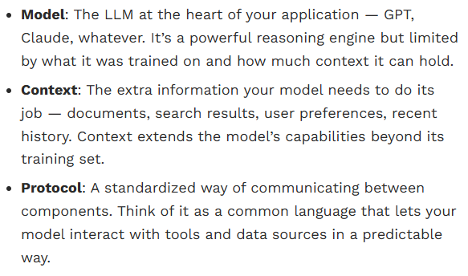

## Purpose

MCP standardizes the connection between AI models and external systems, enabling seamless access to:

- `Data sources`
- `Tools`
- `Workflows`

## What MCP Enables

Using MCP, AI applications (such as ChatGPT or Claude) can connect to:

- **Data Sources**
  - Local files
  - Databases
  - External APIs

- **Tools**
  - Search engines
  - Calculators
  - Custom utilities

- **Workflows**
  - Specialized prompts
  - Automated task flows
  - Contextual pipelines

## Simple Analogy

**MCP is like a USB-C port for AI applications.**

Just as USB-C provides a universal way to connect hardware devices, MCP provides a universal way to connect AI models to external systems and capabilities.

# Architecture of MCP

MCP uses a `client–host–server architecture`, where:

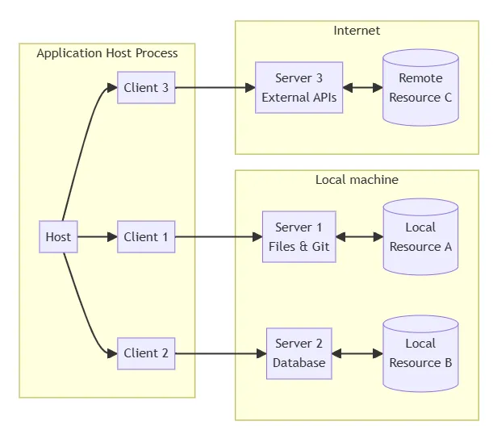

- `Where each host can run multiple client instances`
- `Clients connect to servers to exchange context`
- `Servers tool provider that exposes math functions over MCP via Stdio/SSE.`

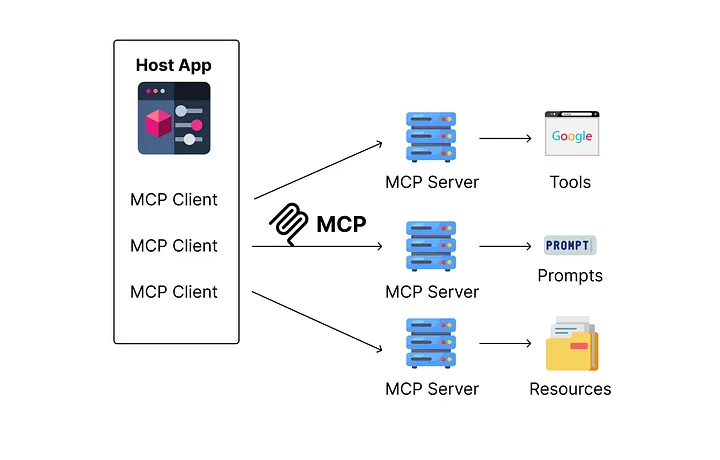

MCP operates on a client-server architecture, in which the clients live inside the host LLM applications and maintain 1-on-1 connections with servers, and the MCP servers act as middleman to external tools/data

This design:

- Makes it easy to integrate AI across different applications
- Keeps **security boundaries** clear
- Separates responsibilities for better isolation

MCP is built on **JSON-RPC** and uses a **stateful session protocol** to:

- Share context efficiently
- Coordinate requests and responses between clients and servers

## Host

The **host** acts as the main controller and coordinator.

Responsibilities:

- Main controller of the system
- Creates and manages multiple clients
- Handles security, permissions, and user consent
- Coordinates AI/LLM usage
- Collects and manages context from all clients

## Clients

**Clients** are created and managed by the host.  
Each client connects to **one specific server (1:1)** and stays isolated from others.

Responsibilities:

- Establish a stateful session with a server
- Talks to the server using MCP rules
- Send and receive MCP messages
- Maintain security boundaries between servers
- Keeps servers isolated and secure

MCP clients are **AI applications or agents** that access external tools, data, or systems.

Key characteristics:

- MCP-compatible (supports prompts, tools, and resources)
- Can connect to any MCP server with minimal setup
- Invokes tools, queries resources, and applies prompts

## Servers

**Servers** provide specialized capabilities and context.
Responsibilities:

- Expose **resources, tools, and prompts**
- Focus on a specific task or system
- Execute tool requests and return results
- Respect security constraints
- Can be local or remote

`One-line summary:`
Host manages → Clients connect → Servers provide capabilities

## MCP Message Types

MCP uses **JSON-RPC 2.0** and defines three message types:

- **Requests** – Messages that ask for an action and expect a response
- **Responses** – Results or errors returned for a request
- **Notifications** – One-way messages with no response needed

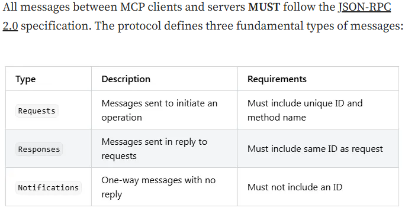

## `JSON-RPC 2.0` in MCP

**JSON-RPC 2.0** is a lightweight, stateless protocol that defines
how two systems communicate using **JSON messages**.
It is not tied to HTTP — it can work over **stdio, HTTP, WebSockets, SSE**, etc.

### Message Structure

All JSON-RPC messages follow a standard structure:

```json
{
  "jsonrpc": "2.0",
  "id": 1,
  "method": "method_name",
  "params": {}
}
```

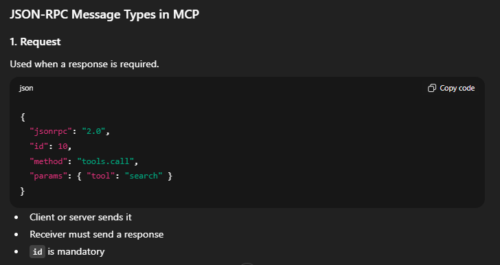

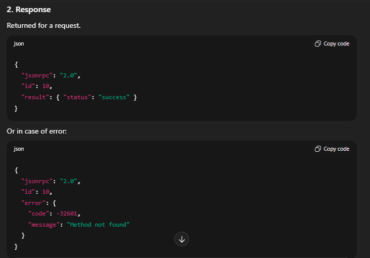

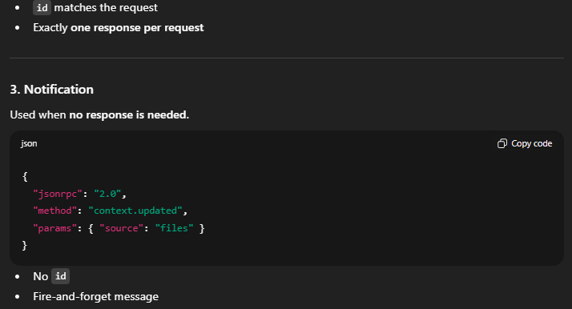

## Capability Negotiation in MCP

MCP uses a `capability-based system` during initialization.

- Clients and servers **declare what they support**
- Only shared capabilities are enabled in the session
- This decides which features, tools, and primitives can be used

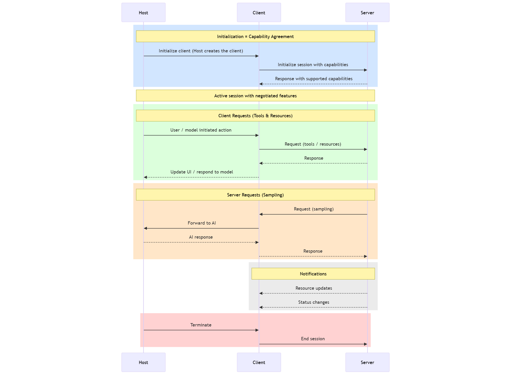

## Capability-Based Flow Explained (Sequence Diagram)

This sequence diagram shows how **MCP’s capability-based system** controls all communication between the **Host**, **Client**, and **Server**.

## 1. Initialization = Capability Agreement

- The **Host** creates the **Client**
- The **Client** starts a session by sending its **supported capabilities**
- The **Server** responds with the capabilities it provides
- MCP enables **only the overlapping capabilities**

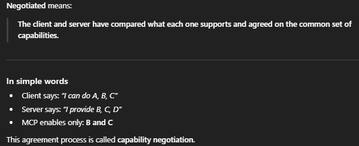

➡️ Result: both sides agree _in advance_ on what actions are allowed.

## 2. Active Session = Rules Are Locked

- Once capabilities are negotiated, the session becomes **active**
- No new features can be used unless negotiated again
- All communication must respect the agreed capabilities

➡️ This ensures safety, predictability, and clear boundaries.

## 3. Client Requests (Tools & Resources)

- A user or model action triggers a request
- The **Client** calls only the **tools/resources declared by the Server**
- The **Server** processes the request and sends a response
- The **Host** updates the UI or responds to the model

➡️ Client **cannot access undeclared tools**.

## 4. Server Requests (Sampling)

- The **Server** may request `sampling` from the model
- This happens **only if the Client declared sampling support**
- The **Client** forwards the request to the AI
- The response flows back through the Client to the Server

➡️ The server never talks to the model directly.

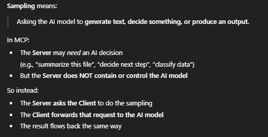

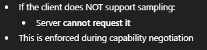

## 5. Notifications (One-Way Updates)

- The **Server** sends updates (resource or status changes)
- Notifications are allowed **only if both sides agreed**
- No response is required

➡️ Lightweight communication within capability limits.

## 6. Termination

- The **Host** ends the session
- The **Client** cleanly disconnects from the **Server**

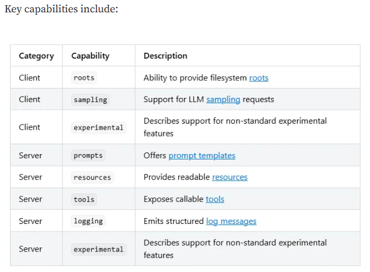

➡️ All interactions stop under defined rules.

## Key Takeaways (Easy to Remember)

- **Handshake first** → declare capabilities
- **Only shared features work**
- **Clients call tools, servers execute them**
- **Servers request sampling via clients**
- **Notifications are optional and one-way**
- **Everything follows the agreed capabilities**

# MCP MIND MAP

Model Context Protocol Mind Map illustrates basic concepts :


# API vs MCP: What’s the Difference?

## APIs (Application Programming Interfaces)

APIs are a core part of software development.  
They allow applications to **communicate over HTTP** using well-defined endpoints and structured data formats like **JSON** or **XML**.

### Example API Request

```http
GET https://api.weather.com/v1/current?city=Bareilly

```

- What Developers Must Do

- Know the correct endpoint

- Send the request in the right format

- Read and understand the API documentation (Swagger / OpenAPI)

- Parse the response manually in code

## MCP Is Built for Language Models to Use Tools Autonomously

Imagine working with an LLM like GPT-4, Claude, or Gemma and asking:

```
What’s the weather in Bareilly?
```

By default, the model does **not** have real-time weather data  
(in our case, using Ollama with Llama 3.2).

With **MCP**, the model can:

- Discover an external tool automatically
- Understand the tool’s input/output schema
- Format the request correctly
- Call the tool in a structured way
- Interpret the response on its own

MCP turns a traditional API into a **model-friendly tool** with:

- Auto-discovery
- Predictable schemas
- Structured, reliable interaction

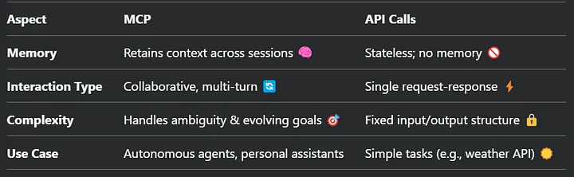

## Simple Analogy

```md
API = A toolbox  
MCP = A smart assistant that knows how to use the tools
```

# Tools in MCP

The **Model Context Protocol (MCP)** allows servers to expose **tools** that language models can call.

A **tool** lets a model interact with the outside world, such as:

- Querying databases
- Calling external APIs
- Performing calculations or logic

Each tool:

- Has a **unique name**
- Includes **metadata and a schema** describing its inputs and outputs

## Tool Definition in MCP

A **tool definition** describes how a tool can be discovered and used by a language model.

It includes the following fields:

- **name**  
  Unique identifier used by the protocol to reference the tool

- **title** _(optional)_  
  Human-readable name for display in UIs

- **description**  
  Explains what the tool does in plain language

- **inputSchema**  
  JSON Schema that defines the expected input parameters

- **outputSchema** _(optional)_  
  JSON Schema that defines the structure of the tool’s output

- **annotations** _(optional)_  
  Additional metadata describing tool behavior or special handling

---

### Key Idea

````md
Tool definitions tell models **what a tool is**, **how to call it**, and **what to expect back**.

## User Interaction Model

Tools in MCP are **model-controlled**.

This means:

- The language model can **discover tools automatically**
- The model decides **when and how** to invoke them based on the user’s prompt and context

However:

- MCP does **not** force a specific UI or interaction pattern
- Applications are free to expose tools through:
  - Chat interfaces
  - Buttons
  - Forms
  - Or fully automatic flows

## Declaring Tool Capability in MCP

Servers that support **tools** must declare this capability during initialization.

### Example Capability Declaration

```json
{
  "capabilities": {
    "tools": {
      "listChanged": true
    }
  }
}
```
````

What listChanged Means

- `true` → The server will send notifications when the available tools change

- `false` → The tool list is static and will not change during the session

# Protocol message

## 1) Listening Tool

To discover available tools, clients send a tools/list request. This operation supports pagination.

```json
Request:

{
  "jsonrpc": "2.0",
  "id": 1,
  "method": "tools/list",
  "params": {
    "cursor": "optional-cursor-value"
  }
}
```

```json
Response:

{
  "jsonrpc": "2.0",
  "id": 1,
  "result": {
    "tools": [
      {
        "name": "get_weather",
        "title": "Weather Information Provider",
        "description": "Get current weather information for a location",
        "inputSchema": {
          "type": "object",
          "properties": {
            "location": {
              "type": "string",
              "description": "City name or zip code"
            }
          },
          "required": ["location"]
        }
      }
    ],
    "nextCursor": "next-page-cursor"
  }
}

```

## 2) Calling Tools

To invoke a tool, clients send a tools/call request:

```json
Request:

{
  "jsonrpc": "2.0",
  "id": 2,
  "method": "tools/call",
  "params": {
    "name": "get_weather",
    "arguments": {
      "location": "New York"
    }
  }
}
```

```json
Response:

{
  "jsonrpc": "2.0",
  "id": 2,
  "result": {
    "content": [
      {
        "type": "text",
        "text": "Current weather in New York:\nTemperature: 72°F\nConditions: Partly cloudy"
      }
    ],
    "isError": false
  }
}
```

## 3) List Changed Notification

When the list of available tools changes, servers that declared the listChanged capability SHOULD send a notification

```json
{
  "jsonrpc": "2.0",
  "method": "notifications/tools/list_changed"
}
```

## 4) Message Flow

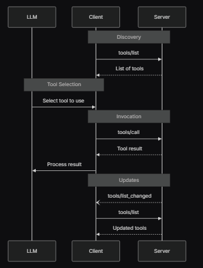

# Code

## 🚀 Running an MCP Server (FastMCP) – Step by Step

This project uses **Model Context Protocol (MCP)** with **FastMCP** to expose Python functions as tools over **STDIO**.

## 📦 Required Python Packages

To run `app.py`, you need the MCP core package and CLI tools.

### 1️⃣ Install MCP (Required)

```bash
pip install mcp
```

This installs:

- mcp.server.fastmcp
- MCP runtime libraries

```bash
pip install "mcp[cli]"
```

This adds:

- mcp dev command
- MCP Inspector support
- Development utilities

⚠️ Without this, you cannot use the MCP Inspector UI.

```python
from mcp.server.fastmcp import FastMCP

mcp = FastMCP("SimpleServer")

@mcp.tool()
def hello_world(name: str = "World"):
    return {"message": f"Hello, {name}!"}

@mcp.tool()
def add(a: int, b: int):
    return a + b

if __name__ == "__main__":
    mcp.run("stdio")

```

```python
mcp dev app.py
```

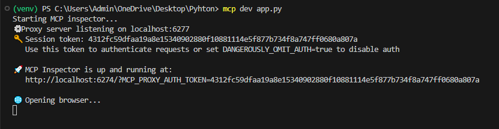

This:

- Starts the MCP server
- Exposes tools over STDIO
- Allows inspection via MCP Inspector

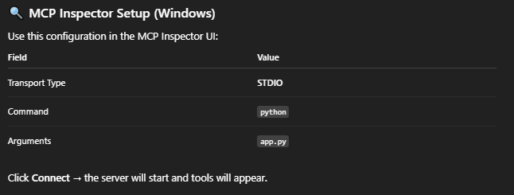

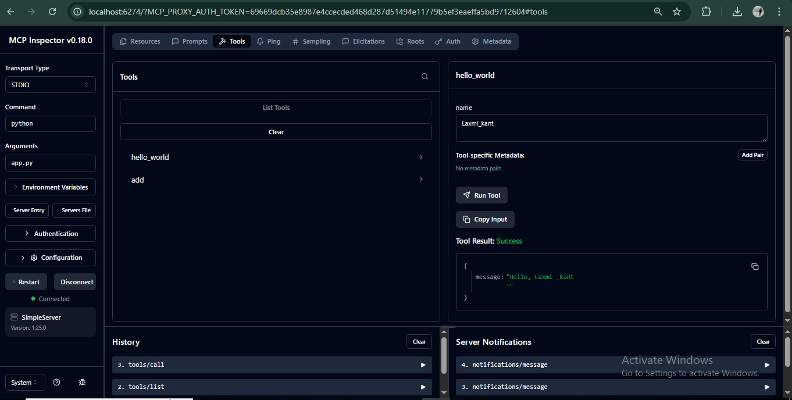

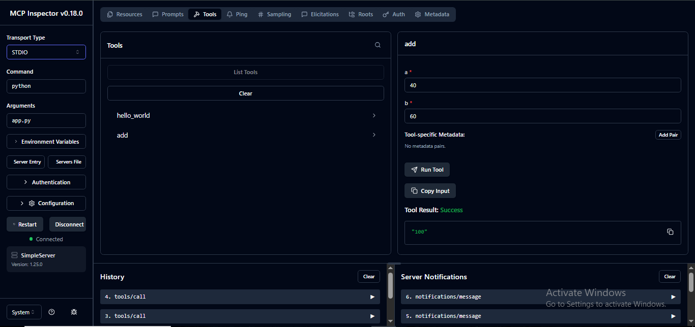

# 🏗️ Code Implementation

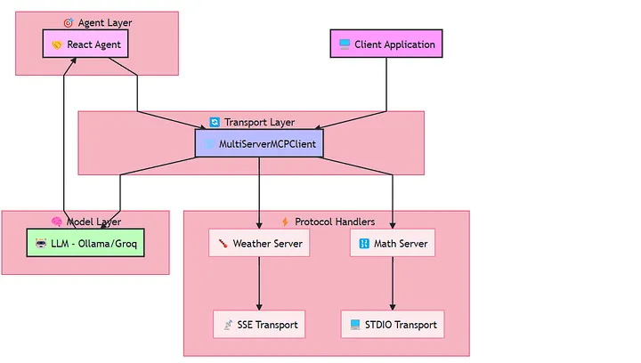

## Multi-Server MCP System Overview

This implementation demonstrates a **multi-server MCP architecture** where different tasks are handled by specialized servers using different transport protocols.

---

## Key Layers in the System

### Agent Layer

- Contains a **ReAct Agent**
- Drives reasoning and decides when to call tools
- Interacts with the model and MCP client

---

### Model Layer

- Uses an **LLM (e.g., Ollama / Groq)**
- Handles reasoning, planning, and decision-making
- Does not directly access external systems

---

### Transport Layer

- Uses a **MultiServerMCPClient**
- Acts as a central connector between agents and servers
- Manages communication across multiple MCP servers
- Abstracts transport differences from the agent

---

### Protocol Handlers (Servers)

- **Weather Server**
  - Handles weather-related operations
  - Communicates via **SSE (Server-Sent Events)**
- **Math Server**
  - Handles mathematical computations
  - Communicates via **STDIO**

Each server is focused on a **single responsibility**.

---

### Client Application

- Provides the user-facing interface
- Sends user requests into the system
- Receives final responses from the agent

---

## Main Takeaways (Easy to Remember)

- One **agent** can use **multiple servers**
- Each server can use a **different transport**
- MCP cleanly separates:
  - Reasoning (LLM)
  - Coordination (Client)
  - Execution (Servers)
- Transport details are hidden from the agent
- System is modular, scalable, and secure

# CODE FILES :

## A) Create Servers

## 1. Math Server -> math_server.py

```python
from mcp.server.fastmcp import FastMCP

# =====================================================
# PROTOCOL HANDLER + SERVER RUNTIME
# - FastMCP implements the MCP protocol
# - Handles tool registration, message parsing,
#   request/response framing
# =====================================================
mcp = FastMCP("Math")

# =====================================================
# TOOL DEFINITIONS (SERVER-SIDE CAPABILITIES)
# - These are exposed to the agent via MCP
# =====================================================
@mcp.tool()
def add(a: int, b: int) -> int:
    """Add two numbers"""
    return a + b

@mcp.tool()
def multiply(a: int, b: int) -> int:
    """Multiply two numbers"""
    return a * b

if __name__ == "__main__":

    # =====================================================
    # TRANSPORT LAYER
    # - stdio = local process communication
    # - Used for local tools / sandboxed execution
    #
    # FLOW STEP:
    # (3) Client launches this process
    # (4) MCP protocol handshake happens over stdio
    # =====================================================
    mcp.run(transport="stdio")

```

# Math MCP Tool Server (stdio)

This file defines a `tool provider` that exposes simple math functions to LLM agents using **Model Context Protocol (MCP)** over **stdio**.

## 📌 What This File Is

- An **MCP server**
- Provides **math tools** (e.g. `add`)
- Communicates via **stdin / stdout**
- Designed to be **launched automatically**, not run manually

## 🧠 Core Concept

```python
from mcp.server.fastmcp import FastMCP

mcp = FastMCP("Math")

# Creates an MCP server named Math
# This name is what clients see
```

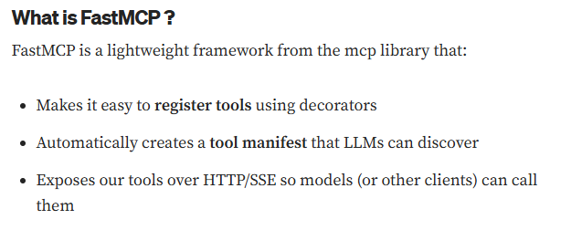

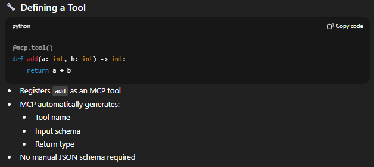

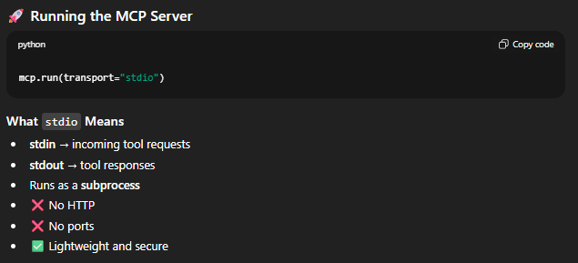

## 2. Weather Server -> weather.py

```python
from typing import Any
import httpx
from mcp.server.fastmcp import FastMCP

# =====================================================
# PROTOCOL HANDLER + SERVER
# - MCP server that exposes weather tools remotely
# =====================================================
mcp = FastMCP("weather")

# =====================================================
# EXTERNAL API CONFIG
# =====================================================
NWS_API_BASE = "https://api.weather.gov"
USER_AGENT = "weather-app/1.0"

# =====================================================
# INTERNAL HELPER (NOT EXPOSED AS TOOL)
# =====================================================
async def make_nws_request(url: str) -> dict[str, Any] | None:
    """Make a request to the NWS API with proper error handling."""
    headers = {
        "User-Agent": USER_AGENT,
        "Accept": "application/geo+json"
    }
    async with httpx.AsyncClient() as client:
        try:
            response = await client.get(url, headers=headers, timeout=30.0)
            response.raise_for_status()
            return response.json()
        except Exception:
            return None


def format_alert(feature: dict) -> str:
    """Format an alert feature into a readable string."""
    props = feature["properties"]
    return f"""
Event: {props.get('event', 'Unknown')}
Area: {props.get('areaDesc', 'Unknown')}
Severity: {props.get('severity', 'Unknown')}
Description: {props.get('description', 'No description available')}
Instructions: {props.get('instruction', 'No specific instructions provided')}
"""

# =====================================================
# TOOL 1: WEATHER ALERTS
# =====================================================
@mcp.tool()
async def get_alerts(state: str) -> str:
    """Get weather alerts for a US state.

    Args:
        state: Two-letter US state code (e.g. CA, NY)
    """
    url = f"{NWS_API_BASE}/alerts/active/area/{state}"
    data = await make_nws_request(url)

    if not data or "features" not in data:
        return "Unable to fetch alerts or no alerts found."

    if not data["features"]:
        return "No active alerts for this state."

    alerts = [format_alert(feature) for feature in data["features"]]
    return "\n---\n".join(alerts)

# =====================================================
# TOOL 2: WEATHER FORECAST
# =====================================================
@mcp.tool()
async def get_forecast(latitude: float, longitude: float) -> str:
    """Get weather forecast for a location.

    Args:
        latitude: Latitude of the location
        longitude: Longitude of the location
    """
    # First get the forecast grid endpoint
    points_url = f"{NWS_API_BASE}/points/{latitude},{longitude}"
    points_data = await make_nws_request(points_url)

    if not points_data:
        return "Unable to fetch forecast data for this location."

    # Get the forecast URL from the points response
    forecast_url = points_data["properties"]["forecast"]
    forecast_data = await make_nws_request(forecast_url)

    if not forecast_data:
        return "Unable to fetch detailed forecast."

    # Format the periods into a readable forecast
    periods = forecast_data["properties"]["periods"]
    forecasts = []
    for period in periods[:5]:  # Only show next 5 periods
        forecast = f"""
{period['name']}:
Temperature: {period['temperature']}°{period['temperatureUnit']}
Wind: {period['windSpeed']} {period['windDirection']}
Forecast: {period['detailedForecast']}
"""
        forecasts.append(forecast)

    return "\n---\n".join(forecasts)


if __name__ == "__main__":

    # =====================================================
    # TRANSPORT LAYER
    # - SSE (Server-Sent Events)
    # - Remote-capable HTTP streaming server
    #
    # FLOW STEP:
    # (2) Weather server started independently
    # (3) Client connects over HTTP/SSE
    # =====================================================
    mcp.run(transport='sse')
```

# Weather MCP Server (SSE / HTTP Streaming)

This file defines a **remote-capable server** that exposes **weather-related tools** using **Server-Sent Events (SSE)** over HTTP.

Unlike stdio-based MCP servers, this server runs as a **long-lived HTTP service** and supports **multiple remote clients**.

## 🌦️ What This File Is

- An **MCP server** for weather data
- Exposes tools over **HTTP**
- Uses **SSE (Server-Sent Events)** for streaming responses
- Can be accessed **locally or remotely**

## 🔁 Key Difference vs Math MCP Server

| Feature   | Math Server    | Weather Server   |
| --------- | -------------- | ---------------- |
| Transport | `stdio`        | `sse`            |
| Protocol  | stdin / stdout | HTTP             |
| Network   | No             | Yes              |
| Startup   | Auto-spawned   | Manually started |
| Clients   | Single         | Multiple         |
| Streaming | No             | Yes              |

## 🚀 Running the MCP Server

## B) Create client -> langchain_mcp_multiserver.py

```python
import asyncio
from mcp import ClientSession, StdioServerParameters
from mcp.client.stdio import stdio_client
from IPython.display import display, Markdown
from langchain_core.messages import HumanMessage, ToolMessage, AIMessage
from langchain_mcp_adapters.tools import load_mcp_tools
from langgraph.prebuilt import create_react_agent
from langchain_mcp_adapters.client import MultiServerMCPClient
#from langchain_azure_ai.chat_models import AzureAIChatCompletionsModel
from langchain_groq import ChatGroq
from langchain_ollama import ChatOllama
from langchain_core.prompts import PromptTemplate
from dotenv import load_dotenv

load_dotenv()

# model = ChatGroq(model="llama-3.3-70b-versatile",temperature=0.5)
# model = ChatOllama(model="llama3.2:1b",temperature=0.0,max_new_tokens=500)

# =====================================================
# MODEL LAYER
# - This is the LLM brain
# - Decides which tool to call
# =====================================================
model = ChatOllama(
    model="llama3.2:3b",
    temperature=0.0,
    max_new_tokens=500
)


server_params = StdioServerParameters(
    command="python",
    # Make sure to update to the full absolute path to your math_server.py file
    args=["weather.py"],
)


# =====================================================
# CLIENT APPLICATION (ENTRY POINT)
# - You type the query here
# =====================================================
async def run_app(user_question):
    # =====================================================
    # MCP CLIENT (MULTI-SERVER)
    # - Connects to multiple MCP servers
    # - Handles protocol + transport negotiation
    #
    # SERVERS:
    # 1. Weather → SSE (remote HTTP)
    # 2. Math    → stdio (local process)
    # =====================================================
    client = MultiServerMCPClient(
        {
            "weather": {
                "url": "http://127.0.0.1:8000/sse",
                "transport": "sse",
            },
            "math": {
                "command": "python",
                "args": ["math_server.py"],
                "transport": "stdio",
            },
        }
    )

    # Load MCP tools
    tools = await client.get_tools()

    # =====================================================
    # AGENT LAYER
    # - ReAct agent
    # - Uses LLM + tools
    # =====================================================
    agent = create_react_agent(model, tools)

    # =====================================================
    # FLOW STEP BREAKDOWN
    #
    # (1) User enters query
    # (2) Agent sends prompt to LLM
    # (3) LLM reasons about intent
    # (4) LLM decides tool call
    # (5) MCP client routes request
    # (6) Transport layer sends request
    # (7) Tool executes on server
    # (8) Tool result returns via MCP
    # (9) LLM produces final answer
    # =====================================================
    agent_response = await agent.ainvoke(
        {"messages": user_question}
    )

    return agent_response["messages"][-1].content


if __name__ == "__main__":
    # =====================================================
    # APPLICATION START
    # =====================================================
    #user_question = "what is the weather in california?"
    user_question = "what's (3 + 5) x 12?"
    #user_question = "what's the weather in seattle?"
    # user_question = "what's the weather in INDIA?"
    response = asyncio.run(run_app(user_question=user_question))
    print(response)

```

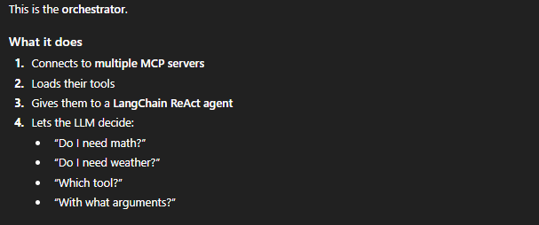

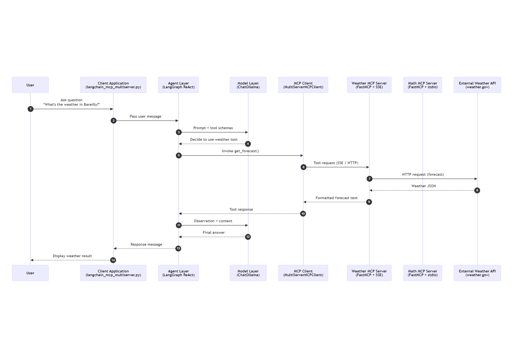

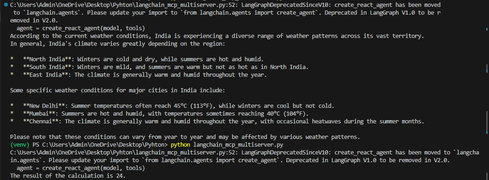

`Note here the MCP Client is able to make connections to respective servers based on the question asked. We did not explicitly mention any routing logic.`

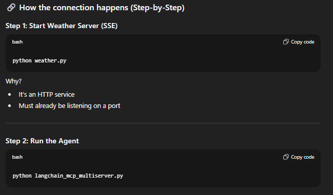

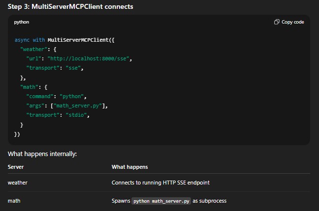

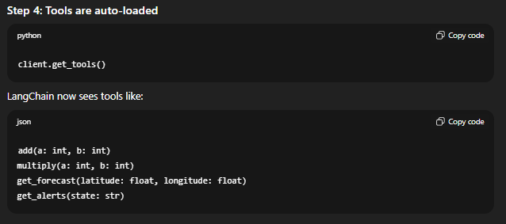

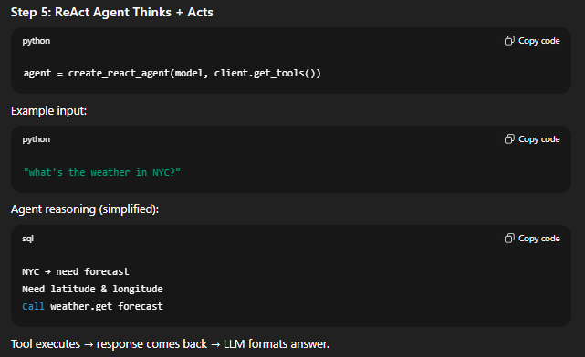
