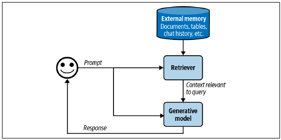
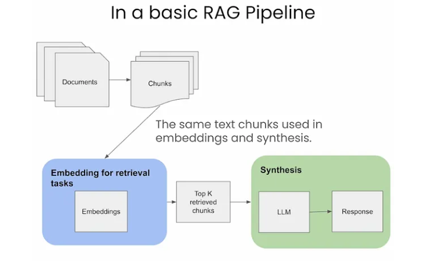
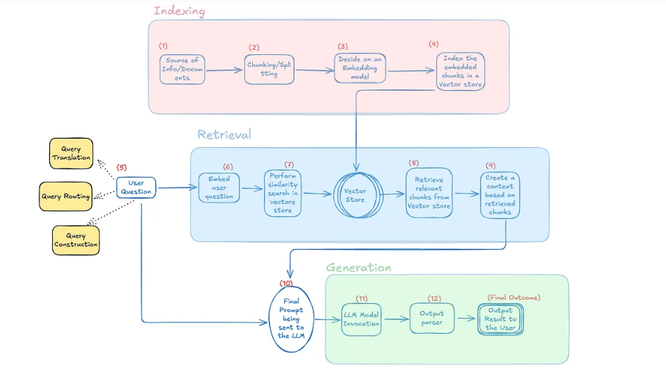
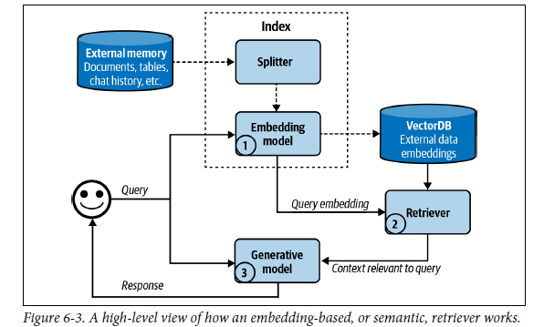
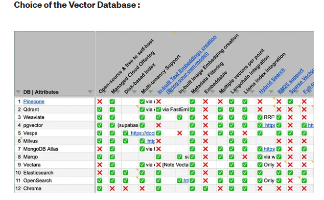
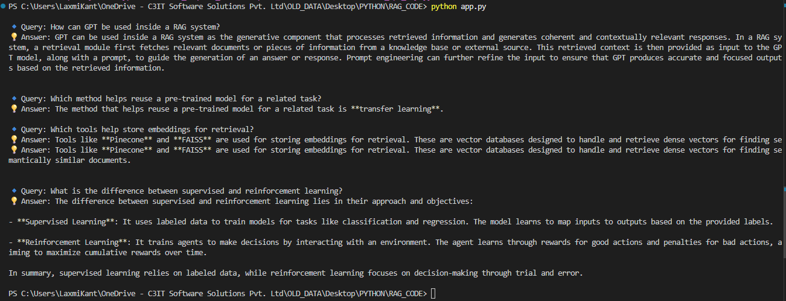
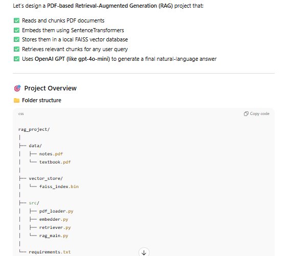

---

# 🤯 Understanding AI Hallucination and How to Reduce It

## What is a Hallucination?

**AI hallucination** occurs when a model **produces incorrect, fabricated, or nonsensical information** that appears plausible or confident but is not grounded in facts or context.

For example:

> A model might confidently state that _Einstein won the Nobel Prize in Physics for the Theory of Relativity_, which is false — he actually won it for the _photoelectric effect_.

### 🧩 Causes of Hallucination

1. **Lack of context** – The model doesn't have access to relevant information.
2. **Ambiguous or vague prompts** – The instructions are unclear or missing details.
3. **Training data limitations** – The model wasn’t trained on the specific facts or domain needed.
4. **Overconfidence** – The model is trained to produce fluent text, not to verify truth.

---

## 🧠 Ways to Reduce or Solve Hallucination

### 1. **RAG (Retrieval-Augmented Generation)**

RAG integrates **retrieval mechanisms** into the generation process.

- The model first **retrieves relevant information** from external sources (databases, documents, web).
- Then it **generates responses grounded** in that retrieved context.  
  ✅ **Reduces hallucinations** by giving the model access to verified, up-to-date facts.

---

### 2. **Prompt Engineering**

Prompt engineering means designing the **input prompt** carefully to guide the model’s reasoning.  
Effective prompt strategies include:

- Being **specific and detailed**.
- Asking the model to **show reasoning** (“step by step”).
- Using **structured templates** or **system prompts** to control tone and scope.  
  ✅ Helps reduce ambiguity and steer the model toward factual, consistent outputs.

---

### 3. **Agentic Pattern (AI Agents)**

Agents can **use external tools** (like web search, APIs, or databases) to gather real data before answering.

- They can **check facts dynamically**.
- Can **plan and verify** their steps before producing the final answer.  
  ✅ Reduces hallucination by grounding responses in real-time, external information.

---

### 4. **Knowledge Grounding**

Ground the model’s answers in **trusted knowledge bases** such as:

- Internal enterprise databases
- Wikipedia or domain-specific datasets
- Verified document stores (e.g., vector databases like Pinecone, FAISS, or Chroma)  
  ✅ Ensures factual consistency across outputs.

---

### 5. **Post-Processing and Verification**

Use secondary models or rules to **evaluate and verify** model outputs:

- **Fact-checking models** (e.g., another LLM to review responses)
- **Human-in-the-loop** review systems
  ✅ Adds a quality control layer to catch hallucinations before final output.

---

### 6. **Fine-Tuning and Instruction Tuning**

Train the model on **high-quality, domain-specific data** or **factual QA pairs**.  
✅ Improves accuracy within specialized domains and reduces reliance on “guessing.”

---

## 🧾 Summary

| Method                  | Description                                  | Effectiveness        |
| ----------------------- | -------------------------------------------- | -------------------- |
| **RAG**                 | Retrieves external context before generating | 🔹 High              |
| **Prompt Engineering**  | Improves clarity and guidance                | 🔹 Medium            |
| **Agentic Pattern**     | Uses tools and APIs to verify info           | 🔹 High              |
| **Knowledge Grounding** | Anchors responses in trusted data            | 🔹 High              |
| **Post-Processing**     | Fact-checks and validates outputs            | 🔹 Medium            |
| **Fine-Tuning**         | Trains model on domain data                  | 🔹 High (but costly) |

---

> **In short:** Hallucinations happen when the model doesn’t “know,” but still tries to “sound right.”  
> The best defense is **grounding**, **clarity**, and **verification** — through methods like **RAG**, **agents**, and **prompt engineering**.

---

# ✧˖° Context Construction in AI Models

To solve a task, a model needs both **the instructions** on how to do it and **the necessary information** to do so.  
AI models are more likely to make mistakes and hallucinate when they are missing context.

For a given application:

- **Instructions** are common to all queries.
- **Context** is specific to each query.

---

## Patterns for Context Construction

Two dominant patterns for constructing context are **RAG (Retrieval-Augmented Generation)** and **Agentic Systems**.

### 🧠 Retrieval-Augmented Generation (RAG)

The **RAG pattern** allows the model to retrieve relevant information from external data sources.  
It is chiefly used for **context construction** — enabling the model to ground its responses in retrieved facts.

### 🤖 Agentic Pattern

The **agentic pattern** can do much more than just context construction.  
It allows the model to **use tools** such as:

- Web search
- News APIs
- Other external systems

Through these tools, the model can dynamically gather information, take actions, and reason across multiple steps to accomplish complex goals.

---

# 🧠 Retrieval-Augmented Generation (RAG)

**RAG** is a technique that enhances a model’s generation by **retrieving relevant information from external memory sources**.  
An external memory source can include:

- An internal database
- A user’s previous chat sessions
- The internet

---

### 📖 Origin of the Retrieve-Then-Generate Pattern

The **retrieve-then-generate** pattern was first introduced in

> “Reading Wikipedia to Answer Open-Domain Questions”.

In this work:

1. The system first **retrieves five Wikipedia pages** most relevant to a question.
2. Then, a model **uses (or reads)** the information from these pages to **generate an answer**.

---

### ⚙️ How RAG Works

With RAG:

- Only the information **most relevant to the query**, as determined by the **retriever**, is fetched and passed to the model.
- The model then uses this retrieved context to **generate a more accurate and informed response**.

---

### 🎯 Benefits

Research by **Lewis et al.** found that:

- Having access to relevant information helps the model **generate more detailed responses**.
- It also significantly **reduces hallucinations** and improves factual accuracy.

---

# 👾 RAG Architecture





## Overview

A **RAG (Retrieval-Augmented Generation)** system has two main components:

1. **Retriever** – Retrieves relevant information from external memory sources (e.g., databases, documents, the web).
2. **Generator** – Uses the retrieved information to generate a meaningful and accurate response.

---

## 🔍 Importance of the Retriever

The **success of a RAG system** largely depends on how well its retriever performs.

A retriever has **two key functions**:

### 1. Indexing

- Processes and organizes data so that it can be **quickly retrieved** later.
- The method of indexing depends on **how you plan to search or query** the data later on.

### 2. Querying

- Sends a query to **find data relevant** to a given question or prompt.
- Works by comparing the query with indexed data to locate the **most relevant pieces** of information.

---

## ⚙️ How a RAG System Works (Example)

### Scenario

Imagine a company with a database containing:

- Memos
- Contracts
- Meeting notes

You want to build a **chatbot** that answers employee questions such as:

> “What was decided in the last product strategy meeting?”

---

### 🧩 Indexing Phase

1. The retriever processes all company documents and converts them into **embeddings** (numerical representations of meaning).
2. These embeddings are stored in a **vector database** (e.g., Pinecone, FAISS, or Milvus).
3. This setup allows for **semantic search**, enabling retrieval based on meaning instead of simple keyword matching.

---

### 🔎 Querying Phase

1. When an employee asks a question, the retriever converts the query into an **embedding**.
2. It compares the query embedding with document embeddings in the vector database.
3. The retriever identifies the **most relevant documents**, such as the latest meeting notes related to product strategy.
4. These documents are sent to the **generator model (e.g., GPT)**.
5. The generator reads them and produces a **precise, contextual answer**.

---

## ✅ Summary

- **Retriever:** Finds and provides relevant information.
- **Generator:** Produces the final, coherent response.
- **RAG systems** combine both to create AI solutions that are **accurate, context-aware, and powerful**.

---

# 📘 Retrieval Algorithms in RAG Systems

Retrieval algorithms are fundamental to **Retrieval-Augmented Generation (RAG)** systems.  
They determine how relevant documents or data chunks are retrieved based on a given query.

There are **two main types** of retrieval mechanisms:

1. **Term-based Retrieval (Lexical Retrieval)**
2. **Embedding-based Retrieval (Semantic Retrieval)**

---

## 🧩 1. Term-based Retrieval

Term-based retrieval, also called **lexical retrieval**, finds documents that contain **specific keywords** from the query.

### 🔍 Example

If the query is `"AI engineering"`,  
the retriever will return all documents containing the term `"AI engineering"`.

### ⚠️ Problems with Term-based Retrieval

1. **Over-selection** — Many documents might contain the term,  
   making it difficult to include all of them as context.

2. **Lack of semantic understanding** —  
   The model only matches words, not meanings.

### 🧮 Term Frequency (TF)

A heuristic often used is **Term Frequency (TF)**:

> The number of times a term appears in a document.  
> Documents with higher term frequency are assumed to be more relevant.

This approach ranks documents based on **how many times** a keyword occurs.

---

## 🧠 2. Embedding-based Retrieval

Term-based retrieval operates at a **lexical level** (surface text),  
while **embedding-based retrieval** works at a **semantic level** (meaning).

### ✨ Why It’s Better

Embedding-based retrieval captures the **meaning** of text rather than its appearance.

**Example:**
A query `"transformer architecture"` may return:

- ❌ Electric transformer documents (wrong meaning)
- ✅ NLP transformer model papers (correct meaning)

Semantic retrieval ensures results **align with the user’s intent.**

---

### ⚙️ Workflow of Embedding-based Retrieval



Embedding-based retrieval involves two main steps:

1. **Embedding Model**

   - Converts both **documents** and the **query** into embeddings (numerical vectors).
   - The same model is used for both indexing and querying.

2. **Retriever**
   - Fetches the top **k data chunks** whose embeddings are closest to the query embedding.
   - The number of chunks (`k`) depends on the **use case** and **model constraints**.

---

### 🗂️ Vector Databases

An embedding-based retriever stores all embeddings in a **Vector Database**.

- A **vector database** stores embeddings (vectors).
- It must efficiently perform **vector search** to find vectors **closest** to the query.

### 🧮 Vector Search (Nearest Neighbor Search)

Given a query embedding, the vector database finds vectors **most similar** to it.

#### Steps:

1. Compute similarity between the query vector and all stored vectors.
   - Common metrics: **Cosine Similarity**, **Euclidean Distance**.
2. Rank vectors by similarity scores.
3. Return top **k nearest vectors**.

This is known as the **k-Nearest Neighbors (k-NN)** search.



---

### 🧰 Real-world Considerations

Modern semantic retrieval systems often include:

- **Rerankers** → Reorder retrieved results for higher relevance.
- **Caches** → Store frequent queries to reduce latency.
- **Hybrid retrieval** → Combine term-based + semantic retrieval.

### 🔁 Reranking Retrieved Results

After the retriever fetches potential documents, a **reranker model** (often a smaller LLM or cross-encoder) can **re-evaluate relevance** more precisely.

- Example: Using `cross-encoder/ms-marco` or a fine-tuned BERT reranker.
- The reranker scores retrieved documents against the query.
- The top results are passed to the generator for final answer synthesis.

✅ **Benefit:** Improves answer accuracy by ensuring only highly relevant documents are used.

### ⚙️ Caching & Memory Optimization

For scalable RAG deployments:

- Cache frequent query embeddings to reduce latency.
- Pre-compute embeddings for static documents.
- Use **vector index pruning** to remove outdated or irrelevant vectors.

This ensures efficient retrieval at scale and prevents redundant computation.

### ⚡ Hybrid Retrieval

While embedding-based retrieval excels at understanding semantics, term-based retrieval can sometimes capture **exact keyword matches** that embeddings miss.

**Hybrid retrieval** combines both approaches:

1. Use a **lexical retriever** (e.g., BM25) to capture keyword matches.
2. Use a **semantic retriever** (e.g., FAISS or Chroma) to capture conceptual matches.
3. Merge and re-rank the results for better accuracy.

This method provides the **best of both worlds** — factual precision from lexical search and contextual understanding from semantic search.

✅ **Benefit:** Improves answer accuracy by ensuring only highly relevant documents are used.

---

### 🧩 Where Vector Search is Used

Vector search is not unique to RAG — it powers many AI systems, such as:

- Search Engines
- Recommendation Systems
- Fraud Detection
- Information Retrieval
- Clustering
- Data Organization

---

### 📊 Evaluating RAG Performance

To assess RAG effectiveness, measure:

- **Precision@k:** Percentage of retrieved documents that are relevant.
- **Recall@k:** Percentage of all relevant documents that were retrieved.
- **F1 score:** Harmonic mean of precision and recall.
- **Context relevance:** Human or model-based scoring of how well the retrieved context supports the answer.
- **Latency:** Time taken for retrieval and generation.

These metrics help optimize retrievers, embeddings, and chunking logic.

---

### 🌐 Multi-Source RAG

Advanced RAG systems can pull context from **multiple data sources**, such as:

- Company documents (internal knowledge base)
- Live APIs or web data
- Structured databases (SQL)
- Unstructured data (PDFs, web pages)

These are merged into a unified **retrieval pipeline**, allowing the model to answer both static and dynamic questions effectively.

---

### 🔄 End-to-End RAG Flow

1. **Input Query** → User asks a question.
2. **Embedding Creation** → Convert query into a vector.
3. **Retriever** → Search the vector database for similar document embeddings.
4. **Top-k Results** → Retrieve the most relevant chunks.
5. **Generator (LLM)** → Use retrieved context to generate a factual response.
6. **(Optional) Reranker or Cache** → Reorder or store results for future use.

---

## 🧠 Summary

| Retrieval Type      | Works On      | Uses             | Pros                    | Cons             |
| ------------------- | ------------- | ---------------- | ----------------------- | ---------------- |
| **Term-based**      | Keywords      | Lexical match    | Fast, simple            | No semantics     |
| **Embedding-based** | Meaning       | Semantic search  | Accurate, context-aware | Needs good model |
| **Hybrid**          | Both          | Combined         | Best precision + recall | More compute     |
| **Reranked**        | Top-k results | Final refinement | Highest accuracy        | Slower           |

---

> 💡 _“Semantic retrieval understands what you mean — not just what you type.”_

---

### 🏁 Key Takeaways

- Term-based retrieval is **keyword-based** and counts term frequency.
- Embedding-based retrieval is **meaning-based** and uses vector similarity.
- Vector databases enable **efficient semantic search**.
- Real-world systems use **rerankers**, **caches**, and sometimes **hybrid methods** for best results.

---

> 💡 _“Semantic retrieval understands what you mean — not just what you type.”_

# ✅ Final Takeaway

A robust **RAG pipeline** should include:

- Smart **chunking and embedding**
- Efficient **vector storage and retrieval**
- **Hybrid retrieval + reranking** for precision
- **Caching and evaluation metrics** for optimization
- **Multi-source integration** for broader knowledge coverage

Together, these ensure **grounded, factual, and scalable** AI systems.

---

# SAMPLE CODES RELATED TO RAG

### 🧩 Why We Use These Components

- **SentenceTransformer** → Converts text into high-dimensional embeddings (vectors) that capture meaning, enabling semantic search rather than simple keyword matching.
- **FAISS (Facebook AI Similarity Search)** → Provides a fast and efficient way to compare embeddings and find the most similar documents from large datasets.
- **Index** →
  The **`index`** is a FAISS data structure that stores all document embeddings.  
  It acts like a searchable database — when a query embedding is provided,  
  the index quickly finds the most similar document vectors based on distance (similarity).  
  In this project, `IndexFlatL2` is used to build the `index` using Euclidean distance.
- **IndexFlatL2** → A simple FAISS index type that uses Euclidean (L2) distance to measure similarity between vectors, ideal for small to medium-scale projects and easy to understand.

## SAMPLE CODE 1 :- RAG System Example

```python
"""
This script demonstrates a simple Retrieval-Augmented Generation (RAG) system
using embedding-based retrieval and a simple generator.

Features:
- Document indexing
- Querying
- Embedding-based retrieval
- Generating answer from retrieved documents
"""
# SentenceTransformer → Converts text into embeddings (vectors). Think of it as turning words into numbers so the computer can compare meanings.

# faiss → Library for fast vector search. Think of it as a super-fast library index in a library that finds nearest pages.

# numpy → For numerical operations. Needed to handle embeddings as arrays.
from sentence_transformers import SentenceTransformer
import faiss
import numpy as np

# -------------------------------
# Step 1: Sample documents
# -------------------------------
documents = [
    "RAG stands for Retrieval-Augmented Generation.",
    "Retriever finds relevant information from external sources.",
    "Generator creates human-like answers using retrieved information.",
    "Indexing organizes data for faster retrieval.",
    "Querying searches for the most relevant data chunks.",
    "Embedding-based retrieval uses semantic similarity rather than exact keywords."
]

print("\n[INFO] We have prepared a small set of example documents that the system can refer to:")

for i, doc in enumerate(documents):
    print(f"Document {i+1}: {doc}")

# -------------------------------
# Step 2: Create embeddings for documents
# -------------------------------
print("\n[INFO] We are loading a language model to understand the meaning of each document...")
model = SentenceTransformer('all-MiniLM-L6-v2')
print("[INFO] Model loaded! The system can now convert sentences into numbers (embeddings) that a computer can understand.")

print("\n[INFO] Converting our example documents into embeddings...")
doc_embeddings = model.encode(documents, convert_to_numpy=True)
print(f"[INFO] Done! Each document is now represented as a vector with {doc_embeddings.shape[1]} dimensions.")
dimension = doc_embeddings.shape[1]

# -------------------------------
# Step 3: Create a FAISS index
# -------------------------------
print("\n[INFO] Now we are creating a search index. This helps us quickly find documents relevant to a user's question.")
index = faiss.IndexFlatL2(dimension)
index.add(doc_embeddings)
print(f"[INFO] Index is ready. We can now search among {index.ntotal} documents efficiently!")

# -------------------------------
# Step 4: Retrieve relevant documents
# -------------------------------
def retrieve(query, top_k=2):
    """
    Retrieve the most relevant documents for a given question.
    """
    print(f"\n[INFO] You asked: '{query}'")
    print("[INFO] The system is understanding your question...")

    query_embedding = model.encode([query], convert_to_numpy=True)
    print("What it does model is a SentenceTransformer model, which converts text (like a sentence or paragraph) into a numerical vector called an embedding.[query] wraps your query string into a list, because model.encode() expects a list of sentences, not just a single string.convert_to_numpy=True tells the model to return a NumPy array instead of a PyTorch tensor.")

    distances, indices = index.search(query_embedding, top_k)
    print("What it doesm index is a FAISS index containing all your document embeddings.query_embedding is the vector representation of your user query.top_k is the number of most relevant documents you want to retrieve.")

    retrieved_docs = [documents[i] for i in indices[0]]
    print(f"[INFO] We found the top {top_k} documents that are most relevant to your question:")
    for i, doc in enumerate(retrieved_docs):
        print(f"{i+1}: {doc}")

    return retrieved_docs

# -------------------------------
# Step 5: Generate answer from retrieved documents
# -------------------------------
def generate_answer(query, retrieved_docs):
    """
    Combine the retrieved documents to provide a helpful answer.
    """
    print("\n[INFO] Now, we are combining the information from the retrieved documents to answer your question...")
    context = " ".join(retrieved_docs)
    answer = f"Question: {query}\nAnswer: {context}"
    print("[INFO] Done! Here's the answer we generated:\n")
    return answer

# -------------------------------
# Step 6: Example queries
# -------------------------------
example_queries = [
    "What does a retriever do?",
    "Explain embedding-based retrieval.",
    "What is RAG system?"
]

for q in example_queries:
    print("\n" + "="*60)
    retrieved_docs = retrieve(q)
    final_answer = generate_answer(q, retrieved_docs)
    print(final_answer)
    print("="*60 + "\n")

# Question :- What does a retriever do?
# Top 3 answers
    # 1) Retriever finds relevant information from external sources.
    # 2) RAG stands for Retrieval-Augmented Generation.
    # 3) Generator creates human-like answers using retrieved information.


```

---

## SAMPLE CODE 2 :- RAG System Example using Azure OpenAI + Sentence Transformers + FAISS

```python
"""
🔹 Overview:
This script demonstrates a simple Retrieval-Augmented Generation (RAG) pipeline.
It retrieves the most relevant documents for a user query and uses Azure OpenAI’s GPT
model to generate a natural-language answer from those retrieved documents.

🧩 Tech Stack:
- SentenceTransformers → For generating text embeddings
- FAISS → For fast similarity (vector) search
- Azure OpenAI → For generating contextual answers
- dotenv → For securely managing environment variables

"""

# =====================================================
# 📦 IMPORTS
# =====================================================
from sentence_transformers import SentenceTransformer
from openai import AzureOpenAI
import numpy as np
import faiss
import os
from dotenv import load_dotenv


# =====================================================
# ⚙️ STEP 1: Load Environment Variables
# =====================================================
# The .env file should contain your Azure OpenAI credentials:
# AZURE_OPENAI_API_KEY=your_api_key
# AZURE_OPENAI_ENDPOINT=https://your-resource-name.openai.azure.com/
# AZURE_OPENAI_DEPLOYMENT=gpt-4o-mini (or your deployment name)
load_dotenv()

print("✅ Environment variables loaded successfully.")
print("🔑 Using Azure endpoint:", os.getenv("AZURE_OPENAI_ENDPOINT"))
print("🧠 Using model deployment:", os.getenv("AZURE_OPENAI_DEPLOYMENT"))


# =====================================================
# 📚 STEP 2: Load Sample Documents
# =====================================================
# These are mock knowledge base entries.
# In real-world use, you could replace them with text from files or databases.
documents = [
    "Supervised learning uses labeled data to train models for classification and regression tasks.",
    "Unsupervised learning finds hidden patterns in unlabeled data using clustering or dimensionality reduction.",
    "Reinforcement learning trains agents to make decisions by rewarding good actions and penalizing bad ones.",
    "Transfer learning allows a pre-trained model to be adapted to a new but related task with less data.",
    "Deep learning is a subset of machine learning that uses neural networks to model complex patterns in data.",
    "RAG stands for Retrieval-Augmented Generation, combining retrieval with generative models.",
    "Vector databases like Pinecone and FAISS are used for storing document embeddings.",
    "Prompt engineering helps control LLM outputs effectively.",
    "OpenAI's GPT models are examples of powerful generative transformers.",
    "Embedding-based retrievers use dense vectors to find semantically similar documents."
]

print(f"📄 Loaded {len(documents)} sample documents into memory.")


# =====================================================
# 🧠 STEP 3: Load Embedding Model
# =====================================================
# SentenceTransformer creates embeddings (vector representations) of text.
embedding_model = SentenceTransformer('all-MiniLM-L6-v2')
print("✅ SentenceTransformer model loaded: all-MiniLM-L6-v2")


# =====================================================
# 🧩 STEP 4: Create FAISS Index of Document Embeddings
# =====================================================
# Convert all documents to vector embeddings for similarity search.
doc_embeddings = embedding_model.encode(documents, convert_to_numpy=True)
dimension = doc_embeddings.shape[1]

# Initialize FAISS index (L2 distance metric)
index = faiss.IndexFlatL2(dimension)
index.add(doc_embeddings)

print(f"✅ FAISS index created with {len(documents)} documents (dimension: {dimension})")


# =====================================================
# 🔍 STEP 5: Define Document Retriever Function
# =====================================================
def retrieve(query, top_k=3):
    """
    Retrieve the most relevant documents for a given user query using FAISS similarity search.
    """
    query_embedding = embedding_model.encode([query], convert_to_numpy=True)
    distances, indices = index.search(query_embedding, top_k)
    retrieved_docs = [documents[i] for i in indices[0]]

    print("\n📖 Retrieved Context Documents:")
    for rank, doc in enumerate(retrieved_docs, start=1):
        print(f"   {rank}. {doc}")

    return retrieved_docs


# =====================================================
# 💬 STEP 6: Define Answer Generator (Azure OpenAI)
# =====================================================
def generate_answer(query, retrieved_docs):
    """
    Generate a contextual answer using Azure OpenAI GPT model based on retrieved documents.
    """
    context = "\n".join(retrieved_docs)

    prompt = f"""
You are an expert AI assistant using the Retrieval-Augmented Generation (RAG) technique.
Answer the question based on the retrieved context only.

Question: {query}

Context:
{context}

Answer:
"""

    # Initialize Azure OpenAI client
    client = AzureOpenAI(
        api_key=os.getenv("AZURE_OPENAI_API_KEY"),
        azure_endpoint=os.getenv("AZURE_OPENAI_ENDPOINT"),
        api_version="2024-06-01"
    )

    # Generate response
    print("\n⚙️ Generating answer using Azure OpenAI...")
    response = client.chat.completions.create(
        model=os.getenv("AZURE_OPENAI_DEPLOYMENT"),
        messages=[{"role": "user", "content": prompt}],
        temperature=0.5
    )

    answer = response.choices[0].message.content.strip()
    print("✅ Answer generated successfully!")
    return answer


# =====================================================
# 🧾 STEP 7: Run Example Queries
# =====================================================
example_queries = [
    "How can GPT be used inside a RAG system?",
    "Which method helps reuse a pre-trained model for a related task?",
    "Which tools help store embeddings for retrieval?",
    "What is the difference between supervised and reinforcement learning?"
]

print("\n🚀 Starting RAG query demonstration...\n")

for q in example_queries:
    print("=" * 80)
    print(f"\n🔹 User Query: {q}")
    retrieved_docs = retrieve(q)
    final_answer = generate_answer(q, retrieved_docs)
    print(f"\n💡 Final Answer:\n{final_answer}")
    print("=" * 80)

```

## 

## SAMPLE CODE 3 :-

#### PDF Retrieval-Augmented Generation (RAG) Project

This project demonstrates a **Retrieval-Augmented Generation (RAG) system** using PDF documents. It reads PDFs, creates embeddings using **SentenceTransformer**, stores them in a **FAISS index** for fast retrieval, and answers user queries using **Azure OpenAI GPT**.



### requirements.txt

```python
annotated-types==0.7.0
anyio==4.11.0
certifi==2025.10.5
charset-normalizer==3.4.4
colorama==0.4.6
distro==1.9.0
faiss-cpu==1.12.0
filelock==3.20.0
fsspec==2025.10.0
h11==0.16.0
httpcore==1.0.9
httpx==0.28.1
huggingface-hub==0.36.0
idna==3.11
Jinja2==3.1.6
jiter==0.11.1
joblib==1.5.2
MarkupSafe==3.0.3
mpmath==1.3.0
networkx==3.5
numpy==2.3.4
openai==2.7.1
packaging==25.0
pillow==12.0.0
pydantic==2.12.3
pydantic_core==2.41.4
PyPDF2==3.0.1
python-dotenv==1.2.1
PyYAML==6.0.3
regex==2025.11.3
requests==2.32.5
safetensors==0.6.2
scikit-learn==1.7.2
scipy==1.16.3
sentence-transformers==5.1.2
setuptools==80.9.0
sniffio==1.3.1
sympy==1.14.0
threadpoolctl==3.6.0
tokenizers==0.22.1
torch==2.9.0
tqdm==4.67.1
transformers==4.57.1
typing-inspection==0.4.2
typing_extensions==4.15.0
urllib3==2.5.0

```

### 1️⃣ src/pdf_loader.py

#### Loading PDF Documents (`pdf_loader.py`)

- The `load_pdfs_from_folder` function scans a folder for PDF files.
- Each PDF is read page by page using `PyPDF2`.
- Text is cleaned and split into **manageable chunks** for embeddings using the `chunk_text` function.
- **Chunking** ensures that each piece of text is small enough for embedding models while retaining context with optional overlap.

**Why:** Breaking text into chunks helps embeddings capture semantic meaning efficiently and prevents losing information during retrieval.

```pyhton
import os
from PyPDF2 import PdfReader

def load_pdfs_from_folder(folder_path):
    """
    Reads all PDF files from a folder and returns a list of text chunks.
    """
    documents = []

    for file in os.listdir(folder_path):
        if file.endswith(".pdf"):
            pdf_path = os.path.join(folder_path, file)
            print(f"[INFO] Reading {pdf_path} ...")

            reader = PdfReader(pdf_path)
            full_text = ""

            for page in reader.pages:
                text = page.extract_text()
                if text:
                    full_text += text.replace("\n", " ")

            # Split text into manageable chunks (for embedding)
            chunks = chunk_text(full_text, chunk_size=400)
            documents.extend(chunks)
            print(f"[INFO] Extracted {len(chunks)} chunks from {file}.")

    print(f"[INFO] Total chunks from folder: {len(documents)}")
    return documents


def chunk_text(text, chunk_size=400, overlap=100):
    """
        Chunk Size and Overlap

        You’re using 400 words per chunk, no overlap.

        If context continuity matters, add overlap (e.g., 50–100 words) to avoid losing information between chunks.
    """
    words = text.split()
    chunks = []
    for i in range(0, len(words), chunk_size - overlap):
        chunk = " ".join(words[i:i + chunk_size])
        chunks.append(chunk)
    return chunks

```

#### If the pdf contain image and tables

```python
import os  # For interacting with the operating system (paths, folders, files)
import tempfile  # For creating temporary directories/files safely
from PyPDF2 import PdfReader  # For reading PDF text content
import camelot  # For extracting tables from PDFs
from pdf2image import convert_from_path  # To convert PDF pages to images for OCR
from tqdm import tqdm  # For showing progress bars during processing
from doctr.io import DocumentFile  # For handling images for docTR OCR
from doctr.models import ocr_predictor  # Pretrained OCR model from docTR


def find_poppler_path():
    """
    Searches for a local installation of Poppler (required for pdf2image on Windows).
    Poppler provides PDF utilities like 'pdfinfo' and 'pdftoppm' for PDF page conversion.
    Returns the first valid path if found, else None.
    """
    possible_paths = [
        r"C:\poppler\Library\bin",
        r"C:\poppler\bin",
        r"C:\Program Files\poppler\bin",
        r"C:\Users\LaxmiKant\Downloads\Release-25.07.0-0\poppler-25.07.0\Library\bin"
    ]
    for path in possible_paths:
        # Check if path exists and contains 'pdfinfo.exe' (verifies Poppler installation)
        if os.path.exists(path) and os.path.isfile(os.path.join(path, "pdfinfo.exe")):
            return path
    return None  # Return None if Poppler is not found


def load_pdfs_from_folder(folder_path, save_folder="extracted_data"):
    """
    Main function to process PDFs in a folder:
    1. Extracts text using PyPDF2
    2. Extracts tables using Camelot
    3. Performs OCR on images of PDF pages using docTR
    4. Splits all text into chunks (for RAG or downstream NLP tasks)
    5. Saves extracted table and OCR data for inspection
    """
    os.makedirs(save_folder, exist_ok=True)  # Create folder to store extracted data if it doesn't exist

    documents = []  # List to hold all chunks of text from all PDFs
    pdf_files = [f for f in os.listdir(folder_path) if f.endswith(".pdf")]  # List all PDFs in folder
    print(f"[INFO] Found {len(pdf_files)} PDF(s) in folder '{folder_path}'")

    poppler_path = find_poppler_path()  # Locate Poppler for PDF-to-image conversion
    if poppler_path:
        print(f"[INFO] Using Poppler at: {poppler_path}")
    else:
        print("[WARNING] Poppler not found! OCR may not work. Install Poppler and add to PATH.")

    # Initialize docTR OCR model (deep learning-based OCR)
    print("[INFO] Loading docTR OCR model (this may take a few seconds)...")
    ocr_model = ocr_predictor(pretrained=True)

    # Loop over each PDF file
    for file in tqdm(pdf_files, desc="Processing PDFs"):
        pdf_path = os.path.join(folder_path, file)

        # 1️⃣ Extract text using PyPDF2
        reader = PdfReader(pdf_path)
        full_text = ""
        for page in tqdm(reader.pages, desc=f"Extracting text from {file}", leave=False):
            text = page.extract_text()  # Extract raw text from PDF page
            if text:
                full_text += text.replace("\n", " ")  # Replace newlines with spaces for cleaner text

        # 2️⃣ Extract tables using Camelot
        table_texts = []
        try:
            tables = camelot.read_pdf(pdf_path, pages='all')  # Extract tables from all pages
            for i, t in enumerate(tables):
                df = t.df  # Convert table to pandas-like DataFrame
                # Create a short summary of the table (first column as key, second column as value)
                summary = f"Table {i+1} summary: " + ", ".join(
                    [f"{row[0]}: {row[1]}" for row in df.values if len(row) > 1]
                )
                table_texts.append(summary)
            # Save table summaries to text file for inspection
            table_file = os.path.join(save_folder, f"{file}_table.txt")
            with open(table_file, "w", encoding="utf-8") as f:
                f.write("\n".join(table_texts))
        except Exception as e:
            # Handle cases where table extraction fails
            print(f"[WARNING] Error extracting tables from {file}: {e}")

        # 3️⃣ Perform OCR using docTR (for scanned or image-based PDFs)
        ocr_texts = []
        try:
            # Create temporary folder to store images of PDF pages
            with tempfile.TemporaryDirectory() as temp_dir:
                # Convert PDF pages to images
                pages = convert_from_path(pdf_path, 300, poppler_path=poppler_path, output_folder=temp_dir)
                for i, page in enumerate(tqdm(pages, desc=f"OCR pages of {file}", leave=False)):
                    img_path = os.path.join(temp_dir, f"page_{i}.jpg")
                    page.save(img_path, "JPEG")  # Save image of page

                    doc = DocumentFile.from_images(img_path)  # Prepare image for docTR
                    result = ocr_model(doc)  # Run OCR on image
                    text = result.render()  # Get extracted text
                    if text.strip():
                        ocr_texts.append(f"Page {i+1} OCR text: {text.strip()}")

            # Save OCR results to a separate text file for inspection
            image_file = os.path.join(save_folder, f"{file}_image.txt")
            with open(image_file, "w", encoding="utf-8") as f:
                f.write("\n".join(ocr_texts))
        except Exception as e:
            print(f"[WARNING] OCR extraction failed for {file}: {e}")

        # 4️⃣ Combine all extracted text for further processing (e.g., RAG pipelines)
        combined_text = full_text + " " + " ".join(table_texts) + " " + " ".join(ocr_texts)
        chunks = chunk_text(combined_text, chunk_size=400)  # Split text into manageable chunks
        documents.extend(chunks)
        print(f"[INFO] Extracted {len(chunks)} chunks from {file}.")

    print(f"[INFO] Total chunks from folder: {len(documents)}")
    return documents  # Return list of text chunks


def chunk_text(text, chunk_size=400, overlap=100):
    """
    Splits a long text into smaller chunks for NLP tasks.
    :param text: Full text string to split
    :param chunk_size: Number of words per chunk
    :param overlap: Number of words to overlap between chunks
    """
    words = text.split()
    chunks = []
    for i in range(0, len(words), chunk_size - overlap):
        chunk = " ".join(words[i:i + chunk_size])  # Slice chunk of words
        chunks.append(chunk)
    return chunks

```

### 2️⃣ src/embedder.py

---

#### Creating Embeddings and FAISS Index (`embedder.py`)

- `build_faiss_index` converts text chunks into **dense vector embeddings** using `SentenceTransformer`.
- These embeddings are added to a **FAISS index**, which allows **fast similarity search**.
- Both the FAISS index and text chunks are saved to disk for future use.

**Why:**

- Embeddings represent text as numbers so machines can compare meaning.
- FAISS provides efficient similarity search, even for large document collections.

---

```python
from sentence_transformers import SentenceTransformer
import numpy as np
import faiss
import os
import pickle

def build_faiss_index(documents, save_path="vector_store/faiss_index.bin"):
    """
    Encodes text chunks into embeddings and saves FAISS index locally.
    """
    print("\n[INFO] Loading embedding model (all-MiniLM-L6-v2)...")
    model = SentenceTransformer('all-MiniLM-L6-v2')

    print("[INFO] Generating embeddings...")
    embeddings = model.encode(documents, convert_to_numpy=True)

    dim = embeddings.shape[1]
    index = faiss.IndexFlatL2(dim)
    index.add(embeddings)

    # Ensure directory exists
    os.makedirs(os.path.dirname(save_path), exist_ok=True)
    faiss.write_index(index, save_path)

    # Save text chunks too (for retrieval)
    with open(save_path.replace(".bin", "_docs.pkl"), "wb") as f:
        pickle.dump(documents, f)

    print(f"[INFO] FAISS index saved at {save_path}")
    return model, index

```

### 3️⃣ src/retriever.py

#### Loading Existing Index (`retriever.py`)

- `load_faiss_index` loads a previously saved FAISS index and corresponding text chunks.
- The `retrieve` function:
  1. Encodes the user query into an embedding.
  2. Searches the FAISS index for the **top-k most similar chunks**.
  3. Returns these chunks for further processing.

**Why:** This allows the system to quickly find the most relevant information for any query without reprocessing all PDFs.

---

```python
import faiss
import pickle
import numpy as np

def load_faiss_index(index_path="vector_store/faiss_index.bin"):
    index = faiss.read_index(index_path)
    with open(index_path.replace(".bin", "_docs.pkl"), "rb") as f:
        documents = pickle.load(f)
    return index, documents

def retrieve(query, model, index, documents, top_k=3):
    """
    Retrieves top-k relevant document chunks for a query.
    """
    print(f"\n[RETRIEVAL] Searching top {top_k} results for: '{query}'")

    query_embedding = model.encode([query], convert_to_numpy=True)
    distances, indices = index.search(query_embedding, top_k)

    results = [documents[i] for i in indices[0]]
    for i, (doc, dist) in enumerate(zip(results, distances[0])):
        print(f"{i+1}. Distance={dist:.3f} | Chunk: {doc}")
    return results


```

### 4️⃣ src/rag_main.py

#### Querying the System (`rag_main.py`)

1. **Load PDFs and create the FAISS index** if it does not exist.
   - Prints the total number of **chunks** and **words** for visibility.
2. **Ask the user to input a query.**
3. **Retrieve the top relevant chunks** from FAISS using the `retrieve` function.
4. **Generate an answer using Azure OpenAI GPT.**
   - The retrieved chunks are combined into a **context**.
   - A **prompt** is constructed instructing the AI to answer based only on the context.
   - Azure OpenAI GPT deployment generates a response.

**Why:**

- Retrieval ensures the AI model uses relevant information.
- Augmenting generation with retrieved data improves accuracy and reduces hallucination.

---

```python
import os
from openai import AzureOpenAI
from pdf_loader import load_pdfs_from_folder
from embedder import build_faiss_index
from retriever import load_faiss_index, retrieve
from dotenv import load_dotenv

# ---------------------------
# CONFIGURATION
# ---------------------------
load_dotenv()  # Load environment variables from .env file

PDF_FOLDER = "data"
INDEX_PATH = "vector_store/faiss_index.bin"
import os
print(os.path.exists(INDEX_PATH))  # Should print True

# ---------------------------
# STEP 1: Load and Embed PDFs (Only first time)
# ---------------------------

if not os.path.exists(INDEX_PATH):
    print("[STEP 1] Creating FAISS index from PDF documents...")

    # Load PDFs and create chunks
    docs = load_pdfs_from_folder(PDF_FOLDER)
    print(f"Total chunks created: {len(docs)}")

    # --- Add total words calculation ---
    all_text = " ".join(docs)  # combine all chunks back to full text
    total_words = len(all_text.split())
    print(f"[INFO] Total words in PDF: {total_words}")
    # -----------------------------------

    # Build embeddings and FAISS index
    model, index = build_faiss_index(docs, INDEX_PATH)

else:
    print("[STEP 1] Using existing FAISS index.")
    from sentence_transformers import SentenceTransformer
    model = SentenceTransformer('all-MiniLM-L6-v2')
    index, docs = load_faiss_index(INDEX_PATH)

# ---------------------------
# STEP 2: Query User Input
# ---------------------------
query = input("\nEnter your question: ")

retrieved_docs = retrieve(query, model, index, docs, top_k=3)

# ---------------------------
# STEP 3: Generate Answer via Azure OpenAI GPT
# ---------------------------
def generate_answer(query, retrieved_docs):
    context = "\n".join(retrieved_docs)
    prompt = f"""
You are a helpful AI assistant using Retrieval-Augmented Generation (RAG).
Answer the question based on the retrieved context only.

Question: {query}

Context:
{context}

Answer:
"""
    # Initialize Azure OpenAI client
    client = AzureOpenAI(
        api_key=os.getenv("AZURE_OPENAI_API_KEY"),
        azure_endpoint=os.getenv("AZURE_OPENAI_ENDPOINT"),
        api_version="2024-06-01"
    )

    # Generate answer using your deployment
    response = client.chat.completions.create(
        model=os.getenv("AZURE_OPENAI_DEPLOYMENT"),  # Your deployment name
        messages=[{"role": "user", "content": prompt}],
        temperature=0.5
    )

    answer = response.choices[0].message.content.strip()
    return answer

print("\n[GENERATION] Generating final answer using Azure OpenAI GPT...")
final_answer = generate_answer(query, retrieved_docs)

print("\n🧩 [FINAL ANSWER]")
print(final_answer)
print("\n✅ Done!")

```

### Run the project

```
python src/rag_main.py
```

---

## SAMPLE CODE 4:-

```python
# **This app uses the Agno framework to create an intelligent Q&A system:**

# 1. **Knowledge Loading**: PDF URLs are processed and stored in LanceDB vector database
# 2. **EmbeddingGemma as Embedder**: EmbeddingGemma generates local embeddings for semantic search
# 3. **Llama 3.2**: The Llama 3.2 model generates answers based on retrieved context

# **Key Components:**
# - `EmbeddingGemma` as the embedder
# - `LanceDB` as the vector database
# - `PDFUrlKnowledgeBase`: Manages document loading from PDF URLs
# - `OllamaEmbedder`: Uses EmbeddingGemma for embeddings
# - `Agno Agent`: Orchestrates everything to answer questions
#         """
#     )

# ------------------------------
# IMPORTS
# ------------------------------
import streamlit as st  # Streamlit for interactive web apps
from agno.agent import Agent  # The core Agent class to orchestrate search + LLM generation
from agno.embedder.ollama import OllamaEmbedder  # Embedder to convert text/PDFs to vectors
from agno.knowledge.pdf_url import PDFUrlKnowledgeBase  # Handles PDF URLs as knowledge sources
from agno.models.ollama import Ollama  # Local LLM (Llama 3.2) for generating answers
from agno.vectordb.lancedb import LanceDb, SearchType  # Local vector DB to store embeddings

# ------------------------------
# STREAMLIT PAGE CONFIGURATION
# ------------------------------
st.set_page_config(
    page_title="Agentic RAG with EmbeddingGemma",  # Browser tab title
    page_icon="🔥",  # Emoji icon for the app
    layout="wide"  # Use full width of the page instead of narrow column
)

# ------------------------------
# FUNCTION: LOAD KNOWLEDGE BASE
# ------------------------------
# This function loads PDFs from URLs, embeds them, and stores in a vector database.
# Using @st.cache_resource so that the knowledge base is cached and does not reload on every rerun
@st.cache_resource
def load_knowledge_base(urls):
    """
    urls: list of PDF URLs to include in the knowledge base
    Returns: a PDFUrlKnowledgeBase object
    """
    # ------------------------------
    # Initialize knowledge base
    # ------------------------------
    # PDFUrlKnowledgeBase handles downloading PDFs, parsing text/tables, embedding text, and storing embeddings
    knowledge_base = PDFUrlKnowledgeBase(
        urls=urls,  # List of PDF URLs
        vector_db=LanceDb(  # Vector database for storing embeddings
            table_name="recipes",  # Name of the table inside the DB
            uri="tmp/lancedb",  # Path to local DB storage
            search_type=SearchType.vector,  # Perform vector similarity search
            embedder=OllamaEmbedder(  # Embedding model to convert PDF text to vectors
                id="embeddinggemma:latest",  # Use latest version of EmbeddingGemma
                dimensions=768,  # Dimension of embeddings (fixed for this embedder)
            ),
        ),
    )

    # ------------------------------
    # Load the PDFs into the knowledge base
    # This step downloads PDFs, extracts text/tables, creates embeddings, and stores in LanceDB
    # ------------------------------
    knowledge_base.load()

    # Print the knowledge base object for debug/inspection
    print("------------------------- Loaded Knowledge Base --------------------------")
    print(knowledge_base)

    return knowledge_base  # Return the KB object

# ------------------------------
# SESSION STATE: STORE PDF URLs
# ------------------------------
# Streamlit session state persists across reruns (necessary to keep track of added URLs)
if 'urls' not in st.session_state:
    st.session_state.urls = []  # Initialize empty list if not present

# ------------------------------
# LOAD KNOWLEDGE BASE FROM SESSION STATE
# ------------------------------
# Loads PDFs currently stored in session state URLs
kb = load_knowledge_base(st.session_state.urls)

# ------------------------------
# INITIALIZE AGENT
# ------------------------------
# Agent is responsible for orchestrating:
# 1. Searching the knowledge base (vector search)
# 2. Feeding retrieved context to the LLM
# 3. Generating answers to user queries
agent = Agent(
    model=Ollama(id="llama3.2:latest"),  # Local LLM model (Llama 3.2)
    knowledge=kb,  # Attach the knowledge base
    instructions=[  # System instructions to guide LLM output
        "Search the knowledge base for relevant information and base your answers on it.",
        "Be clear, and generate well-structured answers.",
        "Use clear headings, bullet points, or numbered lists where appropriate.",
    ],
    search_knowledge=True,  # Enable semantic search before generating answers
    show_tool_calls=False,  # Hides backend tool usage details from user
    markdown=True,  # Display answers in Markdown format (for headings, lists, bold, etc.)
)

# ------------------------------
# SIDEBAR: ADD NEW PDF URLS
# ------------------------------
with st.sidebar:
    # ------------------------------
    # Header in the sidebar
    # ------------------------------
    st.header("🌐 Add Knowledge Sources")

    # ------------------------------
    # Text input box for new PDF URL
    # ------------------------------
    new_url = st.text_input(
        "Add PDF URL",  # Label
        placeholder="https://example.com/file.pdf",  # Example shown in input
        help="Enter a PDF URL to add to the knowledge base",  # Tooltip help
    )

    # ------------------------------
    # Button to add the URL
    # ------------------------------
    if st.button("➕ Add URL", type="primary"):
        if new_url:  # Check that input is not empty
            kb.urls.append(new_url)  # Append to KB
            with st.spinner("📥 Adding new URL..."):  # Spinner while processing
                kb.load(recreate=False, upsert=True)  # Only add new PDFs, don't recreate entire DB
            st.success(f"✅ Added: {new_url}")  # Feedback
        else:
            st.error("Please enter a URL")  # Error if no input

    # ------------------------------
    # Display currently added PDFs
    # ------------------------------
    if kb.urls:
        st.subheader("📚 Current Knowledge Sources")
        for i, url in enumerate(kb.urls, 1):
            st.markdown(f"{i}. {url}")  # List URLs with numbering

# ------------------------------
# MAIN APP: TITLE AND DESCRIPTION
# ------------------------------
st.title("🔥 Agentic RAG with EmbeddingGemma (100% local)")
st.markdown(
    """
This app demonstrates an **agentic RAG system** using local models via Ollama:

- EmbeddingGemma: Generates vector embeddings of PDF text
- LanceDB: Local vector database to store embeddings
- Llama 3.2: Local LLM to generate answers from retrieved context

Add PDF URLs in the sidebar and ask questions below.
"""
)

# ------------------------------
# QUERY INPUT
# ------------------------------
query = st.text_input("Enter your question:")

# ------------------------------
# ANSWER GENERATION
# ------------------------------
# When user clicks "Get Answer"
if st.button("🚀 Get Answer", type="primary"):
    if not query:  # Validate that query exists
        st.error("Please enter a question")
    else:
        st.markdown("### 💡 Answer")  # Section header
        response = ""  # Initialize empty string to store streaming answer
        resp_container = st.empty()  # Placeholder to update answer in real-time

        # ------------------------------
        # Generate answer using agent
        # Streaming mode allows incremental display as LLM generates content
        # ------------------------------
        with st.spinner("🔍 Searching knowledge and generating answer..."):
            try:
                for chunk in agent.run(query, stream=True):
                    if chunk.content:  # Only add non-empty chunks
                        response += chunk.content
                        resp_container.markdown(response)  # Update displayed answer
            except Exception as e:
                st.error(f"Error: {e}")  # Show errors if something goes wrong

# ------------------------------
# HOW IT WORKS EXPLAINER
# ------------------------------
# Expandable info section to educate user about workflow
with st.expander("📖 How This Works"):
    st.markdown(
        """
**Workflow of this app:**
1. Users add PDF URLs → stored in PDFUrlKnowledgeBase
2. EmbeddingGemma generates embeddings → stored in LanceDB vector DB
3. User enters a query → Agent searches vector DB → Llama 3.2 generates answer

**Key Components:**
- PDFUrlKnowledgeBase: Loads and parses PDFs
- EmbeddingGemma: Converts text into vectors for semantic search
- LanceDB: Stores embeddings locally
- Agent: Orchestrates search + LLM generation
- Llama 3.2: Generates answers based on retrieved context
        """
    )

```

---

https://ollama.com/search

# Agentic RAG with EmbeddingGemma

https://github.com/Shubhamsaboo/awesome-llm-apps/tree/main/rag_tutorials/agentic_rag_embedding_gemma
This project demonstrates a **local agentic AI system** for **question answering over PDF documents**. It combines:

- **PDF knowledge base**: Store and manage PDF content.
- **Vector embeddings**: Convert PDF text to semantic vectors using **EmbeddingGemma**.
- **Local LLM (Llama 3.2)**: Generate answers based on relevant knowledge.
- **Agentic AI orchestration**: Combines search, retrieval, and answer generation automatically.

## Overview

This Streamlit app allows users to:

1. Add PDF URLs to a knowledge base.
2. Automatically embed the content into a **local vector database (LanceDB)**.
3. Ask questions related to the PDFs.
4. Get real-time answers generated by **Llama 3.2**, informed by the knowledge base.

It showcases **agentic AI** because the system:

- Decides which PDFs are relevant to a query.
- Interacts with tools (PDF knowledge base, vector DB).
- Chains multiple reasoning steps autonomously.

---

## Agentic AI Explanation

**Agentic AI** is an AI system that acts autonomously to accomplish tasks rather than only passively responding to prompts. Key aspects:

1. **Decision-making**: The agent decides which PDFs and knowledge are relevant.
2. **Tool usage**: Uses PDFUrlKnowledgeBase and LanceDB as external tools.
3. **Planning / multi-step reasoning**: Searches KB → retrieves top results → feeds context to LLM → generates answers.
4. **Autonomy**: Combines knowledge retrieval and answer generation without further user instructions.

**Limitations**:

- The agent cannot interact with the real world (no web browsing, emails, or APIs outside provided PDFs).
- It is constrained to the PDFs you provide.
- True general-purpose agentic AI would require multi-domain autonomy.

---

## Features

- Add PDF URLs dynamically via Streamlit sidebar.
- Knowledge base managed in **PDFUrlKnowledgeBase**.
- Embeddings generated using **EmbeddingGemma** and stored in **LanceDB**.
- Real-time streaming answers with **Llama 3.2**.
- Answers displayed in **Markdown** with headings, bullet points, etc.
- Expandable section explaining app workflow.

---
